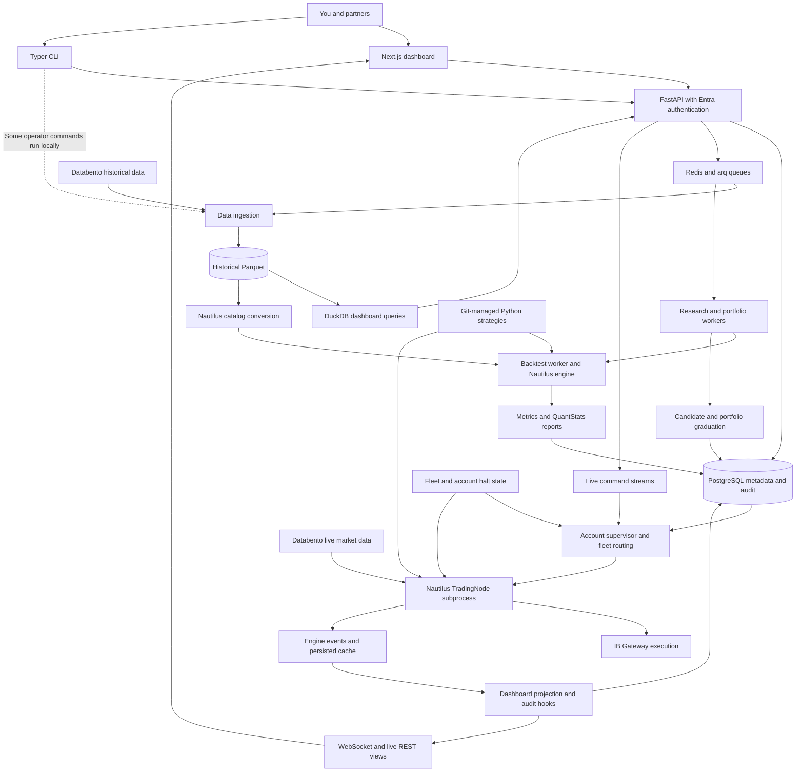

# MSAI v2 Master Map

Initial assessment: **October 3, 2026**, source `7f9eb2b5ad252bc3ba730f53a159ca04046278eb`. **Post-release reconciliation: October 6, after PR111 Azure acceptance and cleanup.** PR102–111 are merged; the latest verified Azure application revision is `fb75795317a7568f276040b5482fae3ec55c9c30`. Exact-main CI/auth/build, [Deploy 37420900926](https://github.com/marketsignal/msai-v2/actions/runs/37420900926), actual data-path smoke and independent cleanup passed. Six installed application images and preserved broker identities/policies were independently observed; existing API/CLI payloads and owner-browser result/report reload were preserved. [Latest released evidence](#released-assessment-integration-october-6). Earlier normal deployment, actual pre-staging cancellation and genuine scheduled recovery passed at `c1dd1c1`; **M20 remains PASS for that bounded release-control scope**, not a new cancellation test at fb757953. [Earlier recovery evidence and limits](docs/audits/2026-10-04/release-acceptance.md).

**MSAI is a functioning platform with real research workflows, but it is not yet the dependable research-to-trading service you wanted.** The initial audit proved local research/portfolio simulations and Azure browser backtests, while reproducing inconsistent financial results. The first repairs are now merged and installed on Azure: a new equity reference backtest reconciles through independent API/CLI checks and a real-browser submission/report/reload. Broader data, final validation, portfolio/account, supervisor and storage findings remain open; bounded release controls and research selection now have verified repairs. The priority is still trustworthy research and dependable operation.

This map separates inspected implementation, offline reproductions, observed local/Azure execution, historical claims, and unverified integrations. Three specialist agents audited research/data, live safety, and product/operations; the coordinator ran the platform and reconciled the evidence. The [initial runtime assessment](docs/audits/2026-10-03/runtime-assessment.md) corrected the limits of source-only assessment. The later [Azure installation and acceptance record](docs/audits/2026-10-03/azure-first-installation.md) establishes the bounded repairs below. Application services were updated with explicit approval; no trading order was placed. The companion [Master Plan](MASTER_PLAN.md) tracks the remaining work.

## Latest verified changes and earlier recovery evidence

PR102, PR103 and PR104 are merged. Exact merged-main CI/auth/image builds passed, followed by automatic Deploy `37171071535` at `fa4c8f8`. The full installer, smoke checks, public probes and normal temporary-rule cleanup passed. Direct VM inspection confirms all six application services at that revision. Fresh API, installed CLI and real-browser reload/full-report checks preserve the reconciled 166-fill reference. The earlier first-installation CI reported 3,748 passed, 11 skipped and 17 xfailed; that is a historical count, not one inferred from the later green run.

**Historical recovery baseline before PR107:** real active-owner preservation, cleanup-only rerun of an arranged original-attempt rule, and cleanup after deliberate SSH staging failure passed. Earlier cancellation setup failed with `CLI_RUNTIME_ERROR`; a repeat created the rule but did not stop its producer until SSH timed out. Those failures remain in the [pipeline history](docs/audits/2026-10-03/azure-normal-pipeline.md). The genuine repaired-revision RC-1 now passed; genuine scheduled inventory/preservation also passed at c1dd1c1 in run37218539817.

**Earlier integrated follow-up, October 4:** [PR105](https://github.com/marketsignal/msai-v2/pull/105) merged cancellation/timeout/diagnostic controls as `f4ede895`. Its 52 focused tests, read-only Azure regression, reviews, exact-main checks and [normal deployment](https://github.com/marketsignal/msai-v2/actions/runs/37179711991) passed. Later `e3ad095` exposed the Requests import lock, repaired by PR107. Those earlier passes remain separately scoped; use [current acceptance](docs/audits/2026-10-04/release-acceptance.md) for the new Linux rollout and actual cancellation result.

**Completed cleanup, October 6:** the PR109 guarded main-source handoff preserved PostgreSQL/Redis/data and saved local results. After PR111 release acceptance, both continuity folds passed, 266 private files and the ignored plan were hash-preserved, and the merged assessment remote/local branch and detached checkout were removed. Final release inventory: one clean checkout, only `main` locally/remotely, local main=origin/main=deployed fb757953, Forge 6.4.5. A subsequent user-requested pull confirmed synchronized main. This is a dated completed cleanup, with new branches reserved for active bounded tasks. [Latest release/retention](#released-assessment-integration-october-6); [earlier consolidation history](docs/audits/2026-10-03/worktree-consolidation.md).

### Forge integration and automatic rollout, October 5

[PR110](https://github.com/marketsignal/msai-v2/pull/110) merged the exact 19-file Forge 6.4.5 update as `54dc40792f88fa49805d35b756c228bb5b85515c`. Paired CLEAN/P3 reviews, focused owning checks, exact-head CI/auth and exact-main [CI](https://github.com/marketsignal/msai-v2/actions/runs/37356445768), [auth](https://github.com/marketsignal/msai-v2/actions/runs/37356445686) and [image build](https://github.com/marketsignal/msai-v2/actions/runs/37356445696) passed. No application or Nautilus dependency changed. Updated main was merged into the assessment as `15a4c09099ca5d4c867ae5390c5fc9c84cca0923`, reconciling 19 identical Forge overlays. This is historical integration evidence; the final reviews, PR111 merge, accepted rollout and branch/worktree cleanup subsequently completed on October 6.

**Historical automatic rollout was not accepted:** [Deploy 37356543395](https://github.com/marketsignal/msai-v2/actions/runs/37356543395) at `54dc407` failed during AAPL/Databento smoke bootstrap with a client `ReadTimeout` (`FAIL_SMOKE_BOOTSTRAP`). The installer reported `FAIL_ROLLBACK_OK` and restoration of the last-good SHA; independent cleanup passed. A separate subsequent public `/health` request returned healthy/production. The underlying bootstrap delay, exact restored image tags and broker identities were not independently verified. Health is liveness evidence, not data-path or release acceptance; `54dc407` is not a verified Azure installation. The earlier PR109 application acceptance and bounded M20 cancellation/recovery PASS retain their dated scopes.

### Released assessment integration, October 6

[PR111](https://github.com/marketsignal/msai-v2/pull/111) merged reviewed head `5e4fc86cb8aa4dce1f5a0b596f1953601475daac` as `fb75795317a7568f276040b5482fae3ec55c9c30` at 05:50:08 UTC after ten exact-head checks passed. Seven Markdown documents changed; application and harness implementation were unchanged. Exact-main [CI](https://github.com/marketsignal/msai-v2/actions/runs/37420523966), [auth](https://github.com/marketsignal/msai-v2/actions/runs/37420523950), [build](https://github.com/marketsignal/msai-v2/actions/runs/37420524050) and [Deploy/independent cleanup](https://github.com/marketsignal/msai-v2/actions/runs/37420900926) passed. Backend CI recorded 3,867 passed, 11 skipped and 17 xfailed.

The actual installer data-path smoke passed at 06:08:50 UTC (backtest `5ffbccff-c22f-43ea-bfbc-cec46d84aaf9`, engine-reported execution count 1,242). Independent VM readback at 06:10:46 UTC found six application/worker tags `fb75795`, all running; both broker container/image/start identities were unchanged, quiet-fleet readiness was complete, and all four network policies matched across fourteen fields. Installed API/CLI hashes for the existing reference backtest, sweep and walk-forward were unchanged. Real owner Entra browser reload and full QuantStats report retained 502 bars, 32 fills and +0.000113%. No new experiment was submitted by that read-only preservation journey.

The October 6 operator acceptance record is `.forge/local/evidence/nautilus-assessment-release/release-acceptance.md`; detailed private artifacts remain retained there, not portable runtime dependencies. This tracked summary and the public exact-revision pipeline links record its scope. Release and merged-branch/worktree cleanup passed. The later smoke and identity checks supersede the pending release gate; the October 5 timeout remains historical and unattributed. No new cancellation drill or broker order was dispatched. V2 remains uninstalled; the completed compatibility trial has partial passes and explicit failures, and the next batch is the [narrow V2 research integration](MASTER_PLAN.md#next-implementation-batch-one-real-research-journey-on-v2). Data completeness, realistic costs, immutable experiments, independent validation, portfolio/account/risk correctness and live-capital readiness remain open.

| Scope | Current evidence and remaining boundary |
| --- | --- |
| Reference equity accounting, M05 | Independently reconciled 166 fills, $1 million opening capital, −$1.21 final change and the first day's −$0.09. API, CLI and real-browser reports agree at −0.000121% return. This closes the reproduced reference-case error; broader portfolio/account and asset accounting stays open. |
| Result meaning and costs, M19 | Opening capital and realized-balance scope are explicit. Unknown legacy P&L/fees remain unavailable; recorded zero fees are distinguishable. Realistic IB costs, slippage and full marked-to-market NAV are not certified. |
| Release controls, M10/M20 | Exact-main CI/auth/fleet controls, normal real Linux create/install/delete and actual pre-staging ordinary cancellation with independent cleanup passed at `c1dd1c1`. Two post-cleanup reads prove owned-rule absence and unchanged four protected policies across 14 fields. Genuine scheduled run37218539817 checked out c1dd1c1, succeeded and preserved all four unrelated policies; bounded release recovery is PASS. |
| Operator workflow, M24 and browser path | The merged candidate repairs CLI settings/diagnostic handling. Installed CLI reads and real Azure browser submission/history/pagination/report/reload passed. Primary main and local source mounts are now reconciled; the local real-browser reference survived handoff. Broader CLI/browser acceptance remains scoped to the named journeys. |
| Broker/supervisor/storage, M21–M23 | Unchanged by this batch. Supervisor remains `65ae682`; account identity, disk placement, restore proof and live acceptance remain open. |

Full evidence, run identifiers, revision/digests and caveats: [Azure first installation](docs/audits/2026-10-03/azure-first-installation.md). Findings below retain the initial audit evidence unless explicitly superseded here; a reference pass is not a blanket finding closure.

### Released research selection and Discovery

PR108 merged reviewed head `5c39c453d4e9805c539d275140becbf2418ef37b` as `b48d0ad88c4ebcff498d2c14dc6fb834bea9c32a` on October 4 at 22:00:39 UTC; its tree `69f5432fc776d178b64008cff716f264b230e8c2` matches the certified candidate. Distinct final code reviews were CLEAN/P3; independent application verification passed 206 focused backend checks and the tracked frontend build, and final local API/CLI/real-browser journeys passed. Original certificates are retained as archival evidence, not reused as gates in another checkout.

| Evidence boundary | Verified result |
| --- | --- |
| Exact-main checks | [CI 37238348579](https://github.com/marketsignal/msai-v2/actions/runs/37238348579): 3,841 passed, 11 skipped, 17 xfailed; lint/strict typing and frontend checks passed. [Auth](https://github.com/marketsignal/msai-v2/actions/runs/37238348839) and [image build](https://github.com/marketsignal/msai-v2/actions/runs/37238348994) passed at the same SHA. |
| Normal rollout | Deploy 37238509145 and independent cleanup succeeded; six application/worker images were directly verified as b48d0ad. Supervisor 65ae682 and IB Gateway 10.43.1c retained their original IDs/start times. Four existing NSG policies were unchanged across 14 fields and the owned transient rule was absent. |
| Azure API and CLI | Actual API client exit 0/31 public steps and CLI client exit 0/26 recorded steps passed for AAPL.NASDAQ, December 2–5, 2024, using existing minute data. Training December 2–3 selected EMA10/20 before separate December 4–5 diagnostics. Automatic/manual/latest-window Discovery retained configuration, instruments, flat training metrics, provenance and stage after separate reads. Failed training produced no winner and actionable refusal. |
| Real Azure browser | Owner sign-in as pablo@marketsignal.ai; fresh sweep, automatic/manual Discovery, one-window walk-forward Discovery, invalid-size refusal, impossible-split correction and reload persistence passed against real API responses. No auth bypass or mocks. |
| Preserved reference | Prior Azure accounting reference remained 166 fills, −$1.21 on $1 million with first-day −$0.09 included. This unchanged path was read again, not newly FIFO-reconciled during research acceptance. |

**Remaining boundaries:** no genuine legacy Azure fixture existed, so that Azure case is NOT_EXECUTED; final local legacy acceptance is separate. The short runtime window does not prove multi-window counterfactual selection or failing-latest-test behavior; owning regressions cover those invariants. The first Azure API client failed because its expected config omitted supported instruments stamping; correcting only the client and rerunning the full matrix passed. Original failure evidence remains retained. Realistic costs, session completeness, immutable experiment inputs, final validation/graduation, portfolio OOS allocation, other assets and live-capital acceptance remain open. Earlier slow startup and intermittent fetch failures recovered, with cause and dependable performance unverified.

**Retention:** release and cleanup evidence is archived under `/Users/pablomarin/.codex/worktree-evidence/msai-v2/2026-10-04/final-merged-cleanup/`. The research archive SHA-256 is `4f1e468c655a835f1ac93373767781990689cdb6bdaa527667d556eee8297ba7`; its manifest records per-file hashes. Detailed release observations are the archive member `.forge/local/evidence/research-selection-bias/azure-acceptance/README.md`, with authentic API/CLI outputs, UI assessment and CI/container/network evidence. This retained operator archive is not a portable runtime dependency.

### Released inclusive backtest dates

[PR109](https://github.com/marketsignal/msai-v2/pull/109) merged reviewed head `aff8e5f0bbc74a94e20d3feeac71915a7b0a2639` as `84707a47313766ef3fbe5c251f8488b9dc2cb822`, with certified tree `a68c7309773ba49cd76e9a696dbdd4bdfdc42b46`. Final paired reviews and application/E2E gates passed before publication. The pinned-engine reproduction at b48d0ad consumed 478 AAPL bars instead of 980 for December 2–3; same-day December 3 produced no fills. The released shared runner uses full inclusive UTC days at both Nautilus cutoffs, preserves explicit timestamp instants and refuses public reversed dates before enqueueing. New results expose total native bars processed; old absent counts remain **Not recorded**.

| October 5 acceptance boundary | Verified result |
| --- | --- |
| Exact-main checks | [CI 37268382738](https://github.com/marketsignal/msai-v2/actions/runs/37268382738): **3,867 passed, 11 skipped, 17 xfailed**; all five real-engine date cases and adjacent train/test/purge case passed, with lint/strict typing/frontend/image-data-path checks. [Auth](https://github.com/marketsignal/msai-v2/actions/runs/37268382730) and [image build](https://github.com/marketsignal/msai-v2/actions/runs/37268382727) passed at the same SHA. |
| Azure installation/preservation | [Deploy 37268585056 and independent cleanup](https://github.com/marketsignal/msai-v2/actions/runs/37268585056) passed. Direct VM observation verified six app/worker tags `84707a4`, unchanged IB Gateway/supervisor container/image/start identities, complete ready fleet and four unchanged network policies across fourteen fields. No extra cancellation/recovery drill. |
| Actual API and installed CLI | December 3–3 jobs `a544a5ed-9327-4c8f-a0ce-2fdc7d1a5684` and `42c54c6e-6842-4b8d-bbe3-e02ea70f8484` each recorded **502 bars/32 fills/+0.000113%**. Independent signed fill cash flows minus recorded fees reconciled **+$1.13 on $1 million**, with zero net filled quantity. Invalid dates created no job; report/history/repeat reads persisted. All per-fill P&L fields remained unavailable. |
| Real owner browser | Entra owner pablo@marketsignal.ai corrected reversed dates in the same form and submitted once. [New result fff32b8a](https://platform.marketsignal.ai/backtests/fff32b8a-d110-423a-9aef-d4e16c3611b9) completed with 502 bars, 32 fills and +0.000113%, full December 3–3 report, reload and history reopening. Real backend/data; no mock responses. |
| Research/Discovery regression | Sweep `d695c5fc` retained **980 training / 471 holdout / 1928 replay** bars; walk-forward `d08dc67d` retained **478 training / 477 holdout / 471 test**. Discovery `de4f1f55` retained the sweep's 10/20 configuration, 980 training bars and exploratory training provenance through public API, installed CLI and real browser reload. No live-stage advancement. |
| Legacy preservation | Old `6d8e6878-55eb-4b42-8444-6d5a6abc7166` public result SHA `c564c877db3212c76801f1155c7838e75bfc4d642f778bf31e3e9aa74d900f7e` stayed unchanged; browser explicitly shows **166 legacy order records**, unverified accounting and **Not recorded**. This legacy readback is separate from the earlier reconciled accounting reference. |

**Local preservation and limits:** guarded main-source handoff preserved PostgreSQL/Redis/data/images and the old local 100-fill JSON hash; native reload of saved `02dac4fb` retained 502 bars and 32 fills. [Cause/contract and earlier local evidence](docs/solutions/backtesting/inclusive-calendar-date-window.md); [graduated journeys](tests/e2e/use-cases/backtests/inclusive-date-window.md). Original locked-Mac and verification-client schema/P&L assumptions remain in PARTIAL records. Final installed clients reused existing job/candidate IDs and passed; no mutation was duplicated. This changes new simulations, including research and portfolio members using the shared runner, without rewriting saved results or split/purge arithmetic. **Only the date-boundary portion of M15 is closed.** Session/input completeness, realistic costs, immutable inputs, independent final validation, other assets and live-capital acceptance remain open.

**Retention and October 5 housekeeping:** latest operator evidence is `.forge/local/evidence/equity-window-release/release-acceptance.md` with actual `vm-api-close.json` and `vm-research-final.json` PASS; private evidence is not a portable runtime dependency. Original task certificates/settings were preserved outside the removed checkout under `/Users/pablomarin/.codex/worktree-evidence/msai-v2/2026-10-05/equity-backtest-window/`, with 2,123 files individually verified and archive SHA `87c965026df2961cdac6a8d226d63bc5aa57467317e28edb58abbbfbb5a12e54`. Local PR109 cleanup passed; the separately approved remote deletion subsequently succeeded during October 5 assessment preflight, with only `main` observed remotely. Assessment integration and cleanup subsequently passed on October 6 as recorded above. No standalone browser screenshot file was saved. CI/public job links and the scoped observations above supplement the retained private evidence.

## The goal this assessment measures

**Research selection status:** the bounded sweep/walk-forward training-selection and exploratory Discovery repair is certified, merged and installed, as recorded above. Historical startup/fetch/layout failures remain in the [pre-certification acceptance record](docs/audits/2026-10-04/research-selection-acceptance.md); its pending/Azure-on-c1dd1c1 wording describes that earlier snapshot. M01/M02 retain the portfolio allocation and independent final-validation/graduation gaps. Costs, immutable inputs and live readiness remain open.

The operator clarified the product goal on October 3: **a professional-grade hedge fund research and portfolio operations platform, managing a portfolio of strategies in each brokerage account**. The platform must support strategy research and honest validation, portfolio construction and validation, deployment to different accounts, and fresh account/portfolio/strategy performance through API, CLI and UI. Interactive Brokers comes first; additional brokers are a future extension. Infrastructure should become dependable enough for the operator to focus on investment research and portfolio decisions.

The product model is **strategy versions and evidence → portfolio revision → account-specific deployment → reconciled live records**. A portfolio definition is separate from its deployment: different accounts may run different compositions, or reuse a validated revision with different capital and limits. The intended operating rule is one active portfolio per account, with multiple strategies inside that portfolio. Account observations follow the selected view scope. Account commands name and validate their execution target independently; fleet-wide controls retain explicit fleet scope. The account selector does not by itself provide customer authorization or a performance ledger.

This clarification changes the assessment standard. Multi-account routing and portfolio revisions serve the core goal; they should not be removed merely because the first reference test uses one equity and one account. Conversely, model names and a successful EMA backtest do not establish the complete product. The single-equity workflow in the plan is a diagnostic/acceptance starting point, not a reduction of the goal. The platform must assess alpha evidence without guaranteeing alpha or claiming that every possible bias has been eliminated.

The revised [agent context](docs/agent-context.md) retains the mandatory-read deployment procedures, API inventory, vendor coverage and Forge E2E configuration. Its new goal is durable; historical operational assertions are dated and known contradictions are explicit. The original "first real backtest" goal is retired as a completed initial milestone.

A further [goal-alignment assessment](docs/audits/2026-10-03/goal-alignment.md) inspected the account/portfolio paths against this goal. It confirms useful foundations and identifies five concrete gaps now tracked as M25–M29: validation tied to a single deployment, no account-wide active-portfolio invariant, incomplete account scoping, placeholder live performance aggregation, and inconsistent promotion/account semantics. These are source-confirmed findings; no new broker operation or two-account acceptance test was performed.

## Answers to your main questions

| Question | Assessment |
| --- | --- |
| What do we have? | A custom investment research and trading operations platform around NautilusTrader, with broad API/CLI/UI workflows and substantial account/supervisor infrastructure. |
| Does it work? | Yes for the exercised local simulations and the newly reconciled Azure equity API/CLI/browser reference journey. Broader data/validation, portfolio economics and research-to-live acceptance remain unverified. |
| Is it good? | Good component choices and useful safety design, combined with material defects at the boundaries between those components. Strong building blocks do not make every result trustworthy. |
| Is it overengineered? | **Selectively.** Halt, broker reconciliation, durable jobs and strategy isolation address real needs. Multiple authorities for live state, dormant manager code, large orchestration handlers, and sophisticated optimization ahead of reliable validation impose avoidable cost. |
| Is it current? | No. The locked trading engine and several libraries lag upstream. Next.js is behind published security patches; arq is maintenance-only. PostgreSQL 16 remains supported. |
| Is it efficient? | Overall efficiency is unmeasured. Queue separation and streaming are useful, but there are source-level memory/I/O bottlenecks and correctness problems under concurrent writes. No 100-symbol capacity proof exists from this audit. |
| Is it substantially better than alternatives? | Not demonstrated. Custom Azure/Entra/account workflows are a potential advantage. Better returns, reliability, research speed or total ownership cost have not been established against LEAN, thin Nautilus workflows, or VectorBT research. |
| Does it meet the clarified intent? | **Partially.** Research and account/portfolio structures exist, but portfolio reuse/account exclusivity, consistent account-scoped interfaces and reconciled live performance need explicit acceptance alongside data, validation and risk repairs. No reliable alpha strategy is established. |

## Scope and evidence legend

- **Tested:** the named focused checks passed on this revision; this applies only to their tested contracts.
- **Runtime-observed:** an actual service, job or browser path was exercised; its environment and scope are specified. A healthy service or completed job does not certify financial correctness.
- **Reproduced defect:** a deterministic offline probe demonstrated incorrect behavior. It is not automatically evidence of a past production incident.
- **Source-confirmed gap:** the reachable code/configuration lacks or contradicts the intended behavior; the real external journey was not run.
- **Unverified:** requires an environment, credentials, data, workload or broker journey not exercised here.
- **Historical:** prior documentation/conversation evidence, not present-day certification.

Severity expresses consequence: **High** affects research conclusions, trading authority, financial records, data integrity or release safety; **Medium** affects operability, consistency or maintainability. It is not a claim that every finding is currently being triggered.

The following paragraph is the historical initial/first-installation baseline, superseded by the release and cleanup evidence above. At the initial audit, local containers were stopped. The follow-up started seven guarded local research services and verified existing data plus new jobs. Azure progressed from `71aa4a9` to the supervised `23db3b8` installation and then the automatic `fa4c8f8` deployment; the older supervisor remains `65ae682`. Account identity remains unresolved: its registry says LVP, the prior context assumed HVP, and account snapshots returned null. No trading order was placed. The latest installer invoked migration successfully with schema head unchanged at `f6a7b8c9d0e1`; existing dependency and broker containers were preserved. The [initial comparison](docs/audits/2026-10-03/runtime-assessment.md), [first installation](docs/audits/2026-10-03/azure-first-installation.md) and [normal pipeline](docs/audits/2026-10-03/azure-normal-pipeline.md) describe distinct snapshots.

## What is actually in this repository

The parallel-version comparison ended in April. The surviving former Claude implementation is now at the root; the older Codex implementation is archived under the `codex-final` tag. The pasted Codex test results and NQ slope-strategy work must not be assumed to describe this root. The active tracked strategies are examples/smokes; no slope strategy was found in the active backend/strategy inventory. See [history decision](docs/decisions/which-version-to-keep.md) and [research audit](docs/audits/2026-10-03/research-data.md).

| Area | Size or surface | Role |
| --- | --- | --- |
| `backend/src/msai/` | 224 Python files; 70,331 physical lines | APIs, CLI, jobs, trading integration, risk, data and operations |
| `frontend/src/` | 137 TS/TSX/CSS files; 24,147 lines; 24 pages | Operator dashboard and workflow controls |
| `strategies/` | 8 Python files; 723 lines | EMA example, trading smokes, shared config and failure demonstration |
| `backend/tests/` | 357 Python files; 106,073 lines | Unit, integration and opt-in E2E tests |
| Frontend tests | 7 Playwright spec files | Selected browser flows, chiefly bypass-auth coverage |
| Database | 48 migration revisions; one structural head | Strategy/research/account/deployment and audit records |
| Deployment | Compose, Azure IaC, image/deploy workflows, backups and watchdog | Single-host operation and recovery tooling |
| Existing docs | 206 Markdown files; 111,018 lines | Plans, decisions, runbooks and historical evidence, with drift |

Counts include comments/blank lines and are not quality scores. The [machine-readable inventory](docs/audits/2026-10-03/inventory.json) records the method and largest files. AST counting found 3,427 backend test functions; this is not a passing-test count or coverage percentage.

## How the system works

This diagram maps intended and inspected connections; it does **not** mark every arrow as working. Catalog conversion, final-validation/portfolio selection, risk wiring and projection remain consequential boundaries below.

There are four distinct state stores: PostgreSQL for application records, historical Parquet, a derived Nautilus catalog, and Redis for queues/commands/live cache. Their different purposes are reasonable. Their consistency contracts need work: a successful ingest is not proof of correct catalog instruments; a stored portfolio weight is not proof of live sizing; a submitted order is not proof of a correctly displayed fill.

## Subsystem map and health

| Subsystem and entry points | What exists | Current assessment | Direction |
| --- | --- | --- | --- |
| Strategy registry: `api/strategies.py`, `services/strategy_registry.py`, `strategies/` | Filesystem discovery, metadata, config loading and hash tracking; API/CLI/UI management | Implemented; executable Python is trusted operator code, not a sandbox for untrusted uploads. Example inventory does not establish alpha. | Keep git-managed source and a small approved strategy set. |
| Instrument registry: `services/nautilus/security_master/` | Provider aliases and instrument metadata; live lookup wiring | Substantial registry exists; backtest catalog reconstruction loses important asset semantics. | Make the registry authoritative through the entire backtest path. |
| Historical data: `services/data_ingestion.py`, `services/parquet_store.py`, `services/data_sources/` | Vendor fetches, validation, monthly atomic replacement, deduplication | Reproduced concurrent lost updates; dataset/bar-schema identity is absent from storage key. Atomic replacement alone is insufficient. | Repair storage identity and writer serialization. |
| Analytics queries: `services/market_data_query.py` | DuckDB over Parquet | Appropriate architecture; interval selection does not provide the requested aggregation in the reproduced probe. | Keep DuckDB; fix frequency/data contracts. |
| Backtesting: `workers/backtest_job.py`, `services/nautilus/backtest_runner.py`, `services/nautilus/catalog_builder.py` | Queued Nautilus execution, reports and results | Real engine integration, but futures/crypto identifiers can be converted into Equity instruments and bars into one-minute catalog data. Broad multi-asset correctness fails at this boundary. | Correct metadata and validate one instrument per promised class. |
| Research: `services/research_engine.py` | Parameter sweeps, Optuna and walk-forward windows | PR108 repairs training-only selection, eligibility/failure handling and latest-training-window Discovery; local and Azure API/CLI/browser acceptance passed in bounded equity scope. Final independent validation and immutable inputs remain open. | Keep exploratory Discovery explicit; establish final-validation and input contracts. |
| Portfolio research: `services/portfolio/`, `services/portfolio_backtest/` | Candidate combinations, return aggregation, allocation and optimization | Out-of-sample allocation can be fitted on the same test returns being scored; combined independent curves are not full shared-account execution simulation. | Fix evaluation before adding optimization sophistication. |
| Graduation: `services/graduation.py`, `services/live/portfolio_service.py` | Candidate stages, live revisions and promotions | Empty evidence can advance; one candidate is consumed by one deployment; portfolio promotion requires a paper-format account but stores it only in the description. | Separate reusable validation, composition materialization and explicit account assignment; preserve suitability checks. |
| Live control: `api/live.py`, `live_supervisor/`, `services/nautilus/trading_node_subprocess.py` | Account routing, subprocess ownership, restart/backoff, commands and reconciliation | Real control architecture; focused halt/restart checks pass. Real broker behavior on this revision remains unverified. | Preserve safety controls; remove retired competing authorities. |
| Risk and flattening: `services/nautilus/risk/risk_aware_strategy.py`, `services/live/flatness_service.py` | Halt latch, node-side gate, data-stale/disconnect responses, reduce-only escape and drain protocol | Useful tested mechanisms; monetary/position/loss risk limits are not fully wired into the production node. Empty Redis state can clear a prior halt in a surviving node. | Complete limits and prove state-loss recovery. |
| Live records: `services/nautilus/projection/`, `services/nautilus/audit_hook.py` | Redis events, persistent fills, snapshots and WS hydration | Actual installed-engine topics are dropped; real position payloads can fail parsing; sign/member attribution defects reproduced. Separate audit persistence exists, so this is not a claim that all fills are lost. | Fix engine contracts and reconcile broker, DB, REST and UI. |
| Access and partners: `core/auth.py`, `api/auth.py`, `api/websocket.py` | Real Entra validation, shared API key, displayed roles | 45 focused auth/health/identity tests pass; role enforcement absent and REST/WS visibility disagrees. | Choose and enforce a small partner policy. |
| Dashboard and CLI: `frontend/src/`, `cli.py` | Broad research/backtest/account/live workflow surfaces | Account selection is partial; All positions can collapse to one streamed deployment. Daily live PnL aggregation writes placeholders, and some CLI operations run locally. | Repair scope/freshness and real account/portfolio/strategy accounting; make command destinations explicit. |
| Release and operations: `.github/workflows/`, `infra/`, `scripts/`, Compose | Image builds, Azure delivery, gates, rollback, backups and gateway watchdog | Same-revision/fleet gates and bounded normal/cancellation/scheduled cleanup passed; latest inclusive-date rollout installed `84707a4`. Old supervisor/API compatibility, broker identity, root-disk placement and restore proof remain open. | Preserve passed release controls; finish the separate storage/restore and live prerequisites. |

Paths in this table are relative to `backend/src/msai/` unless another root is shown. Detailed file/line evidence and reproduction procedures are in the three audit reports linked below.

## Fit against your requirements

| Your requirement | Fit today |
| --- | --- |
| Azure plus Interactive Brokers | Azure owner sign-in, browser backtest/report, container operation and backups were observed. Existing IB connection health responds, but account attribution is unresolved and current order execution remains unverified. |
| Python strategy authoring | Good fit. Git-only source is deliberate; UI/CLI manage registration/configuration, not arbitrary strategy-file uploads. |
| Minute data for stocks, indexes, futures, options and some crypto | Partial. Provider/registry concepts exist, but correct research representation is not established across these classes. Options chains, lifecycle/expiry and crypto paths need explicit acceptance evidence. |
| Trading every 5–10 minutes or daily | Possible as strategy logic on minute input, but the data/catalog/query interval contract is incomplete. Do not equate an interval parameter with verified resampling or daily execution. |
| Approximately 100 symbols and selected options | No representative load/capacity test run. Options cannot be sized from the old storage estimates. |
| Research and validate strategies, then construct and validate portfolios | These stages have code and interfaces, but validity, evidence binding, cost/sizing semantics and selection defects break assurance between stages. A one-member quick simulation is not full shared-capital portfolio validation. |
| Deploy a portfolio of strategies per account; reuse a revision across accounts | Revision/account schema and routing fit the model, but candidate evidence is consumed by one deployment and a second portfolio on the same account is not prohibited by the inspected guards. M25/M26 remain open; a two-account live journey is unverified. |
| Switch accounts consistently through API, CLI and UI | Selector/filter plumbing exists, but several API/CLI reads are global/gateway-bound and the All positions view can drop non-streamed deployments. Historical live PnL aggregation is a placeholder. M27/M28 require implementation and acceptance. |
| IB first, additional brokers later | IB is the current execution integration. Treat future broker support as an extension requirement; declarations or metadata are not functioning adapters. |
| Strong protection against overfitting | **Partly repaired.** Research sweep/walk-forward choices now use eligible training evidence, with diagnostic/test results separate. Portfolio OOS allocation, immutable final validation and graduation evidence gates remain open; runtime success does not establish alpha. |
| Pyfolio-like tearsheets | QuantStats reports exist. Their trustworthiness depends on corrected returns, drawdown, fees and input data. |
| Access for you and a few partners via Entra | Authentication fits; read-only/operator permissions and individual CLI identity do not yet fit reliably. |
| Positions, trades, P&L and system health | Broad UI/API coverage; correctness and completeness gaps remain in financial attribution, daily P&L and multi-process metrics. |
| API first, CLI second, UI third | Largely reflected in interfaces; local-service CLI commands and missing complete journey tests remain exceptions. |
| AI/LLM features deferred | Sensible to retain. No reason to add them before research and accounting are trustworthy. |

## Findings that should drive the next phase

The identifiers below are stable references for the Master Plan. They retain the original findings; the latest verified change and explicit repaired-scope labels above supersede only their named acceptance cases. Broader unresolved boundaries remain open.

The historical [October 3 research-foundation verification](docs/audits/2026-10-03/research-foundation-verification.md) retains the repaired accounting/presentation/harness evidence and remaining limits. At that snapshot, reversed-date input failed late as `ENGINE_CRASH`; [PR109 later repaired reversed-date refusal before enqueueing](#released-inclusive-backtest-dates). Broader date/session completeness and realistic-cost acceptance remain open. Intermittent browser history/trades transport failures also remain unresolved despite working Retry/reload and corrected error presentation.

| ID | Priority | Finding and consequence | Evidence |
| --- | --- | --- | --- |
| M01 | High, remaining portfolio/validation scope | PR108 repairs sweep/halving/Optuna training-only choice and latest-training-window persistence/Discovery. Portfolio OOS allocation can still use future test-window information; final validation is not independently certified. | [Released research evidence](#released-research-selection-and-discovery); [original research audit](docs/audits/2026-10-03/research-data.md); `services/portfolio/orchestration.py:1808`; `services/portfolio_backtest/optimizer.py:275` |
| M02 | High, remaining graduation scope | PR108 repairs research eligibility, unavailable/failed-training handling and exploratory Discovery refusal/provenance. Graduation can still advance without independently validated final evidence; Discovery is not investment approval. | [Released research evidence](#released-research-selection-and-discovery); [original research audit](docs/audits/2026-10-03/research-data.md) |
| M03 | High | Backtest catalog recreates non-equities as Equity with multiplier 1 and hardcodes minute bars. Futures/options economics and frequency can be wrong. | [Research audit](docs/audits/2026-10-03/research-data.md); `services/nautilus/instruments.py:23`; `services/nautilus/catalog_builder.py:48` |
| M04 | High | Dataset/schema share a storage namespace; concurrent monthly writes lose rows. | [Research audit](docs/audits/2026-10-03/research-data.md); `services/parquet_store.py:264`; deterministic two-writer reproduction |
| M05 | Reference repair verified; broader accounting open | The reproduced return-unit and first-day error is repaired in the 166-fill Azure and 100-fill local references. Broader multi-account/asset, mark-to-market and edge-case accounting remains open. | [Reference acceptance](docs/audits/2026-10-04/release-acceptance.md); [original runtime accounting evidence](docs/audits/2026-10-03/runtime-assessment.md); [research audit](docs/audits/2026-10-03/research-data.md) |
| M06 | High | Position/exposure/daily-loss limit code is not connected to live execution; live revision weights are not a sizing policy. | [Live audit](docs/audits/2026-10-03/live-safety.md); `services/nautilus/risk/risk_aware_strategy.py:516`; `services/nautilus/trading_node_subprocess.py:2892` |
| M07 | High | Actual engine order/account topics are discarded by projection; actual position payloads can fail parsing, lose short sign or overwrite another member. | [Live audit](docs/audits/2026-10-03/live-safety.md); installed Nautilus 1.223.0 event probes |
| M08 | High | Redis recreation loses halt/cache/stream state. A still-running node can interpret missing halt keys as permission after reconnect. | [Live audit](docs/audits/2026-10-03/live-safety.md); `services/nautilus/trading_node_subprocess.py:302`; `docker-compose.prod.yml:80` |
| M09 | High for shared use | Viewer/operator labels are not enforced; REST/WS and shared-key identities disagree. | [Product audit PO-01 and PO-02](docs/audits/2026-10-03/product-operations.md) |
| M10 | Repaired in tested release scope | Initial same-revision CI and stopping-deployment gate defects were repaired in PR103. Automatic `fa4c8f8` deployment exercised same-SHA CI/auth and complete fleet readiness. This snapshot is not a maintenance lock or account-flatness proof. | [Original PO-04/PO-08](docs/audits/2026-10-03/product-operations.md), [runtime acceptance](docs/audits/2026-10-03/azure-normal-pipeline.md) |
| M11 | High at incompatible boundaries | Image rollback leaves an already-upgraded schema/data contract in place. Destructive historical migrations make arbitrary rollback unsafe. | [Product audit PO-06](docs/audits/2026-10-03/product-operations.md) |
| M12 | Maintenance priority | Next.js 15.5.12 predates published 15.5.27 security fixes. Reachability varies by advisory; exploitation was not demonstrated. | [Ecosystem audit](docs/audits/2026-10-03/ecosystem-and-baseline.md), [September release](https://nextjs.org/blog/september-2026-security-release) |
| M13 | Medium, with financial-record implications | Daily P&L label, multi-member hash attribution, partial-fill P&L update, cold member-position reads and legacy active-count authority are inconsistent. | [Product audit PO-03](docs/audits/2026-10-03/product-operations.md), [live audit](docs/audits/2026-10-03/live-safety.md) |
| M14 | Medium | Browser CI, multi-process observability and documentation do not provide current full-workflow assurance. | [Product audit PO-05 and PO-07](docs/audits/2026-10-03/product-operations.md) |
| M15 | Partially repaired; inclusive dates released | PR109/84707a4 passed final certification, exact-main checks, Azure installation and actual API/CLI/browser/research acceptance. Both engine cutoffs consume whole UTC days; equal dates work and reversed dates refuse before enqueueing. New counts are recorded; old absence stays unknown. Session/input completeness and realistic cost assumptions remain open. | [Released acceptance](#released-inclusive-backtest-dates); [repair contract](docs/solutions/backtesting/inclusive-calendar-date-window.md); [original RD-06](docs/audits/2026-10-03/research-data.md) |
| M16 | High for reproducibility | Coverage can miss internal gaps; recorded source/data hashes and reused Optuna studies do not bind an immutable executed experiment. | [Research audit RD-09](docs/audits/2026-10-03/research-data.md); source-confirmed limitations |
| M17 | Medium | Research reserves multiple compute slots while trials run serially; cancellation is checked after the experiment. Blocking I/O and full-history reads add avoidable work. | [Research audit RD-10](docs/audits/2026-10-03/research-data.md); runtime-scale impact unmeasured |
| M18 | High for recovery decisions | `broker_flat` checks deployment positions in the local engine cache, not a fresh account-wide broker query. Position views exclude failed/stopping deployments that may retain exposure. | [Live audit operational boundaries](docs/audits/2026-10-03/live-safety.md); source-confirmed scope, actual residual exposure unverified |
| M19 | Economic-validation gap | Backtests hardcode one million USD per venue and do not expose/pin realistic commission, slippage, spread or latency assumptions in the inspected builder. Realistic net returns are unverified; this is not proof all costs are zero. | [Research audit module map and priorities](docs/audits/2026-10-03/research-data.md) |
| M20 | Verified repair, bounded scope | Focused startup repair is integrated through PR107. Actual Linux normal rollout and RC-1 passed at `c1dd1c1`, including producer interruption before staging, independent cleanup, repeated rule absence and protected-policy preservation. Genuine scheduled inventory/preservation run37218539817 also passed; independent Azure inventory matches all four protected policies across fourteen fields. No new orphan fixture was present in that schedule. Earlier generic crashes remain unattributed; already-running installer termination/rollback is outside RC-1 scope. | [Current acceptance](docs/audits/2026-10-04/release-acceptance.md), [previous failures](docs/audits/2026-10-03/azure-normal-pipeline.md), [startup assessment](docs/audits/2026-10-04/azure-cli-startup.md) |
| M21 | High live-start compatibility | Running Azure supervisor cannot resolve canonical strategy paths stored by the newer API. Actual resolver raises FileNotFoundError; no live start attempted. | [Runtime assessment](docs/audits/2026-10-03/runtime-assessment.md) |
| M22 | High operational | Application/database volumes are on the 83%-used root filesystem; intended 128 GB data disk is attached but unmounted. | [Runtime assessment](docs/audits/2026-10-03/runtime-assessment.md) |
| M23 | High before trading | Historically documented HVP, registered LVP and null broker-reported account identity do not establish a safe current account binding. System health reports version/commit unknown. | [Runtime assessment](docs/audits/2026-10-03/runtime-assessment.md); documentation now qualified, operational identity still unresolved |
| M24 | Bounded CLI repair verified | Compose-only settings and sensitive validation-input handling were repaired; focused diagnostics checks and installed Azure CLI reads passed. Broader command destinations and access scope remain separately assessed. | [Reference acceptance](docs/audits/2026-10-04/release-acceptance.md); [original runtime failure](docs/audits/2026-10-03/runtime-assessment.md) |
| M25 | Medium workflow, required for multi-account acceptance | Graduation candidate has one deployment link and becomes ineligible after binding. Reusing the same approved strategy/composition across accounts requires new eligible candidate records, coupling validation to deployment lifecycle. | [Goal alignment GA-01](docs/audits/2026-10-03/goal-alignment.md#ga-01--p2-a-validation-candidate-is-consumed-by-one-deployment); `api/live.py:941`, `:2069`; source-confirmed |
| M26 | High for account assignment | One active portfolio per account is not enforced: uniqueness/collision guards protect a deployment, while gateway startup serialization allows a different deployment after the first is running. | [Goal alignment GA-02](docs/audits/2026-10-03/goal-alignment.md#ga-02--p1-one-active-portfolio-per-account-is-not-enforced); `models/live_node_process.py:169`; `live_supervisor/fleet_router.py:1875`; no conflicting live starts attempted |
| M27 | High for account visibility | Account selection is incomplete across API/CLI/UI. All positions can replace the fleet snapshot with one deployment's WebSocket list, hiding other accounts despite a successful REST response. | [Goal alignment GA-03](docs/audits/2026-10-03/goal-alignment.md#ga-03--p1-account-selection-is-only-partially-propagated-and-all-can-hide-other-deployments); `frontend/src/app/live-trading/page.tsx:203`, `:243`; source-confirmed |
| M28 | High financial-record gap | Daily live performance aggregation writes zero PnL/win/loss placeholders and only updates order-row counts. Gateway snapshots do not provide a persisted account/portfolio/strategy performance ledger. | [Goal alignment GA-04](docs/audits/2026-10-03/goal-alignment.md#ga-04--p1-the-live-performance-history-is-a-skeleton-not-an-accounting-ledger); `workers/pnl_aggregation.py:45`, `:83`; source-confirmed, no broker accounting reconciliation |
| M29 | Medium workflow consistency | Portfolio promotion requires a `DU` paper-format target although composition is reusable and the supplied account is stored only in its description. Current test-account availability/binding does not justify assuming this path is usable. | [Goal alignment GA-05](docs/audits/2026-10-03/goal-alignment.md#ga-05--p2-portfolio-promotion-has-an-obsolete-paper-only-target-contract); `api/portfolio.py:617`; `services/live/portfolio_service.py:340`; no restriction changed |

The subsystem reports contain narrower secondary findings and recommended fixes. They remain part of the assessment; this table prioritizes rather than erases them.

**Historical runtime strengthening of M05/M19:** the initial 100-fill local case reproduced return-unit and first-day errors, with 50 round trips and −$0.53 gross P&L. The reference presentation is now repaired and persisted through cleanup; old per-fill economics remain unavailable. Realistic costs and broader accounting are still unverified. [Original reconciliation](docs/audits/2026-10-03/runtime-journey.md#observed-local-result-and-accounting-reconciliation).

## What to keep and what to simplify

**Keep the basic stack.** FastAPI, PostgreSQL, Parquet, DuckDB and Nautilus match the workload. Separate ingest/research/backtest queues prevent long work from blocking interactive requests. A live supervisor, node-side halt checks, restart reconciliation, immutable portfolio revisions and fill deduplication address concrete failure modes. Replacing these wholesale would discard useful work while leaving the financial-validity problems unresolved.

**Keep the account/portfolio model.** The clarified goal requires multiple account identities, reusable portfolio definitions, account-specific deployments, routing and attributed records. Evaluate whether each mechanism correctly serves that model before calling it overengineering. Remove conflicting authorities and unsupported generality, not the user's requested account management capability.

**Simplify conflicting implementations.** The old `TradingNodeManager` still supplies an active count even though the active portfolio path uses the fleet router. Live state is represented in several places without fully consistent identity and serialization. Large handlers (`fleet_router.py`, 4,906 lines; `api/live.py`, 4,087; `cli.py`, 3,529) combine too many decisions. Extract small stable boundaries while fixing named defects. Do not start a generic framework rewrite.

**Pause new sophistication until the fundamentals work.** Optimizer breadth, additional account topologies, more asset classes, new databases, Kubernetes, a visual strategy builder and AI features would increase the support surface. The platform already has far more machinery than demonstrated strategy value. A two-VM split may eventually protect trading from research load, but should follow measured contention and a clear operating requirement.

**Treat trusted Python execution honestly.** A subprocess isolates process failures; it is not a security sandbox. The current git-managed operator-authoring model is reasonable. Partner uploads or arbitrary generated code would change that trust boundary and require separate design.

## Is it advantageous compared with what exists elsewhere

| Alternative | What it already provides | MSAI judgment |
| --- | --- | --- |
| QuantConnect / LEAN | Python/C# research, backtests and IB live trading; local/cloud workflows | Strong comparison candidate. MSAI's custom ownership and account/UI integration may matter, but superiority is unproven. [LEAN](https://www.quantconnect.com/docs/v2/lean-engine/getting-started), [IB CLI](https://www.quantconnect.com/docs/v2/lean-cli/live-trading/brokerages/interactive-brokers) |
| Thin Nautilus plus notebooks/CLI | Same engine family for simulation and live execution | Likely lower platform maintenance for one researcher, by inference. Gives up much of the custom product surface. [Nautilus documentation](https://nautilustrader.io/docs/latest/) |
| VectorBT for research | Optimized portfolio simulations and performance analysis | Useful research-speed benchmark; does not by itself establish a replacement for MSAI's account/execution/recovery workflow. [Portfolio API](https://vectorbt.dev/api/portfolio/base/) |

The justified advantage to pursue is **a trustworthy workflow tailored to your team**, with control over data, research evidence and execution. There is no evidence that a custom dashboard or more code creates an investment edge. Compare one identical strategy, data interval, fees and decisions across systems before considering migration. Current pricing, licensing entitlements and total ownership costs were not evaluated.

## Currency and good practice

The source stack is recognizable and appropriate; the dependency lifecycle needs attention. Nautilus remains locked to 1.223.0; the October 5 executed comparison of 1.231.0 and V2 2.0.0rc6 selects direct V2 development, with application/live compatibility still unproven, as detailed below. The earlier ecosystem snapshot records FastAPI 0.133.1 versus upstream 0.142.2 and Databento 0.71.0 versus 0.87.0. Next.js needs security maintenance. arq's maintenance-only status warrants an ownership plan, not an immediate queue rewrite. PostgreSQL 16 is supported. DuckDB's official support pages conflict and need reconciliation before choosing its upgrade target. Sources and precise limits are in the [ecosystem audit](docs/audits/2026-10-03/ecosystem-and-baseline.md); non-Nautilus release facts were not refreshed in this follow-up.

Good practices already present include lockfiles, typed schemas, explicit auth validation, asynchronous jobs, revision/hash metadata, atomic file replacement, non-root backend containers, managed-identity secret access, health endpoints and backups. Practices needing correction include validation leakage, economic identity loss, unenforced limits, inconsistent authorization, homegrown event decoding, release gates detached from tests, and image-only rollback across schema changes.

Evaluate current native capabilities before extending custom engine-related code. Upgrade security fixes promptly; select engine/data releases through measured compatibility and parity checks. V2 deserves active evaluation because upstream development and useful capabilities have moved there. Its prerelease label is a risk to assess, not a substitute for either acceptance evidence or a blanket rejection.

### Nautilus native reuse and upgrade evidence

**October 5 assessment at MSAI `84707a4`: bounded runtime investigation and version decision completed; compatibility remains partial.** Following the [source/package assessment](docs/research/2026-10-05-nautilus-native-upgrade.md), three specialist agents and the coordinator exercised native research, offline live/state contracts and full dependency packaging. The project lock, existing application services, data and brokers were unchanged. [Executed trial and decision](docs/research/2026-10-05-nautilus-runtime-trial.md); [exact upstream contracts](docs/research/2026-10-05-nautilus-upstream-trial-addendum.md).

The earlier selected eight-file import probe resolved **41/41** current Nautilus module/symbol pairs in 1.223 and 1.231, but only **1/41** unchanged in V2 RC6. The follow-up went beyond imports: **21 native scenario/version executions, including retained failures**. The single-equity **$28** and futures **$48** results are the reconciled positive controls across all versions; the matrix is not 21 passing tests. RC6 correctly refuses the staggered second cash entry and an oversized order in the native cap fixture; both V1 versions fail those controls. Same-bar shared-cash submission still fails; all three versions including RC6 fail the aggregate margin affordability requirement; RC6's second simultaneous sell differs by one tick. These failures remain part of the evidence, not successful portfolio acceptance.

RC6's native-only lifecycle saves/reloads strategy state and custom cache markers through separate Redis storage, while cache-backed `run_async()` fails explicitly. Account keys persisted, but account restoration independent of sandbox initialization remains unproved. Actual native events show that MSAI's old projections, member identity and cold readers need migration; safety-wrapper callbacks/currency imports also drift. The full backend resolves for both candidates, with meaningful dependency differences; the linked trial records Linux image/import results separately from application acceptance. Actual MSAI journeys, existing-state/catalog conversion, order/position recovery and IB acceptance remain open. Azure package metadata was not freshly inspected.

| Disposition | Assessment consequence |
| --- | --- |
| **Configure native now / on the selected version** | Nautilus already owns simulation, fills/account mechanics, cost models, catalog interval checks, persistence, reconciliation and per-order risk primitives. Expose the missing configuration; do not build parallel engines. The production factory leaves optional native notional caps unset, and backtests use fixed capital/no explicit fee/fill models. |
| **Evaluate simplification** | Native definitions can replace test-equity reconstruction; native catalog maintenance/data loading and account analytics may simplify custom adapters. Native joint simulation is the correct baseline for shared cash/margin portfolios. Replacement depends on behavioral evidence, including preserved financial meanings and data. |
| **Retain MSAI responsibility** | Research/holdout policy, immutable experiment evidence, portfolio selection, authorized account assignment, process/job supervision and API/CLI/UI operations remain application work. Native features do not automatically close these findings. |
| **Target direct V2 development** | Native research and persistence feasibility justify a narrow migration slice. Do not ship 1.231 first by default: it does not fix the tested V1 funding/risk gaps and downgrades IB Async. Keep current runtime until application acceptance; unresolved native cases and RC production guidance remain explicit gates. |

The [decision and next implementation slice](MASTER_PLAN.md#next-implementation-batch-one-real-research-journey-on-v2) now put one complete V2 research journey before wider data/cost integration, with live/state migration separately gated. The [agent-context rule](docs/agent-context.md#nautilus-first-engineering) requires consulting official Nautilus documentation before technical decisions and reusing native modules where suitable. **No M01–M29 finding is closed, no speedup is claimed and no production upgrade is certified by this research.**

## Initial audit verification (historical)

| Check | Result and interpretation |
| --- | --- |
| Research/data focused tests | **89 passed**, with seven warnings. Separate deterministic probes exposed defects outside those assertions. |
| Live safety/projection focused tests | **79 passed**. Real installed-engine event/position probes exposed contract defects despite green tests. |
| Auth/health/identity focused tests | **45 passed**. Token validation is tested; partner authorization is not thereby proved. |
| Backend lint | Passed. |
| Backend strict typing | Failed: four missing-stub/import errors in two files. This is a local check failure, not proof of an application crash. |
| Frontend lint/build | Could not execute successfully: `eslint` and `next` absent; `node_modules` empty. Dependency setup is incomplete, not a reproduced frontend code failure. |
| Migration graph | 48 revisions, one head, no missing parents. No migration/restore executed. |
| Local runtime | Seven services started and healthy; current source mounted; broker/vendor ingestion guarded off. Actual equity backtest, two research trials, discovery candidate, quick portfolio simulation and two full tearsheets succeeded. |
| CLI | Retrieved the actual completed backtest from `backend/`; root-directory settings failure recorded separately. |
| Azure runtime | Public health/readiness/UI 200; actual container versions, disk mounts, backup Blob metadata and stopped deployment records inspected. Current GitHub CI/auth/build all passed; latest two deploys failed before VM update. |
| Real browser access | Owner Entra login succeeded using `pablo@marketsignal.ai`. Actual Azure browser submission completed in 2.50 seconds, with 166 simulated fills, native results and a rendered full QuantStats report. Local dashboard partially works, but history/trades fetch failures remain unresolved in the available browser. |
| Complete acceptance | Full research→live journey, current order execution, new market-data ingestion, recovery/restore, partner permissions and scale remain unverified. See runtime report for the bounded Azure browser simulation result. |

Total focused cases: **213 passed** across the three disjoint selections. This is not the full suite. Exact commands, scope and counterexamples are preserved in the audit reports. No full regression, benchmark, penetration test or production certification was attempted during that initial audit; later exact-main CI counts are recorded above.

## Documentation to trust and documentation to reconcile

Use this map as an assessment bound to the stated revision, then follow source evidence. `docs/agent-context.md` was revised on October 3 to express the full goal, preserve operational knowledge and Forge's testing configuration, correct obsolete inventory/deferred claims, and distinguish historical accounts/vendor checks from current evidence. `docs/architecture/platform-overview.md` still mixes older capability/stub/Phase 2 claims with newer implementation. The old design's storage/pricing estimates and historical “complete/no findings” language must not drive decisions.

Further documentation updates should follow verified capability and repair evidence. Preserve old plans as history with explicit status; keep project intent in agent context, assessment evidence here and its linked reports, and proposed work in the Master Plan. Do not mark a finding closed because its description was improved.

## Evidence and next phase

- [Research, data and analytics audit](docs/audits/2026-10-03/research-data.md)
- [Live trading and safety audit](docs/audits/2026-10-03/live-safety.md)
- [Product, access and operations audit](docs/audits/2026-10-03/product-operations.md)
- [Current ecosystem and runtime baseline](docs/audits/2026-10-03/ecosystem-and-baseline.md)
- [Measured source inventory](docs/audits/2026-10-03/inventory.json)
- [Actual runtime assessment and local/Azure comparison](docs/audits/2026-10-03/runtime-assessment.md)
- [Account/portfolio goal alignment and two-account acceptance](docs/audits/2026-10-03/goal-alignment.md)
- [Actual local job requests and results](docs/audits/2026-10-03/local-runtime-evidence.json)
- [Proposed Master Plan](MASTER_PLAN.md)

The first milestone should be **one small, correctly measured, reproducible research-to-trading workflow**. The plan orders repairs around that result. It does not assume that completing infrastructure work will produce a profitable strategy.
