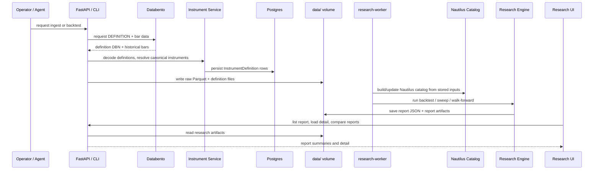
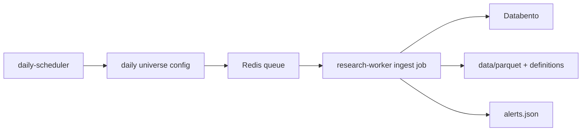
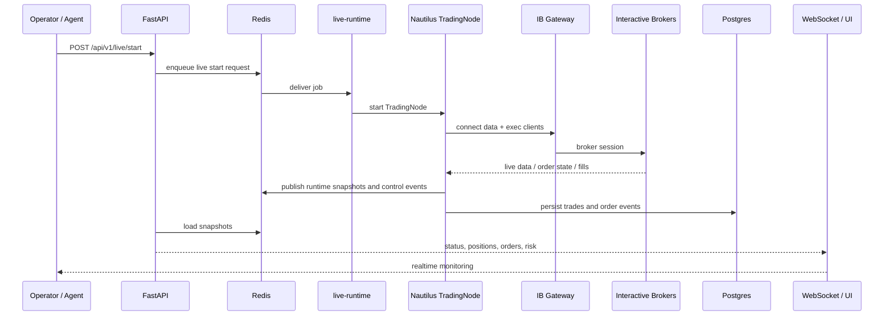
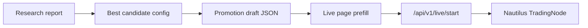
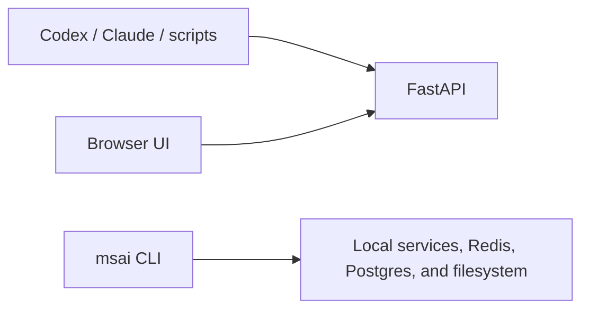

# Data Flows

This document describes the two main modes of the platform:

- the slow path: historical ingest, catalog build, backtests, research
- the fast path: live market data, live decisions, live execution, live state

## Shared Design Principle

The system tries to keep one strategy implementation and two runtime modes:

- research mode through Nautilus backtesting
- live mode through Nautilus live trading

That matches Nautilus' live-trading model, where the same strategies and
execution logic are intended to run against both backtest and live nodes:
[Nautilus live trading](https://nautilustrader.io/docs/latest/concepts/live/).

## Slow Path: Historical Research

### High-level flow

### Step-by-step

1. A user or agent starts from the API, UI, or CLI.
2. Historical market data is fetched from Databento.
3. Databento instrument definitions are fetched first and persisted.
4. Raw bars are written under `data/parquet`.
5. The Nautilus catalog is built under `data/nautilus`.
6. Nautilus backtests run on top of that catalog.
7. The research engine saves sweep and walk-forward reports under
   `data/research`.
8. The Research UI and API read those reports and allow comparison and
   promotion.

### Why definitions are loaded first

This repo intentionally follows Nautilus' Databento guidance:

- load `DEFINITION` files before market data
- write instruments to the catalog before bars/trades/quotes

That is documented in the official integration guide:
[Nautilus Databento integration](https://nautilustrader.io/docs/latest/integrations/databento/).

### Daily refresh flow

The daily refresh path is separate from ad hoc ingest:

Current behavior:

- a dedicated `daily-scheduler` container polls once per minute
- when the configured time is reached, it enqueues daily ingest jobs
- the ingest requests come from the persisted daily universe
- failures emit alerts into the alert feed

## Fast Path: Live Trading

### High-level flow

### Step-by-step

1. The operator starts live through the UI, API, or CLI.
2. The backend validates the request and queues it to the dedicated
   `live-runtime` worker.
3. The `live-runtime` worker owns the live lifecycle and calls the Nautilus
   trading-node manager.
4. The Nautilus live node connects to Interactive Brokers through the
   `ib-gateway` container.
5. Nautilus publishes runtime state through Redis-backed snapshot streams.
6. The backend reads those snapshots and exposes them through REST and WebSocket
   APIs.
7. The UI shows the live positions, orders, risk, and event feed.

### Why the API does not own the trading process directly

The API used to be too close to the trading runtime. The dedicated
`live-runtime` worker exists so the live lane is:

- isolated from normal HTTP request handling
- closer to Compose and later VM deployment boundaries
- easier to reason about as a single trading-runtime service

This is the current bridge between a one-machine Compose deployment and later
service separation.

### Where live data comes from today

Current provider split:

- historical data for research: Databento
- live streaming data: Interactive Brokers
- live execution: Interactive Brokers

That means the strategy code is shared, but the data provider is different
across research and live today. This is a deliberate tradeoff for the current
phase, not perfect parity.

## Promotion Flow: Research To Live

Important guardrail:

- the best sweep result is not auto-deployed
- a human or calling client must explicitly promote it

That keeps a review checkpoint between research optimism and live execution.

## API-First Interaction Model

Every important capability is expected to be reachable two ways:

- through the UI
- through the API

The CLI is a third convenience layer for local developer/operator workflows.

Practical meaning:

- the UI should never have a capability that only exists in the browser
- agent-driven strategy iteration should be able to use the same backend
  surfaces the browser uses
- the documentation and tests should treat the API as the canonical contract
- the CLI is useful locally, but it is not the primary integration boundary

## Where To Look In Code

Historical path:

- [data_ingestion.py](/Users/pablomarin/Code/msai-v2/codex-version/backend/src/msai/services/data_ingestion.py)
- [instrument_service.py](/Users/pablomarin/Code/msai-v2/codex-version/backend/src/msai/services/nautilus/instrument_service.py)
- [catalog_builder.py](/Users/pablomarin/Code/msai-v2/codex-version/backend/src/msai/services/nautilus/catalog_builder.py)
- [backtest_runner.py](/Users/pablomarin/Code/msai-v2/codex-version/backend/src/msai/services/nautilus/backtest_runner.py)
- [research_engine.py](/Users/pablomarin/Code/msai-v2/codex-version/backend/src/msai/services/research_engine.py)

Live path:

- [live.py](/Users/pablomarin/Code/msai-v2/codex-version/backend/src/msai/api/live.py)
- [live_runtime.py](/Users/pablomarin/Code/msai-v2/codex-version/backend/src/msai/services/live_runtime.py)
- [workers/live_runtime.py](/Users/pablomarin/Code/msai-v2/codex-version/backend/src/msai/workers/live_runtime.py)
- [trading_node.py](/Users/pablomarin/Code/msai-v2/codex-version/backend/src/msai/services/nautilus/trading_node.py)
- [live_state.py](/Users/pablomarin/Code/msai-v2/codex-version/backend/src/msai/services/nautilus/live_state.py)

## Known Gaps

These docs describe how the system works today, not how we wish it worked.

Current important gaps:

- broker-connected paper E2E still depends on the IB paper account being active
- live market visualization is richer than before, but it is still not a full
  institutional tick-chart terminal
- Databento historical and IB live mean the engine is shared, but the market
  data source is not fully identical yet
- paper burn-in and Azure ops hardening remain required before real capital
