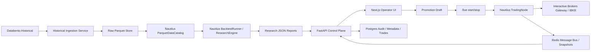

# Platform Overview

For the fuller current-state documentation set, read this together with:

- [System Topology](./system-topology.md)
- [Module Map](./module-map.md)
- [Data Flows](./data-flows.md)

## Goal

Build a single platform that can:

- ingest historical market data for research
- normalize that data into NautilusTrader catalogs
- run backtests, parameter sweeps, and walk-forward validation
- surface results in the UI for comparison and promotion
- deploy selected strategies into paper/live trading against Interactive Brokers

## High-Level Shape

## Main Components

### Frontend

Path: `frontend/`

The Next.js frontend provides three operator surfaces that matter most right now:

- `Backtests`: run one-off backtests and inspect completed results
- `Research`: inspect saved parameter sweep and walk-forward reports, compare
  them side by side, and create paper-trading promotion drafts
- `Live Trading`: deploy a strategy, monitor live status/positions, and trigger
  safe stop / kill-all workflows

### Backend API

Path: `backend/src/msai/api/`

The FastAPI backend is a control plane, not a replacement trading engine.
It is responsible for:

- auth and API key access
- strategy discovery and validation
- backtest job orchestration
- research artifact APIs
- promotion draft creation
- live deployment control
- audit logging and persistence

### NautilusTrader Layer

Path: `backend/src/msai/services/nautilus/`

NautilusTrader is the core trading runtime. We intentionally rely on it for:

- normalized `Instrument` handling
- research catalog reads
- `BacktestRunner` execution
- live `TradingNode` runtime
- live portfolio/cache/controller behavior
- external message-bus driven state propagation

### Data Providers

- Databento: primary historical research data for US equities and CME futures
- Interactive Brokers: live execution venue and live broker/account state

We do not use Interactive Brokers as the main historical research backbone.

### Persistence

- Postgres:
  - users
  - strategies
  - backtests
  - live deployments
  - live order events
  - fills/trades
  - audit logs
- Redis:
  - job queue
  - live runtime snapshots
  - control-plane streams
- Filesystem:
  - raw Parquet
  - Databento definition DBN files
  - Nautilus data catalog
  - HTML backtest reports
  - JSON research reports
  - JSON promotion drafts

## Runtime Boundaries

### Research Path

1. Historical data is fetched from Databento.
2. Databento instrument definitions are downloaded and persisted.
3. Raw market data is written to `data/parquet`.
4. Nautilus catalog data is built from the raw files plus persisted definitions.
5. `ResearchEngine` runs parameter sweeps or walk-forward validation on top of
   the Nautilus catalog.
6. The report is saved under `data/research/*.json`.
7. The Research UI reads those reports through `/api/v1/research/...`.

### Live Path

1. A selected strategy config is promoted into a paper-trading draft.
2. The Live UI reads that promotion draft and prefills the paper deploy form.
3. `/api/v1/live/start` resolves instruments and starts a Nautilus `TradingNode`.
4. Nautilus publishes runtime state through Redis.
5. The backend consumes those snapshots and exposes them to the UI.
6. Safe stop / kill-all flows use Nautilus control messages rather than ad hoc
   sidecar state.

## Where The Platform Is Strong Today

- Historical research for US equities and CME futures is now Databento-first.
- Research backtests use persisted Nautilus-compatible Databento definitions
  rather than synthetic bootstrap instruments.
- The live stack is Nautilus-led and IB-backed rather than a mock stub.
- Research results can now move into paper-trading drafts through a supported UI
  path instead of manual edits.
- The browser and backend tests now cover the Phase 3 research flow.

## Current Limits

- Broker-connected paper E2E still depends on the IB paper account being active.
- Research report artifacts summarize metrics/configs, but they are not yet a
  full experiment database with every per-run trade artifact preserved.
- Azure production deployment hardening is still a separate phase.
- The platform is safer and more coherent now, but it still requires staged
  paper validation before any real capital deployment.
