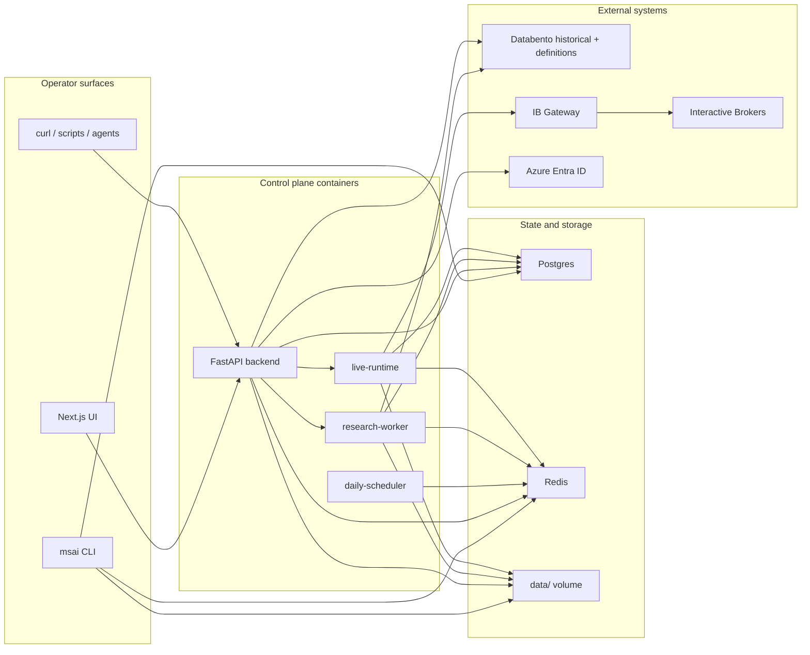

# System Topology

This document explains the system as it exists today in the Compose-first
deployment shape.

The guiding design choice is:

- NautilusTrader owns trading-engine behavior.
- MSAI owns the control plane around it.

That means MSAI is responsible for API orchestration, UI, scheduling,
promotion, audit, and persistence, while Nautilus owns the trading runtime,
portfolio/cache/message-bus internals, and broker-facing strategy execution.

## Topology

## Service Roles

| Service | Role | Reads | Writes |
|---|---|---|---|
| `frontend` | Operator UI for data, backtests, research, live monitoring | Backend API | Browser state only |
| `backend` | API-first control plane | Postgres, Redis, filesystem snapshots, Entra, live snapshots | Postgres, Redis, filesystem artifacts |
| `research-worker` | Runs ingest jobs, backtests, sweeps, walk-forward jobs | Databento, strategies, filesystem, Redis jobs | Parquet, Nautilus catalog, reports, alerts, job state |
| `live-runtime` | Owns live start/stop/status/kill-all requests | Redis jobs, Postgres, strategies, IB Gateway | live deployments, order events, trades, live snapshots |
| `daily-scheduler` | Enqueues recurring historical refresh jobs | scheduler config, Redis | scheduler state, queued ingest jobs, alerts |
| `postgres` | Durable metadata and audit store | N/A | users, strategies, backtests, deployments, trades, order events |
| `redis` | queue + snapshot + control transport | N/A | ARQ jobs, live runtime snapshots, message streams |
| `ib-gateway` | broker connectivity bridge for Nautilus live nodes | IB credentials | live broker session |

## Nautilus-Centric Mapping

The platform is intentionally organized around official Nautilus concepts:

- Architecture and component model:
  [Nautilus architecture](https://nautilustrader.io/docs/latest/concepts/architecture/)
- Internal and external event routing:
  [Message bus](https://nautilustrader.io/docs/latest/concepts/message_bus/)
- Shared strategy code across backtest and live:
  [Live trading](https://nautilustrader.io/docs/latest/concepts/live/)
- Interactive Brokers adapter:
  [IB integration](https://nautilustrader.io/docs/latest/integrations/ib/)
- Databento adapter and definition-first catalog loading:
  [Databento integration](https://nautilustrader.io/docs/latest/integrations/databento/)

This repo maps those concepts like this:

| Nautilus concept | How MSAI uses it today |
|---|---|
| `Instrument` | persisted through `InstrumentDefinition` rows and reused for research/live instrument resolution |
| `ParquetDataCatalog` | research data store under `data/nautilus` |
| `BacktestRunner` / backtest engine | one-off backtests, parameter sweeps, walk-forward evaluation |
| `TradingNode` | live execution runtime |
| internal message bus | inside Nautilus runtime |
| external message bus / streams | bridged out through Redis-backed snapshots and control messages |
| portfolio/cache | source of live state inside the live controller |
| live execution reconciliation | trusted inside live-node startup/runtime more than ad hoc API-side polling |

## Runtime Boundaries

### Control plane

The control plane lives in:

- [backend/src/msai/api](/Users/pablomarin/Code/msai-v2/codex-version/backend/src/msai/api)
- [backend/src/msai/core](/Users/pablomarin/Code/msai-v2/codex-version/backend/src/msai/core)
- [frontend/src/app](/Users/pablomarin/Code/msai-v2/codex-version/frontend/src/app)

Responsibilities:

- auth
- HTTP API
- WebSocket fanout
- strategy discovery
- job submission
- report browsing
- promotion drafts
- operator actions
- audit and metadata persistence

### Research runtime

The research runtime lives in:

- [backend/src/msai/services/data_ingestion.py](/Users/pablomarin/Code/msai-v2/codex-version/backend/src/msai/services/data_ingestion.py)
- [backend/src/msai/services/research_engine.py](/Users/pablomarin/Code/msai-v2/codex-version/backend/src/msai/services/research_engine.py)
- [backend/src/msai/workers/research_job.py](/Users/pablomarin/Code/msai-v2/codex-version/backend/src/msai/workers/research_job.py)

Responsibilities:

- historical ingest
- Databento definition ingestion
- Parquet writes
- catalog preparation
- research execution
- report persistence

### Live runtime

The live runtime lives in:

- [backend/src/msai/services/live_runtime.py](/Users/pablomarin/Code/msai-v2/codex-version/backend/src/msai/services/live_runtime.py)
- [backend/src/msai/workers/live_runtime.py](/Users/pablomarin/Code/msai-v2/codex-version/backend/src/msai/workers/live_runtime.py)
- [backend/src/msai/services/nautilus/trading_node.py](/Users/pablomarin/Code/msai-v2/codex-version/backend/src/msai/services/nautilus/trading_node.py)
- [backend/src/msai/services/nautilus/live_state.py](/Users/pablomarin/Code/msai-v2/codex-version/backend/src/msai/services/nautilus/live_state.py)

Responsibilities:

- start/stop/kill requests
- live node ownership
- IB-backed live data and execution
- runtime snapshots
- live order-event persistence
- live trade persistence

## Why Everything Is Container-Separated Even On One Machine

The current rollout plan deliberately keeps services separated as containers
before splitting them across machines or managed services.

That gives us:

- one-machine operational simplicity today
- clean ownership boundaries between services
- easier debugging than a distributed deployment
- lower migration cost when moving later to Azure VM or managed services

See the rollout plan in
[2026-04-07-azure-rollout-plan.md](/Users/pablomarin/Code/msai-v2/codex-version/docs/plans/2026-04-07-azure-rollout-plan.md)
for the phased deployment path.
