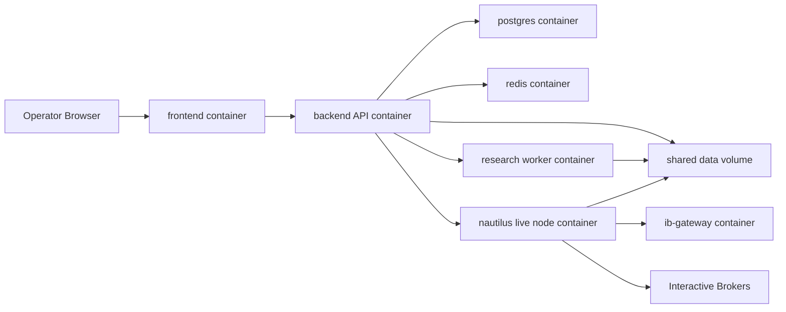
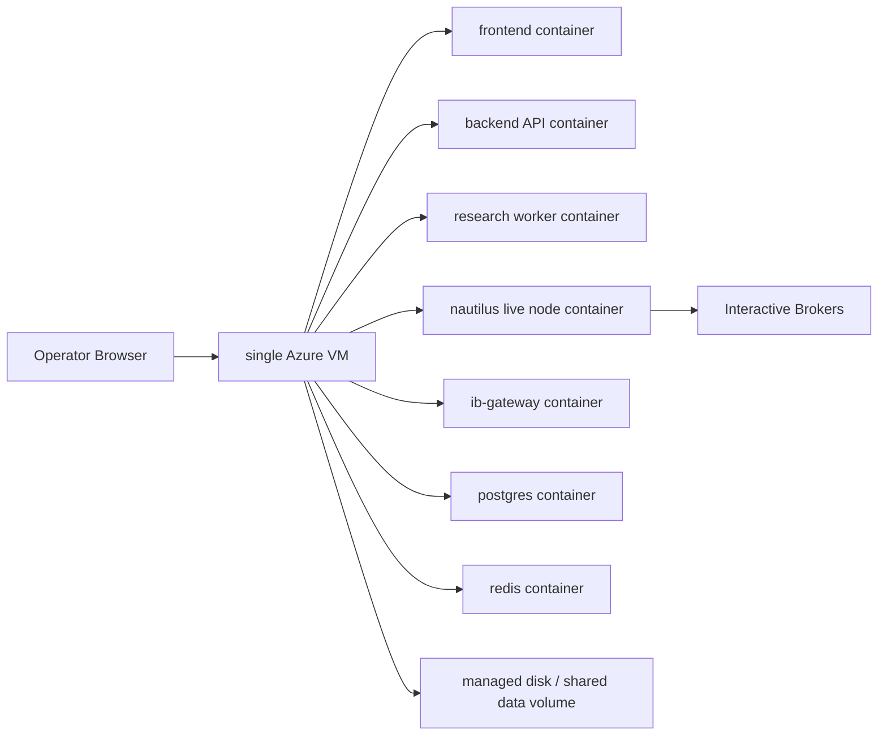
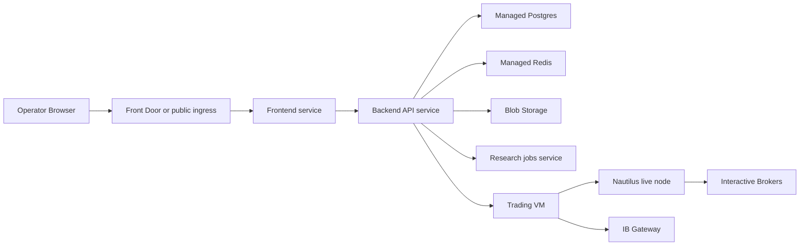
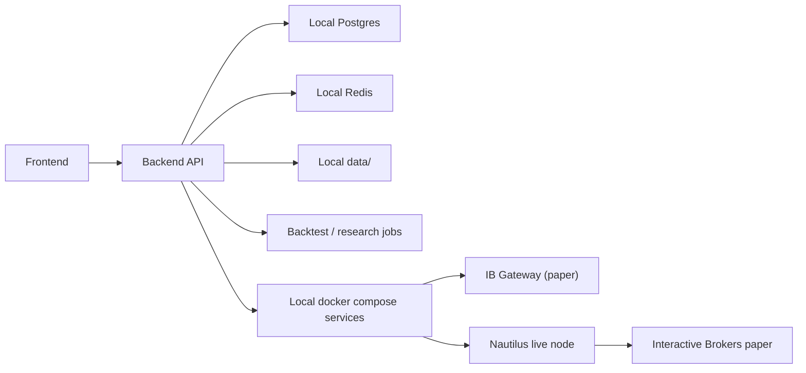

# Azure Deployment Research And Rollout Plan

Date: 2026-04-07
Scope: `codex-version`
Status: Recommended target architecture for later execution

## Executive Summary

The rollout order should be:

1. make the entire platform work end to end in Docker Compose on one machine
2. move that same Compose stack to one Azure VM so the local workstation is no
   longer part of the uptime story
3. only after that is stable, split pieces into managed Azure services

So the best first production target is not a distributed Azure design.
It is a production-shaped Compose deployment with separate containers for:

- frontend
- backend API
- research worker
- Nautilus live node
- IB Gateway
- Postgres
- Redis

plus a shared `data/` volume.

This gives the fastest path to proving the real system:

- Databento ingest
- Nautilus backtests
- strategy research in the UI
- promotion into paper trading
- IB Gateway connectivity
- paper trade execution
- stop / kill / restart behavior

Once that works, moving the same stack to a single Azure VM is much lower risk
than trying to distribute the architecture prematurely.

## Why This Is The Recommendation

### 1. Nautilus + IB Gateway should stay together

NautilusTrader’s Interactive Brokers integration explicitly supports IB Gateway
and recommends a dockerized IB Gateway for automated deployments and hosted cloud
platforms. Nautilus also expects its live runtime to be centered around the
live trading node, cache, message bus, and portfolio model.

Sources:

- [Nautilus Interactive Brokers integration](https://nautilustrader.io/docs/latest/integrations/ib/)
- [Nautilus live trading concepts](https://nautilustrader.io/docs/latest/concepts/live/)
- [Nautilus message bus concepts](https://nautilustrader.io/docs/latest/concepts/message_bus/)

Implication:

- run IB Gateway and the Nautilus live node on the same dedicated VM
- keep that VM private
- treat it as a singleton broker-connected runtime, not a horizontally scaled
  web workload

### 2. Databento and backtests belong in a separate research plane

Nautilus’ Databento integration is explicit that instrument definitions from the
`DEFINITION` schema should be loaded before catalog market data. That fits a
research/job workload much better than an always-on singleton VM design.

Source:

- [Nautilus Databento integration](https://nautilustrader.io/docs/latest/integrations/databento/)

Implication:

- backtests, parameter sweeps, and walk-forward runs should be job-oriented
- Azure Container Apps Jobs fit this well

### 3. Azure Container Apps fits the control plane and research jobs

Azure Container Apps is designed for APIs, background processing jobs,
event-driven workloads, internal ingress, service discovery, and Log Analytics
integration.

Source:

- [Azure Container Apps overview](https://learn.microsoft.com/en-us/azure/container-apps/overview)

Implication:

- use Container Apps for the API and frontend
- use Container Apps Jobs for scheduled or on-demand research execution

### 4. Azure Container Instances is not the right default for the live trader

Azure Container Instances is great for simple container groups, but Microsoft’s
docs explicitly note that:

- if a container group restarts, its IP can change
- container groups may restart due to platform maintenance
- VNet deployments require a NAT gateway for outbound connectivity

Source:

- [Azure Container Instances overview](https://learn.microsoft.com/en-us/azure/container-instances/container-instances-overview)

Implication:

- ACI is acceptable for burst jobs or experiments
- it is not the best first home for the always-on broker-connected live node

### 5. AKS is powerful, but too much too early

AKS is the right service when you truly need a managed Kubernetes platform for
high availability, scale, portability, and multi-service orchestration.

Source:

- [What is AKS?](https://learn.microsoft.com/en-us/azure/aks/what-is-aks)

Implication:

- do not start with AKS
- it adds operational complexity before the platform has earned it
- move there later only if research/job scale or multi-service needs justify it

## Recommended Rollout Topology

### Phase 1: Single-machine Docker Compose

This is the recommended first target.

One machine does not mean one process. The services should still be separated
into containers so the later split is mechanical rather than architectural.

### Phase 2: Same Compose stack on one Azure VM

This phase is about removing dependence on the workstation:

- no laptop sleep or reboot risk
- no home office outage risk
- no local resource contention

### Phase 3: Selective decomposition into services

This should happen only after the single-VM paper environment is already stable.

## Container Boundaries To Preserve From Day One

Even in the single-machine Compose phase, keep these as separate containers:

- `frontend`
- `backend-api`
- `research-worker`
- `daily-scheduler`
- `nautilus-live-node`
- `ib-gateway`
- `postgres`
- `redis`

Why:

- easier fault isolation
- easier restart behavior
- easier logs and resource control
- easier later split into Azure services

This is the key bridge between “simple now” and “separable later”.

## Service Roles

### `frontend`

Role:

- operator UI
- backtest and research pages
- promotion workflow
- live deployment controls

Why separate:

- independent web lifecycle
- easy future move to its own Azure web service

### `backend-api`

Role:

- auth
- orchestration
- strategy registry
- backtest and research APIs
- promotion APIs
- live control-plane APIs
- audit logging

Why separate:

- central control plane
- should scale and deploy independently from workers and broker runtime

### `research-worker`

Role:

- background backtests
- parameter sweeps
- walk-forward jobs
- future scheduled ingestion or research jobs

Why separate:

- batch workload profile is different from the API
- failures or long jobs should not impact the web/API process

### `daily-scheduler`

Role:

- enqueue the canonical daily Databento refresh for the starter universe
- keep historical research data current without host-level cron
- preserve the exact same operational behavior from local Compose to Azure VM

Why separate:

- scheduler lifecycle should not be tied to the API request loop
- makes daily refresh portable across environments
- avoids hidden machine-specific cron setup

### `nautilus-live-node`

Role:

- live trading runtime
- strategy execution
- broker-facing Nautilus state
- runtime message publication

Why separate:

- broker-connected singleton runtime
- should be restartable and observable independently from the API
- should remain the closest container to `ib-gateway`

### `ib-gateway`

Role:

- Interactive Brokers connectivity
- market data and order routing bridge to IBKR

Why separate:

- broker dependency has different lifecycle and failure modes
- should stay isolated from app restarts

### `postgres`

Role:

- durable metadata store
- users, strategies, backtests, deployments, trades, audit logs

Why separate:

- independent persistence lifecycle
- easy later move to managed Postgres

### `redis`

Role:

- queueing
- runtime snapshots
- message and coordination layer

Why separate:

- independent persistence/performance behavior
- easy later move to managed Redis

## Current Compose Status In This Repo

Today, the Compose files already give us most of the target boundaries:

- `frontend`
- `backend`
- `research-worker`
- `live-runtime`
- `ib-gateway`
- `postgres`
- `redis`

Files:

- [docker-compose.dev.yml](/Users/pablomarin/Code/msai-v2/codex-version/docker-compose.dev.yml)
- [docker-compose.prod.yml](/Users/pablomarin/Code/msai-v2/codex-version/docker-compose.prod.yml)

What is still missing relative to the target rollout shape:

- `live-runtime` is now a first-class long-running Compose service which owns
  Nautilus live node control through the dedicated live queue
- live strategy deployments are still subprocesses managed by `live-runtime`,
  not one container per deployment
- production Compose should be run with `.env.prod` plus
  `docker compose --env-file .env.prod -f docker-compose.prod.yml ...`
- production health checks, restart semantics, and dependency sequencing still
  need continued hardening for a true one-machine production deployment

## Service-By-Service Recommendation For The Final Split

### Frontend

Azure service:

- Azure Container Apps

Reason:

- simple HTTPS app
- easy revisions and rollout
- integrates cleanly with internal/public ingress

### Backend API

Azure service:

- Azure Container Apps

Reason:

- API traffic pattern fits Container Apps well
- easy secret injection and Log Analytics integration
- internal service discovery fits the backend/frontend pairing

### Research/Backtest Workers

Azure service:

- Azure Container Apps Jobs

Reason:

- backtests and sweeps are batch workloads
- jobs can be triggered on demand from the API or schedule
- easier than keeping a permanent worker VM alive for every research workload

### Trading Runtime

Azure service:

- one dedicated Linux VM per environment

Reason:

- IB Gateway and Nautilus should stay together
- easier to supervise with `systemd` or Docker Compose
- easier to reason about restart behavior and broker connectivity
- lower ops complexity than Kubernetes for a singleton live runtime

Suggested split:

- `paper-trading-vm-01`
- later `live-trading-vm-01`

### Postgres

Azure service:

- Azure Database for PostgreSQL

Reason:

- fully managed database service
- better than self-hosting Postgres on a VM for this platform

Source:

- [Azure Database for PostgreSQL overview](https://learn.microsoft.com/en-us/azure/postgresql/overview)

### Redis

Azure service:

- Azure Managed Redis

Reason:

- low-latency in-memory store
- good fit for queues, messaging, and runtime snapshots
- Microsoft explicitly positions it for queuing and messaging patterns

Source:

- [Azure Managed Redis overview](https://learn.microsoft.com/en-us/azure/redis/overview)

### Object Storage

Azure service:

- Azure Blob Storage

Reason:

- object storage for large unstructured data
- good target for raw data, reports, catalogs, archives, and backups

Source:

- [Azure Blob Storage introduction](https://learn.microsoft.com/en-us/azure/storage/blobs/storage-blobs-introduction)

### Shared Filesystem

Near-term service:

- Azure Files

Reason:

- the current codebase is still path- and filesystem-oriented in several places
- this is the shortest bridge to Azure without rewriting the entire storage model

Target state:

- Blob as the system of record
- local SSD / temp disk caching where needed for speed

## Answer To The “One VM Has Data?” Question

I do **not** recommend a dedicated “data VM”.

Instead:

- Postgres should be managed
- Redis should be managed
- historical and report artifacts should live in Blob Storage
- near-term shared paths can live in Azure Files

In phase 1 and phase 2, Postgres and Redis can still live on the same host as
containers. But conceptually they should remain separate services.

The only VM I strongly recommend in the final split is the trading VM, because
the broker-connected runtime is the one place where singleton process
supervision matters most.

## Local Development Shape

Before Azure, the local shape should stay close to production:

Local stack:

- Docker Compose
- frontend container
- backend API container
- research worker container
- Nautilus live-node container
- IB Gateway container
- Postgres container
- Redis container
- shared local `data/` volume

This is still the best way to debug ingestion, research, paper deployment, and
promotion flow before moving to Azure.

## Recommended Rollout Plan

## Phase A: Single-machine Docker Compose first

Goal:

- prove the whole platform works end to end on one host
- keep local the fast iteration loop for Codex/agents and strategy development

Work:

- make Docker Compose the primary production-shaped deployment target
- keep all major roles in separate containers
- make the shared `data/` volume work across API, worker, and live node
- keep local Databento ingestion and research jobs working
- keep local paper trading working against paper IB Gateway
- prove promotion from research to paper trading through the UI

Success criteria:

- local research E2E works
- local paper deployment flow works
- local promotion flow works
- local paper trades actually execute through IB Gateway
- stop / kill / restart behavior works cleanly on the same machine

## Phase B: Move the same stack to one Azure VM

Goal:

- get the proven stack off the workstation and onto an always-on host

Environment:

- one large Azure Linux VM
- Docker Compose
- frontend container
- backend API container
- research worker container
- Nautilus live-node container
- IB Gateway container
- Postgres container
- Redis container
- managed disk / shared data volume
- secure secret injection
- monitoring and backups

Success criteria:

- browser UI works on the Azure host
- research jobs run on the Azure host and save artifacts
- promotion drafts can be created and used there
- paper trading runs there without depending on the local machine
- outages or reboots on the local workstation do not affect the system

## Phase C: 30-day Azure paper burn-in

Goal:

- prove the system survives real operating conditions before any live-money use

Required drills:

- API restart
- trading VM restart
- IB disconnect/reconnect
- Redis restart
- stale snapshot detection
- kill-all
- graceful stop
- paper order lifecycle visibility

Success criteria:

- no orphaned exposure
- reconciliations remain correct
- alerts fire when expected
- operator runbooks are usable by someone other than the developer

## Phase D: Selective decomposition into services

Goal:

- split only the parts that now deserve to be split

Recommended order of separation:

1. move Postgres to managed Postgres
2. move Redis to managed Redis
3. move historical/report storage toward Blob or Azure Files
4. move frontend and backend API to Container Apps
5. move research workers to Container Apps Jobs
6. keep `ib-gateway` + `nautilus-live-node` together the longest

Success criteria:

- each split reduces operational risk instead of creating new ambiguity
- the system remains functionally identical to the single-VM version
- paper trading remains stable during the migration

## Phase E: Separate live environment and controlled rollout

Goal:

- start tiny, stay observable, fail safe

Sequence:

1. one strategy
2. one account
3. one asset bucket
4. tiny capital allocation
5. tight kill-switch rules
6. daily reconciliation review

Only after this should multi-strategy or broader capital rollout be considered.

## CI/CD And Codex Workflow

This is how I recommend the day-to-day workflow:

1. Strategy code lives in Git.
2. Codex or agents add strategies and research improvements locally first.
3. CI builds images into Azure Container Registry.
4. Merge first updates the Compose deployment target.
5. Later, once the stack is split, the same images can deploy to their Azure services.
6. Research artifacts are reviewed in the Research UI.
7. Promotion creates a paper draft.
8. The Live UI consumes that draft and starts Nautilus paper trading.

## Secrets And Security

Use Azure Key Vault for:

- Databento API key
- IB paper/live credentials
- database connection strings
- API keys

Operational controls:

- no public SSH to the trading VM
- use private networking + Bastion
- separate paper and live credentials
- separate paper and live resource groups
- separate paper and live trading VMs

## What Is Still Missing Before Execution

Before actually doing the Azure rollout, the platform still needs:

- broker-connected paper E2E with the active IB paper account
- Azure environment templates / infrastructure as code
- deploy scripts or GitHub Actions
- better observability and alert rules
- final runbooks for restart, reconcile, and failover

## Final Recommendation

If the goal is a robust platform for:

- research
- backtesting
- promotion
- paper trading
- later live trading

then the best rollout order is:

1. Docker Compose on one machine, with separate containers
2. the same Compose stack on one Azure VM
3. selective decomposition into managed services
4. live rollout only after Azure paper burn-in

Do not start with:

- AKS
- a dedicated data VM
- a distributed Azure architecture before the single-machine stack is stable
- ACI as the main always-on trading runtime

Those may become useful later, but they are not the best first production path
for this codebase and this operating model.
