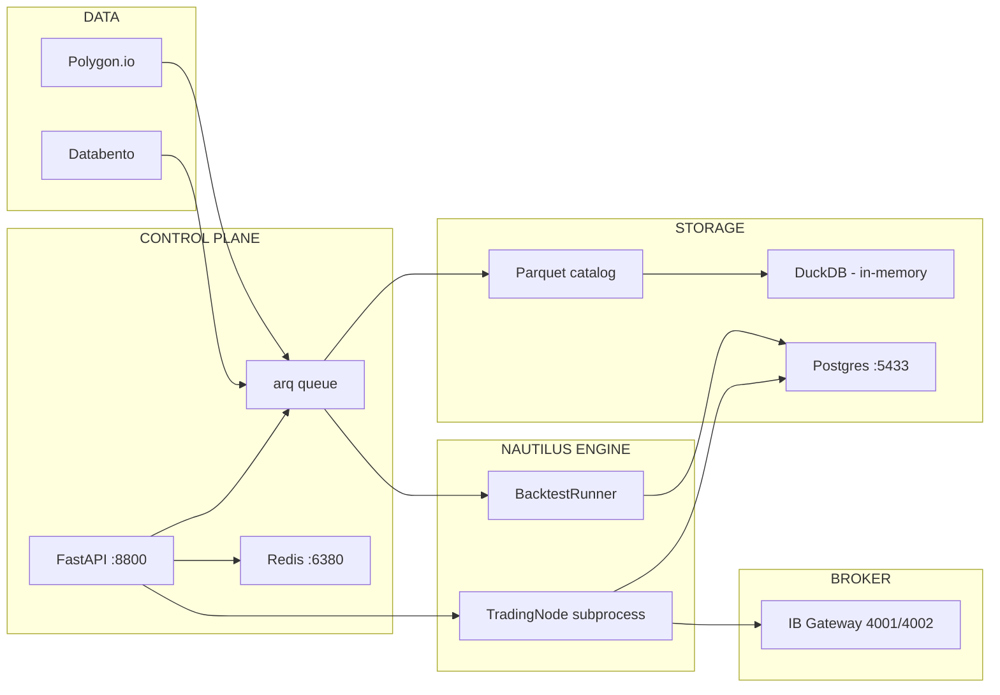

<!-- forge:doc developer-journey -->

# The Developer Journey — From Blank Repo to Live P&L

This is the front-of-house orientation for MSAI v2. It walks you through the end-to-end path: pulling the repo, registering the symbols you want to trade, authoring a strategy, backtesting it, sweeping its parameters, graduating the winners, composing them into a portfolio, deploying that portfolio to a real Interactive Brokers account, and watching the result on a real-time dashboard.

If you've ever read the [NautilusTrader home-page diagram](https://nautilustrader.io) and thought "I want to use this engine, but as a product," — that is what MSAI v2 is. Nautilus is the engine. MSAI is the cockpit, the audit trail, the parameter sweeps, the portfolio composition, the live supervisor, and the dashboard.

You will encounter every operation through three surfaces: **API** (the contract), **CLI** (`uv run msai …` for scripting and ops), and **UI** (the Next.js dashboard at `:3300`). The [Detailed Rules](../../CLAUDE.md#detailed-rules) declare the order: **API-first, CLI-second, UI-third** — but the parity is real, and each how-to in this set documents it explicitly.

---

## The Component Diagram

Read top-to-bottom: where data enters, where commands enter, where state lands.

```
                ┌─ DATA SOURCES ───────────────┐    ┌─ CONTROL PLANE ──────────────────┐
                │                              │    │                                  │
                │   Polygon.io     Databento   │    │   FastAPI  ── arq queue ── Redis │
                │   (stocks)       (futures)   │    │   :8800     workers       :6380  │
                │                              │    │                                  │
                └────────┬──────────┬──────────┘    └──────┬───────────────────────────┘
                         │          │                      │
                         ▼          ▼                      ▼
              ┌─ INGEST ──────────────────────┐  ┌─ INSTRUMENT REGISTRY ──────────────┐
              │  msai symbols onboard         │  │  instrument_definitions   (UUIDs)  │
              │  → bootstrap → ingest →       │  │  instrument_aliases       (windows)│
              │    coverage → IB qualify      │  │  SecurityMaster.resolve_*          │
              └────────┬──────────────────────┘  └──────────┬─────────────────────────┘
                       │                                    │
                       ▼                                    │
              ┌─ PARQUET CATALOG ─────────────┐              │
              │  {DATA_ROOT}/parquet/         │              │
              │    {asset}/{symbol}/          │              │
              │      {YYYY}/{MM}.parquet      │◄─────────────┘
              │                               │
              │  DuckDB reads (in-memory)     │
              └────────┬──────────────────────┘
                       │
        ┌──────────────┼─────────────────┐
        │              │                 │
        ▼              ▼                 ▼
 ┌─ BACKTEST ──┐  ┌─ RESEARCH ──┐  ┌─ GRADUATION ─────┐
 │ BacktestRunner│ │ Param sweep │  │ 9-stage state    │
 │ (spawns subproc)│ │ Walk-forward│ │ machine →        │
 │ + QuantStats  │ │ → ResearchTrial│ │ GraduationCandidate│
 └──────┬────────┘ └──────┬──────┘  └─────────┬────────┘
        │                 │                   │
        │                 └───── promote ─────┤
        │                                     ▼
        │                          ┌─ BACKTEST PORTFOLIO ─┐
        │                          │ /api/v1/portfolios   │
        │                          │ allocates Candidates │
        │                          │ → PortfolioRun       │
        │                          └──────────┬───────────┘
        │                                     │ (vetted)
        │                                     ▼
        │                          ┌─ LIVE PORTFOLIO ─────┐
        │                          │ /api/v1/live-portfolios│
        │                          │ → Revision (frozen)  │
        │                          │ → /live/start-portfolio│
        │                          └──────────┬───────────┘
        │                                     │
        │                                     ▼
        │                          ┌─ LIVE SUPERVISOR ────┐
        │                          │ ProcessManager spawns│
        │                          │ TradingNode in a     │
        │                          │ multiprocessing.Process│
        │                          │ Heartbeat + cmd bus  │
        │                          │ (Redis Streams + PEL)│
        │                          └──────────┬───────────┘
        │                                     │
        │                                     ▼
        │                          ┌─ IB GATEWAY ─────────┐
        │                          │ paper :4002          │
        │                          │ live  :4001          │
        │                          └──────────┬───────────┘
        │                                     │
        │                                     ▼
        │                          ┌─ EXECUTION ──────────┐
        │                          │ Order events         │
        │                          │ Fill events          │
        │                          │ Reconciliation       │
        │                          └──────────┬───────────┘
        │                                     │
        ▼                                     ▼
 ┌─ POSTGRES ──────────────────────────────────────────────┐
 │  ~30 tables — strategies, backtests, research_jobs,     │
 │  graduation_candidates, portfolios, live_deployments,   │
 │  trades, orders, alerts, audit logs                     │
 └────────────┬────────────────────────────────────────────┘
              │
              ▼
 ┌─ REAL-TIME MONITORING ──────────────────────────────────┐
 │  WS /api/v1/live/stream/{deployment_id}                 │
 │  → Dashboard P&L · positions · halt-flag · alerts       │
 └─────────────────────────────────────────────────────────┘
```

The dotted-line groupings are conceptual layers; the arrows are real data and command flow. Every box is one of the eight how-tos in this set.

---

## The Eight Steps (and the Documents That Cover Them)

### 1. [Get the symbols you want to trade](how-symbols-work.md)

Before anything else, the system has to know what `AAPL`, `ES`, `EUR/USD` actually are: which exchange, which contract, which trading hours, which provider has data. You **onboard** symbols via `POST /api/v1/symbols/onboard` (or `msai symbols onboard --manifest <path>`, which is manifest-file-driven and POSTs the same body, or the **Data Management** UI page). The orchestrator runs a four-phase pipeline per symbol — _bootstrap → ingest → coverage check → optional IB qualification_ — and writes Parquet files at `{DATA_ROOT}/parquet/{asset}/{symbol}/{YYYY}/{MM}.parquet`. The instrument registry (`instrument_definitions` + `instrument_aliases`) becomes the single source of truth for "what does `AAPL` resolve to right now?" — including futures roll windows. Daily refresh keeps the catalog current.

### 2. [Author a strategy](how-strategies-work.md)

A strategy is a Python file in `strategies/` that subclasses NautilusTrader's `Strategy`. There is no "create strategy" API in Phase 1 — strategies live in git, period. The system **discovers** them by scanning the directory; the registry stores each one's `code_hash` (SHA256 of the file plus its sibling `config.py`), `strategy_class` name, `config_schema` (JSON Schema extracted from the strategy's `*Config` class), and `default_config`. When you list strategies via `GET /api/v1/strategies/`, `msai strategy list`, or the **/strategies** UI, the registry re-syncs the directory before responding. `POST /strategies/{id}/validate` confirms the file actually exposes a valid `Strategy` subclass without instantiating it.

### 3. [Backtest a single strategy](how-backtesting-works.md)

Now you run the strategy against historical bars. `POST /api/v1/backtests/run` (or `msai backtest run`, or the **/backtests** "New Backtest" form) enqueues an arq job. The backtest worker spawns a subprocess that loads the strategy, resolves instruments via `SecurityMaster.resolve_for_backtest(start=…)` (so historical alias windows are respected), reads Parquet through DuckDB, and runs `BacktestRunner` against per-instrument `BacktestVenueConfig` venues derived from the canonical InstrumentId suffix (e.g. `AAPL.NASDAQ` → `NASDAQ`, `ESM5.CME` → `CME`); a backtest spanning multiple venues gets one `BacktestVenueConfig` per unique venue (see `services/nautilus/backtest_runner.py:58-83`). Results plus a QuantStats HTML report are persisted at the end. Every result row stamps `code_hash`, `git_sha`, `nautilus_version`, `python_version`, and `data_snapshot` for reproducibility. You see the trade log paginated and the QuantStats report as an iframe on `/backtests/[id]`.

### 4. [Sweep parameters and walk-forward](how-research-and-selection-works.md)

A single backtest tells you how the strategy did with one config. **Research** lets you sweep many. `POST /api/v1/research/sweeps` runs a parameter grid; `POST /api/v1/research/walk-forward` runs the same sweep across rolling/anchored train+test windows. Each `ResearchJob` produces N `ResearchTrial` rows — one per `(parameters, window)` combination — with metrics, objective values, and a back-reference to the underlying backtest. When you find a winner, `POST /api/v1/research/promotions` creates a `GraduationCandidate` row at the **discovery** stage (you can promote the best trial by default, or any specific trial via the `trial_index` selector — see `api/research.py:282-289`). The **/research** page shows OOS plots, top-N tables, and a "Promote" button for each winner.

### 5. [Graduate the winners](how-graduation-works.md)

Graduation is the gate between "this looked good in research" and "this is allowed to allocate real capital." `GraduationCandidate` rows progress through a **9-stage state machine** — `discovery → validation → paper_candidate → paper_running → paper_review → live_candidate → live_running`, plus the off-path stages `paused` and `archived` (see `services/graduation.py:37-47` for the canonical `VALID_TRANSITIONS` map). Each move writes an immutable `GraduationStageTransition` row. Stage advancement freezes the candidate's metadata for that snapshot: `code_hash`, `git_sha`, walk-forward fingerprint, risk overlay status. By convention you allocate from candidates that have passed the paper-trading gate (`paper_review` or `live_candidate`), but **the API does not enforce a stage gate at portfolio composition time** — `PortfolioService.create` only verifies each `candidate_id` exists (see `services/portfolio_service.py:115-119`). Use `GET /api/v1/graduation/candidates`, `msai graduation list`, or the **/graduation** queue to inspect — the UI is the primary surface for stage transitions.

### 6. [Compose a backtest portfolio](how-backtest-portfolios-work.md)

> **Naming alert.** The **backtest portfolio** lives at URL `/api/v1/portfolios` (file `backend/src/msai/api/portfolio.py` — singular file, plural URL) and the UI at `/portfolio`. The **live portfolio** is the next document and lives at `/api/v1/live-portfolios` (file `portfolios.py` — plural file). Two domains, two files, two URLs. Codex caught this split during planning; we keep them strictly separate.

A backtest portfolio is an **allocation of `GraduationCandidate` rows** with weights — the multi-strategy × multi-symbol composition you've decided to test together. (As noted in step 5, the API only validates each candidate exists; gating on graduation stage is a workflow convention, not a constraint enforced by `PortfolioService.create`.) `POST /api/v1/portfolios` creates one; `POST /api/v1/portfolios/{id}/runs` runs a portfolio backtest as per-component fan-out followed by aggregation, with contribution analysis per component. (Walk-forward / fold logic is per-component only — no portfolio-level rebalance loop is implemented today; see doc 06 for the detail.) This is where you decide _the basket_ before deploying anything.

### 7. [Deploy a live portfolio and wire it to an IB account](how-live-portfolios-and-ib-accounts.md)

Once the basket vets out, you create a **live portfolio** at `POST /api/v1/live-portfolios`, add member strategies to its draft revision, and **freeze** that revision via `POST /api/v1/live-portfolios/{id}/snapshot`. Frozen revisions are immutable — they get a hash. To deploy, you `POST /api/v1/live/start-portfolio` with the `portfolio_revision_id`, an `account_id` (IB account — `DU…` for paper, `U…` for live), and `paper_trading: true|false`. The live supervisor spawns a TradingNode subprocess, connects to IB Gateway on port 4002 (paper) or 4001 (live), bootstraps the instruments, loads the strategies wrapped by `FailureIsolatedStrategy` (so one strategy crashing doesn't kill the node), and starts trading. The 4-layer kill-all (`POST /api/v1/live/kill-all`) gives you a panic button.

### 8. [Watch it run in real time](how-real-time-monitoring-works.md)

The **dashboard** subscribes to `WS /api/v1/live/stream/{deployment_id}`. The first message must be a JWT within 5 seconds — that's the auth handshake. On connect (and on reconnect), the server hydrates the client with the current state — orders and trades from the database, positions/account/status/halt-flag from the in-memory projection state (which the worker rebuilds from Redis if cold) — then pushes deltas as they happen. You see P&L curves, position lists, halt-flag indicators, and alert toasts. `GET /api/v1/account/summary` and `GET /api/v1/account/portfolio` give you the IB-side truth (independent of MSAI's audit), and `GET /api/v1/account/health` probes the IB Gateway connection. Each deployment is bound to one IB account; the live-trading page surfaces the currently running deployment, and you re-deploy with a different `account_id` to switch broker accounts.

---

## Component Diagram (Mermaid trial)

The text diagram above is canonical; this Mermaid version is here as a render-quality experiment. If GitHub renders this cleanly, we may use Mermaid in the per-doc sequence diagrams; if not, ASCII stays the standard.



---

## If You Only Read Three Documents

If you have to onboard fast and can't read the whole set, read these three:

1. **[How Symbols Work](how-symbols-work.md)** — because nothing else functions without instruments resolving correctly.
2. **[How Live Portfolios and IB Accounts Work](how-live-portfolios-and-ib-accounts.md)** — because that's the operationally riskiest surface and the hardest to reason about (the immutable-revision model + 3-layer idempotency + 4-layer kill-all are non-obvious).
3. **[How Real-Time Monitoring Works](how-real-time-monitoring-works.md)** — because if you can't see what's happening, you can't operate it.

The rest you can pull in as needed.

---

## Reading Order

The 8 docs are written to be read in journey order, but each is self-contained. If you bounce in from a Slack link, the first few sections of any doc will tell you what concept and surface you're looking at.

| Step | Document                                                                | Surfaces               | Lives in code                                                                           |
| ---- | ----------------------------------------------------------------------- | ---------------------- | --------------------------------------------------------------------------------------- |
| 0    | This document                                                           | —                      | docs only                                                                               |
| 1    | [Symbols](how-symbols-work.md)                                          | API + CLI + UI         | `api/symbol_onboarding.py` · `api/instruments.py` · `services/symbol_onboarding/`       |
| 2    | [Strategies](how-strategies-work.md)                                    | API + CLI + UI (+ git) | `api/strategies.py` · `services/strategy_registry.py` · `strategies/*.py`               |
| 3    | [Backtesting](how-backtesting-works.md)                                 | API + CLI + UI         | `api/backtests.py` · `workers/backtest_job.py` · `services/nautilus/backtest_runner.py` |
| 4    | [Research & Selection](how-research-and-selection-works.md)             | API + CLI + UI         | `api/research.py` · `workers/research_job.py` · `services/research_engine.py`           |
| 5    | [Graduation](how-graduation-works.md)                                   | API + CLI + UI         | `api/graduation.py` · `services/graduation.py` · `models/graduation_candidate.py`       |
| 6    | [Backtest Portfolios](how-backtest-portfolios-work.md)                  | API + CLI + UI         | `api/portfolio.py` · `services/portfolio_service.py`                                    |
| 7    | [Live Portfolios + IB Accounts](how-live-portfolios-and-ib-accounts.md) | API + CLI + UI         | `api/portfolios.py` · `api/live.py` · `live_supervisor/`                                |
| 8    | [Real-Time Monitoring](how-real-time-monitoring-works.md)               | API (WS) + CLI + UI    | `api/websocket.py` · `frontend/src/app/dashboard/`                                      |

---

## Voice and convention (for future authors)

If you're adding to this set, follow what doc 01 (`how-symbols-work.md`) does:

- **Component diagram first** (ASCII, Nautilus-style boxed components)
- **TL;DR + 3 surfaces** — one-paragraph summary, then the API/CLI/UI it lives on
- **Numbered sections** with a TOC
- **Parity table per operation** — `Intent | API | CLI | UI | Observe / Verify` — same operation across all surfaces, side-by-side
- **One internal sequence diagram** showing what the system does after the request enters MSAI (not three diagrams per surface — that triples noise)
- **§ Common Failures**, **§ Idempotency / Retry Behavior**, **§ Rollback / Repair** — every doc closes with these three
- **§ Key Files** footer — `path:line` table

Cite every claim with `path/file.py:LINE`. Lead with stable identifiers (function names, table names, route prefixes); line numbers are supporting evidence and will rot.

---

**Date verified against codebase:** 2026-04-28
**Next doc:** [How Symbols Work →](how-symbols-work.md)
