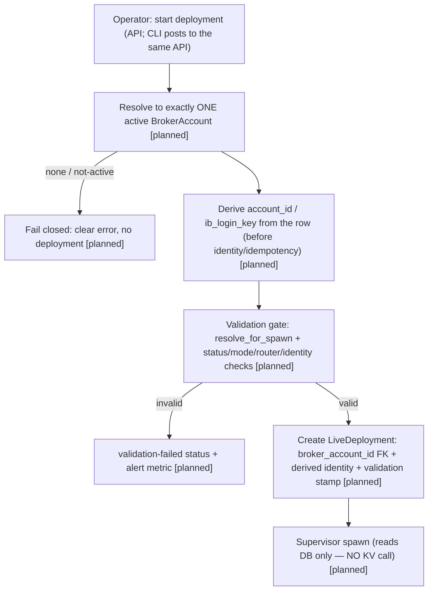

# Broker-Account Spawn-Wiring Implementation Plan

> **For agentic workers:** REQUIRED SUB-SKILL: Use superpowers:subagent-driven-development (recommended) or superpowers:executing-plans to implement this plan task-by-task. Steps use checkbox (`- [ ]`) syntax for tracking.

**Goal:** Make a PR-3 `BrokerAccount` deployable by identity: link a `LiveDeployment` to a `BrokerAccount` (nullable FK), derive `account_id`/`ib_login_key`/gateway routing from that row for new deployments, and add a fail-closed control-plane validation gate (using `resolve_for_spawn`) that refuses to deploy against an archived / mode-inconsistent / non-router-resolvable / credential-unresolvable account before the supervisor spawns a node.

**Architecture:** Council-ratified **narrowed Option A** (`docs/decisions/multi-account-broker-fleet.md`, 2026-06-02 addendum). Control-plane-only: a nullable additive FK + a deploy/start-time resolve→derive→validate step that runs at the TOP of the API `/live/start-portfolio` handler (before identity/idempotency/binding), with the CLI as a thin HTTP client of that API. The supervisor per-spawn/warm-restart path is NOT touched and makes NO KV call. Gateway working credentials remain env/rendered (Option B deferred); no per-account containers (Option C deferred). The gate validates account identity + credential **resolvability**; it does NOT prove the gateway authenticated with those credentials.

**Tech Stack:** Python 3.12, SQLAlchemy 2.0 (async), Alembic, PostgreSQL 16, NautilusTrader 1.223.0 (IB adapter — unchanged), Azure Key Vault / file store (read-only via existing `resolve_for_spawn`), pytest.

---

## Approach Comparison

### Chosen Default

**Narrowed Option A** — nullable additive `LiveDeployment.broker_account_id` FK; new deploy/start flows resolve exactly one ACTIVE `BrokerAccount` and derive identity from the row; `resolve_for_spawn` used ONLY as a control-plane deploy-time validation gate (not node wiring, not on the supervisor per-spawn path); legacy string fallback for existing rows.

### Best Credible Alternative

**Option B** — wire `resolve_for_spawn` into the gateway-env render path (`msai-render-env`/`GATEWAY_CONFIG`) so a `BrokerAccount`'s KV creds actually authenticate its gateway.

### Scoring (fixed axes)

| Axis                  | Default (A)                          | Alternative (B)                                    |
| --------------------- | ------------------------------------ | -------------------------------------------------- |
| Complexity            | M                                    | H                                                  |
| Blast Radius          | L (control-plane only; additive FK)  | H (touches frozen cloud-init render unit + deploy) |
| Reversibility         | H (nullable FK, additive)            | M                                                  |
| Time to Validate      | L (off-hours paper LVP)              | H (gateway-render spike + likely market hours)     |
| User/Correctness Risk | L (fail-closed, node path untouched) | M-H (real-money gateway auth change)               |

### Cheapest Falsifying Test

Performed in design: read `live_node_config.py:475` + NautilusTrader v1.223.0 `config.py:198-291` (installed source) → the node config takes no TWS creds, so B is the only path that changes gateway auth and pulls in frozen-render-unit risk. < 30 min, done.

## Contrarian Verdict

**COUNCIL** (2026-06-02 standalone `/council`, 5 advisors + Codex chairman xhigh). Verdict = narrowed Option A. Minority report (Simplifier "theater") partially sustained → the gate is control-plane validation only; its naming/docs/tests must state what it proves (identity + credential resolvability) and does NOT prove (gateway authenticated with those creds). Full verdict in `docs/decisions/multi-account-broker-fleet.md` (2026-06-02 addendum).

---

## Developer Briefing (Gate 1)

**What I'll build:** Adding a broker account through Settings (PR 3) doesn't yet let you _deploy_ a strategy to it — a live deployment carries hand-typed account strings with no link to the account record, and nothing checks the account is usable before real money is at risk. This change lets a deployment point at a real broker-account record, fills in the account's IB identity from that record automatically, and refuses to start a deployment if the chosen account is archived or misconfigured — _before_ any trading process launches. `[planned]`

**How it'll fit:**

**Key decisions:** nullable additive FK (`ondelete=RESTRICT`); resolve→derive happens BEFORE identity/idempotency/binding so divergent free-form strings can't drive identity; validation reuses existing primitives (`resolve_for_spawn`, `assert_account_mode_consistent`, `GatewayRouter.accounts_for`); supervisor path untouched; CLI stays a thin HTTP client; honest naming.

---

## Research

`docs/research/2026-06-02-broker-account-spawn-wiring.md`. Applied below:

- `ADD COLUMN` nullable = metadata-only; `ADD ... FOREIGN KEY` = `SHARE ROW EXCLUSIVE` (not `ACCESS EXCLUSIVE`). `live_deployments` is small → direct add OK; document the `NOT VALID`+`VALIDATE` two-step alternative in the migration comment.
- **`ondelete=RESTRICT`** — preserve the deployment↔account audit link. `broker_accounts` are soft-archived, never hard-deleted, so RESTRICT is a backstop; "can't deploy against archived" is enforced by the **application gate**, not the FK.
- NautilusTrader v1.223.0 `InteractiveBrokersExecClientConfig` has `account_id`, no username/password — node config unchanged.

---

## Ground-truth references (verified during plan review)

- Current alembic head: **`d97a64e13e4e`** (migration `down_revision`).
- `/live/start-portfolio` handler: `backend/src/msai/api/live.py:828`; it calls `_resolve_binding_for_start_portfolio` (`:864`) which computes identity (`derive_portfolio_deployment_identity`, `:453` region) + the `(portfolio_revision_id, account_id)` collision check (`:484`); the idempotency **body hash uses request strings** (`:877`).
- `derive_portfolio_deployment_identity`: `backend/src/msai/services/live/deployment_identity.py:263`.
- `PortfolioStartRequest`: `backend/src/msai/schemas/live.py:21` (today: required `account_id` + `ib_login_key`, **no** `broker_account_id`). Live status response schema: `schemas/live.py:78` (today exposes `account_id`/`ib_login_key`, **not** the FK); status builder `api/live.py:2801`.
- `resolve_for_spawn(account_id: UUID) -> Credentials(tws_userid, tws_password)`: `broker_account_service.py:556`. Raises `AccountArchivedError` (archived) + `CredentialResolutionError`. **Side effects on success:** commits + stamps `credentials_last_accessed` + sets `KV_SECRET_AGE`. **`credentials_secret_version` is NULL and EXPECTED for `legacy_env` rows** (`:561`); only non-legacy NULL version fails closed. `SPAWN_FAILED.inc(account_id, reason)` fires on `CredentialResolutionError` only (NOT on archived/mode/router).
- `assert_account_mode_consistent(ib_account_id, trading_mode)`: `services/nautilus/ib_port_validator.py:38`.
- `GatewayRouter.accounts_for(ib_login_key) -> list[str]`: `services/live/gateway_router.py:135`.
- `SPAWN_FAILED` / `KV_SECRET_AGE`: `services/observability/broker_account_metrics.py:28`.
- Partial unique index `uq_broker_accounts_active_ib_account_id` (`d87c2aa5f751:66`) ⇒ **at most one ACTIVE row per `ib_account_id`** — resolving by `ib_account_id` among active rows is unique by construction (no real ">1 active" case).

---

## File Structure

- **Create:** `backend/alembic/versions/<rev>_add_live_deployment_broker_account_fk.py` — nullable FK + validation-stamp columns (down_revision `d97a64e13e4e`).
- **Modify:** `backend/src/msai/models/live_deployment.py:109-119` — `broker_account_id` (nullable FK, `ondelete=RESTRICT`) + `broker_account` relationship + `credentials_validated_at` / `credentials_validated_version` (both nullable; version stays NULL-valid for legacy).
- **Modify:** `backend/src/msai/schemas/live.py:21` — add optional `broker_account_id: UUID | None = None` to `PortfolioStartRequest`; `:78` — expose `broker_account_id: UUID | None` on the live-status/deployment response so linkage is observable through the API (E2E can't peek at the DB).
- **Create:** `backend/src/msai/services/live/deployment_account_resolver.py` — `resolve_active_broker_account(...)` (by `broker_account_id` UUID, else by `ib_account_id`(+`ib_login_key`) among ACTIVE → unique-by-index; none/not-active → fail closed) + `validate_account_for_deploy(...) -> DeployValidation` (gate; reuses `resolve_for_spawn` + `assert_account_mode_consistent` + `accounts_for`). Module docstring states EXACTLY what the gate proves (identity + credential resolvability) and does NOT prove (gateway authenticated with these creds).
- **Modify:** `backend/src/msai/services/live/deployment_identity.py:263` — callers pass DERIVED `account_id`/`ib_login_key` (no signature change needed; derivation happens at the call site in `api/live.py`).
- **Modify:** `backend/src/msai/api/live.py:828` (+ `_resolve_binding_for_start_portfolio` `:864`) — at the TOP of the handler resolve account → derive identity strings → validate → on success set FK + derived identity + stamp BEFORE identity_signature/body-hash/binding; on failure fail closed + alert.
- **Modify:** `backend/src/msai/cli.py:762`/`:833` (`live start-portfolio`, HTTP client) — add an optional account selector arg + surface the API's fail-closed error/exit code. No local DB/KV/service instantiation.
- **Modify:** `backend/src/msai/services/observability/broker_account_metrics.py:28` — add (or reuse) an alertable counter for deploy-time validation failures whose reason is archived/mode/router (cred failures already hit `SPAWN_FAILED`).
- **Test:** `backend/tests/unit/test_deployment_account_resolver.py`, `backend/tests/integration/api/test_live_start_broker_account.py`, `backend/tests/integration/live_supervisor/test_spawn_path_no_kv_call.py`, `backend/tests/integration/test_broker_account_fk_migration.py`.

---

#### E2E Use Cases

**Surface coverage decision** (project surfaces: API, CLI, UI):

- **API — Covered** (UC-SW-API-1, UC-SW-API-2). Primary surface.
- **CLI — Covered** (UC-SW-CLI-1). `msai live start-portfolio` is an HTTP client of `/live/start-portfolio`; it gains the selector arg + surfaces the same fail-closed refusal.
- **UI — N/A (substantive):** the live-trading deploy page calls the same `/live/start-portfolio` API and inherits the server-side validation gate + FK behavior (no separate contract). A deploy-time **account-selector dropdown** is explicitly **PR 4 (dashboard account selector)** scope. No UI contract changes here.

All UCs run **off-hours on the paper LVP account**. They assert connection + linkage + fail-closed refusal, NOT fills.

##### UC-SW-API-1 — Operator deploys a strategy to a selected broker account (API)

**Actor:** Fleet operator integrating via the HTTP API.
**Scenario:** They added an active paper `BrokerAccount` earlier (PR 3 CRUD) and now want to start a portfolio deployment against it programmatically and confirm it is linked to that account with identity derived from it.
**Interface:** API
**Intent:** The operator starts a deployment against a chosen broker account and retrieves it back showing the link + derived identity.
**Setup:** Via sanctioned API: create an active paper `BrokerAccount` (`POST /api/v1/broker-accounts`); create a portfolio + frozen revision. Do NOT pre-create the deployment. Auth via dev API key.
**Steps:**

1. `POST /api/v1/live/start-portfolio` with `broker_account_id` set to the active account (the new optional selector).
2. `GET /api/v1/live/status`.
   **Verification:** The start call returns success with the deployment id; `GET /live/status` shows the deployment with `broker_account_id` equal to the selected account AND `account_id`/`ib_login_key` matching the account row's values (derived, not the raw request), with the node reaching connected/running against the routed paper gateway. Response contains no TWS secret fields.
   **Persistence:** Re-request `GET /api/v1/live/status` after a short delay → the deployment is still listed, still linked to the same `broker_account_id`, identity unchanged.

##### UC-SW-API-2 — A deploy against an archived account is refused before any node spawns (API)

**Actor:** Fleet operator integrating via the HTTP API.
**Scenario:** They archived a broker account but a deploy request still targets it. They expect a clean, specific refusal — and no node started.
**Interface:** API
**Intent:** The operator attempts to deploy against an unusable account and gets a fail-closed refusal, with nothing left half-started.
**Setup:** Create an active paper `BrokerAccount`, then archive it (`POST /api/v1/broker-accounts/{id}/archive`). Create a portfolio + revision. (Archiving is setup; the deploy attempt is the action under test.)
**Steps:**

1. `POST /api/v1/live/start-portfolio` with `broker_account_id` = the archived account.
2. `GET /api/v1/live/status`.
   **Verification:** The start call returns a specific error (422/409) whose body names the account + explains it is archived/unusable; `GET /live/status` shows **no running deployment** for that account (or a distinct `validation-failed` status, never silent `starting`).
   **Persistence:** Re-request `GET /api/v1/live/status` after a short delay → still no running deployment for the archived account; the refusal is stable.

##### UC-SW-CLI-1 — Operator deploys from the CLI and gets a clean refusal on a bad account (CLI)

**Actor:** Operator running the `msai` CLI on the host.
**Scenario:** They drive deployments from the shell — deploy a portfolio to a good active account (works), then try one against an archived account and expect a clear stderr refusal + non-zero exit, launching nothing.
**Interface:** CLI
**Intent:** The operator deploys via the CLI against a selected account and sees the same fail-closed behavior the API gives.
**Setup:** `msai broker add ...` (active paper account) + create a portfolio/revision via CLI. Do NOT pre-create the deployment.
**Steps:**

1. `msai live start-portfolio --broker-account-id <good>` → succeeds.
2. `msai broker archive <second>`, then `msai live start-portfolio --broker-account-id <archived>`.
   **Verification:** First invocation stdout shows the created deployment + linked account; `msai live status` (separate invocation) lists it linked to the account. Second invocation's **stderr explains the account is archived** + exits non-zero; `msai live status` does NOT list a running deployment for the archived account.
   **Persistence:** In a fresh shell, `msai live status` still shows the good deployment linked to its account and none for the archived one.

---

## Tasks

### Task 1: Migration — nullable FK + validation-stamp columns

**Files:** Create `backend/alembic/versions/<rev>_add_live_deployment_broker_account_fk.py`; Test `backend/tests/integration/test_broker_account_fk_migration.py`

- [ ] **Step 1: Failing test** — after upgrade, `live_deployments` has nullable `broker_account_id` (FK→`broker_accounts.id`, ondelete RESTRICT) + `credentials_validated_at` (nullable tz-aware) + `credentials_validated_version` (nullable str); a pre-inserted legacy deployment row survives with `broker_account_id IS NULL`; downgrade drops the three columns + FK + index cleanly.
- [ ] **Step 2: Run → FAIL.** `cd backend && uv run pytest tests/integration/test_broker_account_fk_migration.py -v`
- [ ] **Step 3: Write migration.** `down_revision = "d97a64e13e4e"`. `upgrade()`: `op.add_column` ×3 (all nullable); `op.create_foreign_key("fk_live_deployments_broker_account_id", "live_deployments", "broker_accounts", ["broker_account_id"], ["id"], ondelete="RESTRICT")`; `op.create_index("ix_live_deployments_broker_account_id", ...)`. Comment: small control-plane table → direct add OK; cite `NOT VALID`+`VALIDATE CONSTRAINT` two-step as the zero-write-block alternative (research brief). `downgrade()` reverses (index, FK, columns).
- [ ] **Step 4: Run → PASS.**
- [ ] **Step 5: Commit.** `feat(live): add nullable broker_account_id FK + validation stamp to live_deployments`

### Task 2: Model — LiveDeployment FK + relationship + stamp

**Files:** Modify `backend/src/msai/models/live_deployment.py:109-119`; Test `backend/tests/unit/test_live_deployment_model.py`

- [ ] **Step 1: Failing test** — construct `LiveDeployment(broker_account_id=<uuid>, credentials_validated_version=None, ...)`; assert the attributes + `broker_account` relationship exist and `account_id`/`ib_login_key` remain (additive). Assert `credentials_validated_version=None` is allowed (legacy-valid).
- [ ] **Step 2: Run → FAIL.**
- [ ] **Step 3: Add mapped columns + relationship** (`ForeignKey("broker_accounts.id", ondelete="RESTRICT")`, nullable, indexed; `relationship(lazy="selectin")`; two nullable stamp columns). Co-locate the `BrokerAccount` import with usage so the formatter can't strip it.
- [ ] **Step 4: Run → PASS.**
- [ ] **Step 5: Commit.** `feat(live): LiveDeployment.broker_account relationship + validation stamp`

### Task 3: Resolver + validation gate service

**Files:** Create `backend/src/msai/services/live/deployment_account_resolver.py`; Test `backend/tests/unit/test_deployment_account_resolver.py`

The gate is split into TWO functions so the cheap row-state checks run early (before idempotency hashing) and the side-effectful KV check runs late (only after the idempotency reservation decides this request actually executes — Codex iter-2 P2):

- [ ] **Step 1: Failing tests.**
      `resolve_active_broker_account`: by `broker_account_id` UUID → active account; by `ib_account_id` among ACTIVE → the unique row (note: `uq_broker_accounts_active_ib_account_id` makes this unique — do NOT write an unreachable ">1 active" test; instead test that an archived-only `ib_account_id` raises `AccountNotResolvable`, and an unknown id raises `AccountNotResolvable`).
      `validate_account_row_state(account, requested_mode) -> DeployValidation` (CHEAP — no KV, no side effects, safe to run before hashing):
  - archived → `invalid("archived")`;
  - mode mismatch → `invalid("mode_inconsistent")` via `assert_account_mode_consistent`;
  - **route does not exist** — `GatewayRouter.resolve(ib_login_key)` raises `ValueError` (unknown login / missing `GATEWAY_CONFIG`) → `invalid("route_not_found")`. (Codex iter-3 P2: `accounts_for()` returns `[]` for BOTH unknown-login AND known-but-unbound, so it cannot detect an unknown login on its own — `resolve()` is the hard route-existence check. `__main__.py:252` confirms `resolve()` is what the supervisor uses.)
  - **known login but account not bound** — when `accounts_for(ib_login_key)` is non-empty and the account's `ib_account_id` ∉ it → `invalid("not_router_bound")`;
  - else `valid` (version not yet known — that comes from the KV check).
    `validate_account_credentials(account) -> DeployValidation` (KV — side-effectful; run post-reservation):
  - `resolve_for_spawn` raises `CredentialResolutionError` → `invalid(reason=<kv reason>)` (do NOT echo secret material); `SPAWN_FAILED` already incremented inside `resolve_for_spawn`;
  - `resolve_for_spawn` raises `AccountArchivedError` → `invalid("archived")` (defensive — archived should be caught earlier, but fail closed here too);
  - **identity mismatch:** resolved `Credentials.tws_userid != account.ib_login_key` → `invalid("login_mismatch")` (LOAD-BEARING test — without it the gate only proves readability);
  - **legacy_env valid:** active legacy row with `credentials_secret_version IS NULL` → `valid(version=None)` (NULL version is expected for legacy; must NOT be treated as invalid);
  - non-legacy valid → `valid(version=<pinned>)`.
- [ ] **Step 2: Run → FAIL.**
- [ ] **Step 3: Implement.** `DeployValidation` = frozen dataclass `{valid: bool, reason: str | None, version: str | None}` (version Optional — None valid for legacy). Compose existing primitives. The row-state function is pure/read-only; the credentials function documents that `resolve_for_spawn` has side effects (commits, stamps `credentials_last_accessed`, fetches the real secret which is compared then discarded, never logged) — which is WHY it runs only after the idempotency reservation (Task 5). Module docstring states what the gate proves (identity + credential resolvability) and does NOT prove (gateway authenticated with these creds).
- [ ] **Step 4: Run → PASS.**
- [ ] **Step 5: Commit.** `feat(live): deployment account resolver + control-plane validation gate`

### Task 4: Request/response schema — selector + observable linkage

**Files:** Modify `backend/src/msai/schemas/live.py:21` (request) + `:78` (status response); Test `backend/tests/unit/test_live_schemas_broker_account.py`

- [ ] **Step 1: Failing test** — `PortfolioStartRequest` accepts `broker_account_id=<uuid>` with `account_id`/`ib_login_key` OMITTED (selector-only deploy must be possible — Codex iter-2 P2); accepts the legacy form (`account_id`+`ib_login_key`, no `broker_account_id`); REJECTS a request with neither (validation error). The live-status/deployment response model carries `broker_account_id: UUID | None`.
- [ ] **Step 2: Run → FAIL.**
- [ ] **Step 3: Implement the either/or contract.** Make `account_id`/`ib_login_key` **optional** and add `broker_account_id: UUID | None = None`; add a `model_validator(mode="after")` requiring **either** `broker_account_id` **or** both legacy strings (else `ValueError`). This is what makes selector-only deploy actually work (without it the operator must still pass redundant raw strings). Add `broker_account_id` to the status response schema + populate it in the status builder (`api/live.py:2801`). Never expose TWS secrets.
- [ ] **Step 4: Run → PASS.**
- [ ] **Step 5: Commit.** `feat(api): broker_account_id selector + observable linkage on live start/status schemas`

### Task 5: Wire resolve→derive→validate at the TOP of /live/start-portfolio

**Files:** Modify `backend/src/msai/api/live.py:828` + `_resolve_binding_for_start_portfolio` `:864` (+ the per-account halt gate `:921`, publish/terminal-halt `:1454`/`:1619`); Modify `backend/src/msai/services/observability/broker_account_metrics.py:28`; Test `backend/tests/integration/api/test_live_start_broker_account.py`

- [ ] **Step 1: Failing integration tests** — UC-SW-API-1 (success → FK set + identity derived from row + validation stamp persisted + status exposes `broker_account_id`) and UC-SW-API-2 (archived → 422/409 + no deployment + alert counter incremented + NO supervisor spawn enqueued). Plus:
  - **Effective-account safety test (Codex iter-2 P1):** a request with `broker_account_id` whose row identity **diverges** from any raw `account_id` sent — the per-account **halt gate** (`api/live.py:921`) and the terminal-halt response (`:1619`) evaluate the **derived/effective** account, so a drained/halted selected account is blocked (NOT bypassed via the raw string). Also: identity_signature + collision check + body-hash all use the effective value.
  - **New-deploy-must-resolve test:** a NEW deployment (no existing identity match) whose `account_id` resolves to no active `BrokerAccount` is refused fail-closed (422), not silently legacy-passed.
  - **Warm-restart back-compat test:** re-issuing start for an ALREADY-EXISTING deployment identity (legacy row, `broker_account_id IS NULL`) still succeeds via the existing warm-restart path (no forced resolution).
  - **Idempotency-ordering test (Codex iter-2 P2):** a duplicate/replayed request that hits the idempotency reservation as a cached/in-flight result does NOT re-run the KV credential check (assert `resolve_for_spawn` / credentials-store not called on the replay → no extra `credentials_last_accessed` stamp).
- [ ] **Step 2: Run → FAIL.**
- [ ] **Step 3: Implement — establish an EFFECTIVE ACCOUNT, then order the two validation stages around the idempotency reservation.**
      **(a) Resolve + derive (cheap, no KV) at the TOP of the handler (`:828`), before `_resolve_binding_for_start_portfolio`/identity/body-hash.** New-vs-legacy rule (council mandate — "new free-form paths must resolve to one active account or fail closed; legacy fallback only for existing deployments"):
  - If `broker_account_id` supplied → `resolve_active_broker_account(by id)`; fail closed (422) if not active.
  - Else legacy strings only: compute the warm-restart lookup from the request strings; if an existing deployment matches that identity → warm-restart, legacy strings allowed (back-compat); if NO existing match (NEW deploy) → MUST `resolve_active_broker_account(by account_id)` to one ACTIVE account or fail closed (422).
  - From the resolved row, compute the **effective account** = derived `account_id` + `ib_login_key`. **ALL downstream uses — identity_signature, `(revision_id, account_id)` collision check (`:484`), idempotency body-hash (`:877`), the per-account halt gate (`:921`), and the terminal-halt response (`:1619`/publish `:1454`) — MUST use the effective account, never the raw `request.account_id`.** (Threading the effective value through these is the fix for the halt-bypass P1.)
  - Run `validate_account_row_state` (cheap) here; fail closed with specific status + increment the alert counter for archived/mode/router reasons.
    **(b) After the idempotency reservation decides this request actually executes** (not a cached/in-flight replay), run `validate_account_credentials` (the KV/side-effectful check: `resolve_for_spawn` + `login_mismatch`); fail closed on invalid (cred reasons already counted by `resolve_for_spawn`). Persist `broker_account_id` + `credentials_validated_at`/`version` before enqueueing the supervisor command. This ordering ensures a replayed/duplicate request never re-fetches credentials or re-stamps `credentials_last_accessed`.
  - No secret in any response/log.
- [ ] **Step 4: Run → PASS.**
- [ ] **Step 5: Commit.** `feat(api): effective-account derivation + two-stage validation gate on /live/start-portfolio`

### Task 6: CLI parity (thin HTTP client)

**Files:** Modify `backend/src/msai/cli.py:762`/`:833` (`live start-portfolio`) AND `:467` (`live start` — the alias that also posts to `/api/v1/live/start-portfolio`, Codex iter-3 P3; apply the same selector + guard relaxation for consistency); Test `backend/tests/integration/test_live_cli_broker_account.py`

- [ ] **Step 1: Failing test** — `msai live start-portfolio --broker-account-id <good>` (WITHOUT `--account`/`--ib-login-key`) posts the selector + prints the created deployment with the linked account; `--broker-account-id <archived>` exits non-zero and prints the API's archived-account error to stderr; nothing is started. Legacy `--account ... --ib-login-key ...` (no `--broker-account-id`) still works.
- [ ] **Step 2: Run → FAIL.**
- [ ] **Step 3: Implement.** Add an optional `--broker-account-id` option; make `--account`/`--ib-login-key` **optional** and **relax the client-side prefix guard** (`cli.py:764`, `:796`) so it only validates the raw account when `--broker-account-id` is absent (the either/or contract must hold on the CLI too, else the guard rejects selector-only before the API sees it — Codex iter-2 P2). Include `broker_account_id` in the JSON POST to `/api/v1/live/start-portfolio` (the CLI is an HTTP client — `cli.py:833`; do NOT instantiate DB/KV/service logic locally). Surface the API's error body to stderr + map to a non-zero exit. Validation lives behind the API (Task 5); the CLI carries the selector + renders the result.
- [ ] **Step 4: Run → PASS.**
- [ ] **Step 5: Commit.** `feat(cli): --broker-account-id selector + fail-closed surfacing on live start-portfolio`

### Task 7: Guard — supervisor per-spawn path makes NO KV call

**Files:** Test `backend/tests/integration/live_supervisor/test_spawn_path_no_kv_call.py`

- [ ] **Step 1: Write the test** — drive the supervisor warm-restart/spawn path (`_build_production_payload_factory` / `FleetRouter.spawn`) for a deployment row and assert (spy on `BrokerAccountService.resolve_for_spawn` + the credentials store) it is **never called** on that path — the supervisor reads only the DB. Encodes the Hawk's blocking objection as a regression guard.
- [ ] **Step 2: Run → must PASS** (the spawn path was never wired to KV; this locks the invariant). If it FAILS, a prior task wrongly added KV to the spawn path — fix that task.
- [ ] **Step 3: Commit.** `test(live): assert supervisor spawn path never resolves KV credentials`

### Task 8: Honesty + docs

**Files:** `deployment_account_resolver.py` docstrings; `docs/CHANGELOG.md`; API/CLI help text

- [ ] **Step 1:** Ensure docstrings/help/messages state the gate proves identity + credential **resolvability**, NOT gateway authentication. Add a CHANGELOG entry. (Covered by comment-analyzer in review.)
- [ ] **Step 2: Commit.** `docs(live): document what the deploy validation gate proves (and does not)`

---

## Dispatch Plan

| Task ID | Depends on | Writes (concrete file paths)                                                                                                                                           |
| ------- | ---------- | ---------------------------------------------------------------------------------------------------------------------------------------------------------------------- |
| T1      | —          | `backend/alembic/versions/<rev>_add_live_deployment_broker_account_fk.py`, `backend/tests/integration/test_broker_account_fk_migration.py`                             |
| T2      | T1         | `backend/src/msai/models/live_deployment.py`, `backend/tests/unit/test_live_deployment_model.py`                                                                       |
| T3      | T2         | `backend/src/msai/services/live/deployment_account_resolver.py`, `backend/tests/unit/test_deployment_account_resolver.py`                                              |
| T4      | —          | `backend/src/msai/schemas/live.py`, `backend/tests/unit/test_live_schemas_broker_account.py`                                                                           |
| T5      | T3, T4     | `backend/src/msai/api/live.py`, `backend/src/msai/services/observability/broker_account_metrics.py`, `backend/tests/integration/api/test_live_start_broker_account.py` |
| T6      | T5         | `backend/src/msai/cli.py`, `backend/tests/integration/test_live_cli_broker_account.py`                                                                                 |
| T7      | T2         | `backend/tests/integration/live_supervisor/test_spawn_path_no_kv_call.py`                                                                                              |
| T8      | T5, T6     | `deployment_account_resolver.py` (docstrings), `docs/CHANGELOG.md`                                                                                                     |

**Sequential mode** — one tightly-coupled control-plane change (migration → model → service → schema → API → CLI share the new columns/fields). Dispatch one task at a time in dependency order. T4 (schema) is independent and can land early; T7 can run any time after T2.
