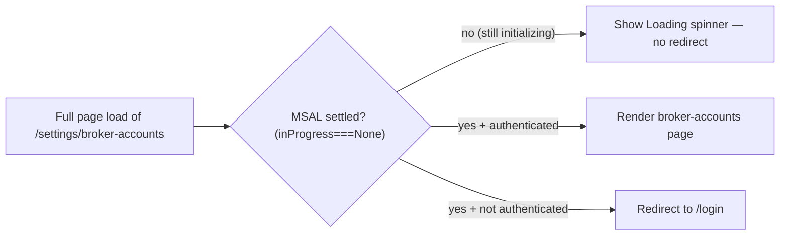

# Fix: deep-link / refresh auth-guard race (broker-accounts unreachable) Implementation Plan

> **For agentic workers:** REQUIRED SUB-SKILL: superpowers:subagent-driven-development (or executing-plans). Steps use checkbox (`- [ ]`) syntax.

**Goal:** A full-page load / refresh / bookmark of any authenticated route (e.g. `/settings/broker-accounts`) lands on the requested page for a signed-in user — instead of bouncing to `/dashboard` — and Broker Accounts is reachable from the sidebar.

**Architecture:** The app-shell auth guard (`app-shell.tsx`) currently decides auth from `useIsAuthenticated()` alone. On a full page load MSAL has not finished initializing, so `useIsAuthenticated()` is briefly `false`; the guard's `useEffect` fires `router.replace("/login")`, then once MSAL rehydrates (authenticated) the `/login`→`/dashboard` redirect fires. Fix: gate the redirect decision on MSAL having settled (`inProgress === InteractionStatus.None`), rendering the existing spinner until then. Secondary: add a Broker Accounts sidebar link so the page is reachable via SPA navigation (not only by direct URL, which is what consistently triggers the race).

**Tech Stack:** Next.js 15 (App Router) · `@azure/msal-react@^5.0.5` · `@azure/msal-browser@^5.3.0` · TypeScript · lucide-react · shadcn/ui.

---

## Approach Comparison (council-ratified default)

| Axis             | **A. MSAL `inProgress` guard (CHOSEN)**                                                        | B. Loading-flag-only (no inProgress)                 | C. Move auth to Next middleware (server-side)                               |
| ---------------- | ---------------------------------------------------------------------------------------------- | ---------------------------------------------------- | --------------------------------------------------------------------------- |
| Complexity       | Low — ~10 lines in one component                                                               | Low                                                  | High — MSAL is client-only here; SSR token validation is a new architecture |
| Blast radius     | app-shell only (all routes benefit)                                                            | app-shell only                                       | Every request; new server auth path                                         |
| Reversibility    | Trivial (revert one file)                                                                      | Trivial                                              | Hard                                                                        |
| Correctness      | Canonical MSAL pattern (Context7-confirmed: gate account logic until `InteractionStatus.None`) | Incomplete — doesn't actually know when MSAL settled | Correct but massive over-reach for this bug                                 |
| Time to validate | Minutes                                                                                        | Minutes                                              | Days                                                                        |

**Chosen default: A.** It's the canonical MSAL-react idiom and the minimal change that fixes the root cause for every route.

## Contrarian Verdict

Single clearly-correct approach (MSAL's own documented init-gating pattern). No viable simpler/cheaper alternative; B is strictly less correct, C is disproportionate. The Phase-3.3 plan-review Codex pass independently validates this approach choice against the code (serves as the contrarian check for this auth-surface fix).

## Root cause (empirically confirmed — Playwright on prod, authenticated as the operator)

- `frontend/src/components/layout/app-shell.tsx:34-41`: the `useEffect` redirects based on `isAuthenticated` (= `useIsAuthenticated()` outside the dev/E2E/api-key bypass). On a full page load, MSAL is mid-`initialize()`/`handleRedirectPromise()` → `useIsAuthenticated()` returns `false` → `router.replace("/login")` fires; then MSAL settles (authenticated) → on `/login`, `isAuthenticated && isPublicRoute` → `router.replace("/dashboard")`.
- **Reproduced on prod (2026-06-02):** direct-load `/settings/broker-accounts` → `/login` → `/dashboard`; direct-load `/strategies` → `/dashboard`; **sidebar (SPA) click of Strategies → stays on `/strategies`** (MSAL already settled, no race).
- **Dev masks it:** `NODE_ENV==="development"` forces `isAuthenticated=true` (bypass), so the race never occurs locally — this is why it "worked on dev."
- **Why broker-accounts is the visible victim:** it has NO sidebar nav link, so it's only reachable by direct URL = always a full load = always races. (Pre-existing app-shell bug; PR #86 exposed it by shipping a page with no nav entry.)
- **Provider safety (verified):** `providers.tsx` always mounts `MsalProvider` (after `initialize()`), and `useMsal()` is already used in `lib/auth.ts:45` — so calling `useMsal()` in app-shell is safe in all modes (no out-of-provider throw).
- **MSAL grounding (Context7, `/azuread/microsoft-authentication-library-for-js`):** the documented pattern is to wait until `InteractionStatus.None` before relying on account state ("ensure MSAL has completed its initialization and the interaction status is 'None' before calling account APIs").

---

## File Structure

- Modify: `frontend/src/components/layout/app-shell.tsx` — add `useMsal()`/`inProgress` gate to the redirect `useEffect` + the render guard.
- Modify: `frontend/src/components/layout/sidebar.tsx` — add a "Broker Accounts" `NavItem`.

(No new test file: the frontend has no unit-test runner — adding vitest+RTL for one test is out of scope per the project's "don't stand up a framework for one helper" rule. Verification strategy below.)

---

### Task 1: Gate the app-shell auth redirect on MSAL initialization

**Files:**

- Modify: `frontend/src/components/layout/app-shell.tsx`

- [ ] **Step 1: Add `useMsal` + `InteractionStatus` imports and the `inProgress` gate.**

  ```tsx
  import { useIsAuthenticated, useMsal } from "@azure/msal-react";
  import { InteractionStatus } from "@azure/msal-browser";
  ```

  Inside `AppShell`, after the existing bypass computation:

  ```tsx
  const { inProgress } = useMsal();
  const isBypassed = isDevBypass || isE2EBypass || isApiKeyBypass;
  const isAuthenticated = isBypassed ? true : _isAuthenticated;
  // MSAL is "settled" once initialize()+handleRedirectPromise() have run (inProgress===None).
  // In bypass modes THIS GUARD doesn't wait on inProgress (it treats settled as true). NOTE
  // (Codex P3): AuthProvider (providers.tsx:24) still awaits msalInstance.initialize() before
  // mounting MsalProvider in ALL modes incl. bypass — that pre-existing provider-level gate is
  // out of scope here; this fix only changes the app-shell redirect race. Until settled, we must
  // NOT treat the transient unauthenticated state as a real redirect signal (the deep-link race).
  const msalSettled = isBypassed || inProgress === InteractionStatus.None;
  ```

  Update the `useEffect` to no-op until settled:

  ```tsx
  useEffect(() => {
    if (!msalSettled) return; // wait for MSAL; don't bounce on the init-window false
    if (!isAuthenticated && !isPublicRoute) {
      router.replace("/login");
    }
    if (isAuthenticated && isPublicRoute) {
      router.replace("/dashboard");
    }
  }, [msalSettled, isAuthenticated, isPublicRoute, router]);
  ```

  Update the protected-route loading guard so the spinner also covers the "MSAL still initializing" window (not just the redirect window):

  ```tsx
  if (isPublicRoute) {
    return <>{children}</>;
  }
  if (!msalSettled || !isAuthenticated) {
    return (
      <div className="flex h-screen items-center justify-center bg-background">
        <div className="flex flex-col items-center gap-3">
          <div className="size-8 animate-spin rounded-full border-2 border-muted-foreground border-t-transparent" />
          <p className="text-sm text-muted-foreground">Loading...</p>
        </div>
      </div>
    );
  }
  ```

- [ ] **Step 2: `cd frontend && pnpm exec tsc --noEmit && pnpm exec eslint src/components/layout/app-shell.tsx` — expect clean.**

### Task 2: Add the Broker Accounts sidebar nav link

**Files:**

- Modify: `frontend/src/components/layout/sidebar.tsx`

- [ ] **Step 1: Add a `NavItem` for Broker Accounts** (import an appropriate lucide icon, e.g. `KeyRound`), placed adjacent to "Settings":

  ```tsx
  { label: "Broker Accounts", href: "/settings/broker-accounts", icon: KeyRound },
  ```

- [ ] **Step 2: Fix the active-state so only the most specific item highlights (Codex plan-review P2).**

  The current per-item test (`sidebar.tsx:98-99`) is `pathname === item.href || pathname.startsWith(`${item.href}/`)`. With the new child item added, `/settings/broker-accounts` would mark BOTH "Settings" (`/settings`) and "Broker Accounts" active. Replace it with **longest-prefix-wins**: compute the single active href once, then match each item against it.

  ```tsx
  // Most-specific match wins: the longest navItem href that is the pathname or a prefix of it.
  const activeHref = navItems
    .filter((i) => pathname === i.href || pathname.startsWith(`${i.href}/`))
    .reduce<string | null>(
      (best, i) => (best === null || i.href.length > best.length ? i.href : best),
      null,
    );
  // ...then per item:
  isActive={item.href === activeHref}
  ```

  This highlights only "Broker Accounts" on `/settings/broker-accounts`, only "Settings" on `/settings`, and is order-independent. (Behavior for all other routes is unchanged — each previously matched exactly one item.)

- [ ] **Step 3: `cd frontend && pnpm exec tsc --noEmit && pnpm exec eslint src/components/layout/sidebar.tsx` — expect clean.**

---

## Verification strategy (honest about the dev bypass)

- **tsc + eslint + `next build`** (via verify-app): the fix is a small typed change; build/lint/types are the first gate.
- **Dev E2E (verify-e2e):** confirms the new **sidebar link** reaches `/settings/broker-accounts` via SPA nav and the page renders. NOTE: the dev bypass forces `isAuthenticated=true`, so the dev environment **cannot reproduce the MSAL init race** — a dev E2E proves the nav-link half and that nothing regressed, not the race fix itself.
- **Definitive prod confirmation (post-deploy):** re-run the exact reproduction that found the bug — full-load `https://platform.marketsignal.ai/settings/broker-accounts` (authenticated) must now land on the broker-accounts page (not `/dashboard`); same for a direct-load `/strategies`. This is the real-world proof, run after the fix deploys to prod. Captured as the closing gate (and documented in the solution doc).

#### E2E Use Cases

**Surface coverage decision** (CLAUDE.md exposes API + CLI + UI):

- **UI: Covered** — the bug + fix are entirely in the frontend auth shell / routing (UI surface).
- **API: N/A** — no API contract changed; the backend is untouched. The race is a client-side MSAL/router timing bug.
- **CLI: N/A** — the CLI has no routing/auth-shell; not reachable by this bug.

**UC-DLA-1 — Operator opens a deep link to Broker Accounts and lands there (not the dashboard)**

- **Actor:** Signed-in operator following a bookmark / pasted deep link to the broker-accounts page in a fresh tab.
- **Scenario:** The operator bookmarked `/settings/broker-accounts` yesterday. They open it directly today (full page load) expecting the broker-accounts list, but the page used to bounce them to the dashboard. After the fix they should arrive on the broker-accounts page.
- **Interface:** UI.
- **Intent:** The operator opens the broker-accounts deep link and arrives on the broker-accounts page, ready to manage accounts.
- **Setup:** Authenticated session via the documented dev path (`NEXT_PUBLIC_E2E_AUTH_BYPASS`/X-API-Key). (Dev caveat above: the bypass means dev verifies reachability, prod verifies the race fix.)
- **Steps:** Navigate (full load) to `/settings/broker-accounts` → wait for load.
- **Verification:** The page shows the "Broker accounts" heading + the accounts table/empty state; the URL stays `/settings/broker-accounts` (NOT `/dashboard`).
- **Persistence:** Reload `/settings/broker-accounts` → still on the broker-accounts page (not bounced).

**UC-DLA-2 — Operator reaches Broker Accounts from the sidebar**

- **Actor:** Signed-in operator navigating the app via the sidebar.
- **Scenario:** The operator wants to manage broker accounts and looks for it in the left nav (previously there was no link — the page was only reachable by typing the URL).
- **Interface:** UI.
- **Intent:** The operator finds and opens Broker Accounts from the sidebar and lands on the page.
- **Setup:** Authenticated session; start on `/dashboard`.
- **Steps:** Click the "Broker Accounts" sidebar link → page transitions (SPA).
- **Verification:** The "Broker accounts" page renders with its heading; the sidebar "Broker Accounts" item is highlighted as active; URL is `/settings/broker-accounts`.
- **Persistence:** Reload → still on `/settings/broker-accounts` with the nav item active.

---

## Developer Briefing (Gate 1)

**What I'll fix:** Opening a bookmarked/refreshed page (like Broker Accounts) while signed in currently kicks you back to the dashboard. I'll make the app wait for the login system to finish loading before it decides whether you're signed in, so deep links land where you asked. I'll also add Broker Accounts to the left sidebar so you don't have to type the URL.

**How it'll fit** `[planned]`:



**Planned file-map:** `frontend/src/components/layout/app-shell.tsx` (the guard), `frontend/src/components/layout/sidebar.tsx` (nav link).

**Key decisions:** `[inferred]` gate on `inProgress === InteractionStatus.None` (MSAL's documented init signal); keep the existing spinner; bypass modes skip the wait so dev/E2E are unaffected; add a top-level "Broker Accounts" sidebar item.
