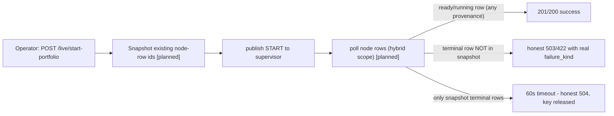

# Fix: start-portfolio 503-but-spawned (stale terminal-row race) — Implementation Plan

> **For agentic workers:** REQUIRED SUB-SKILL: Use superpowers:subagent-driven-development (recommended) or superpowers:executing-plans to implement this plan task-by-task. Steps use checkbox (`- [ ]`) syntax for tracking.

**Goal:** `POST /api/v1/live/start-portfolio` must report the outcome of THIS start attempt — never a previous run's terminal `live_node_processes` row — so a warm-restart redeploy returns an honest 201/503/504 instead of the false, cacheable 503 `{"detail":"unknown failure","failure_kind":"unknown"}` observed 3/3 in the 2026-06-05 LVP drill while the spawn actually succeeded.

**Architecture:** Attempt-scope the response-path poll with a hybrid rule (approach A′, contrarian-validated): capture the set of the deployment's **pre-existing `live_node_processes` row ids** immediately before `bus.publish_start`, and teach `_poll_for_terminal` to accept ready/running rows regardless of provenance (an active row is by definition the current node — partial unique index `uq_live_node_processes_active_deployment`) but terminal rows only when their id is **not** in the pre-publish set. Exact set semantics — no clocks, no timestamps, no tie-breakers (plan-review iter-1 P1-3 replaced the original `created_at`-marker mechanism with this). No schema change, no supervisor change; `/stop` and `/drain` call sites are untouched (no exclusion set passed → behavior identical).

**Tech Stack:** FastAPI + SQLAlchemy 2.0 async (Postgres 16), pytest + testcontainers (Postgres/Redis), existing fake-supervisor integration harness.

---

## Root Cause (verified, all claims cited)

1. The endpoint publishes START (`backend/src/msai/api/live.py:2018`) then immediately polls `_poll_for_terminal` (`live.py:2084-2091`); the loop **reads first, sleeps after** (`live.py:326-342`).
2. `_poll_for_terminal` selects the **latest row by `started_at desc`** for the deployment with no attempt-scoping (`live.py:332-339`).
3. The supervisor inserts the new `starting` row only after Redis delivery + Phase A locks/gates (`backend/src/msai/live_supervisor/fleet_router.py:1936-1987`) — hundreds of ms to seconds after publish.
4. On a warm restart, prior terminal rows exist (per-restart history by design, `backend/src/msai/models/live_node_process.py:3-7`; the dedup check `live.py:1772-1798` only blocks on _active_ rows). The first poll read returns the **previous run's** `stopped`/`failed` row.
5. A cleanly-stopped row's `failure_kind` (NULL/`"none"`) coerces to `UNKNOWN` (`live.py:2214-2215`) → `permanent_failure(UNKNOWN, "unknown failure")` → 503, **cacheable**, committed under the operator's Idempotency-Key (`live.py:2222-2224`, `backend/src/msai/services/live/idempotency.py:280-307`).

**Invariant supporting the fix (verified):** every outcome of an attempt surfaces on a **new** Phase-A-inserted row — all failure writers key by that `row_id` (`fleet_router.py:1989-2133`; Phase-B gates `fleet_router.py:816-1070`). Old terminal rows are never re-opened. Phase-A aborts that insert no row (concurrent-startup guard `fleet_router.py:1885-1900`, stale-START drop) map to the designed 60s poll-timeout 504 path with its stranded-START flip guard (`live.py:2100-2152`).

**Success-path contract (verified):** a newly-published START that reaches ready/running returns **HTTP 201** via `EndpointOutcome.ready` (`idempotency.py:95-98`); `already_active` returns 200 (`idempotency.py:100-110`). The UI dialog already accepts both (`frontend/src/components/live/portfolio-start-dialog.tsx:20`).

## Approach Comparison (final — post-contrarian, post-plan-review-iter-1)

### Chosen Default

**A′ — Hybrid attempt-scoped poll.** Pre-publish snapshot of existing row ids; poll accepts ready/running rows unconditionally, terminal rows only when `id ∉ snapshot`.

### Best Credible Alternative

**B — per-attempt nonce** threaded through the START payload onto a new `live_node_processes` column; poll filters by nonce.

| Axis                  | A′: hybrid id-set                                                                                                | B: nonce + column                                                                                                                | C: prior-latest-row-id exclusion         |
| --------------------- | ---------------------------------------------------------------------------------------------------------------- | -------------------------------------------------------------------------------------------------------------------------------- | ---------------------------------------- |
| Complexity            | Low — one snapshot query + 2-branch filter in `_poll_for_terminal`                                               | Medium-high — migration + payload contract + fleet_router + API (and still needs A′'s hybrid rule for the concurrent-START case) | Low but weaker                           |
| Blast Radius          | `api/live.py` + tests                                                                                            | Real-money spawn path: schema + supervisor + bus payload + API                                                                   | `api/live.py` + tests                    |
| Reversibility         | Trivial                                                                                                          | Migration leaves dead column on revert                                                                                           | Trivial                                  |
| Time to Validate      | Fast — PG-testcontainers integration tests simulate supervisor timing                                            | Slow — migration everywhere + supervisor restart + drill                                                                         | Fast                                     |
| User/Correctness Risk | Exact set semantics — no clock, no timestamp ties, no tz/dialect concerns. Cases 1–6 below all resolve correctly | Same case profile once hybrid added; nonce precision adds nothing at the deployment-level contract                               | Excludes one row only — class not closed |

**Case analysis for A′** (the contract):

| #   | Case                                                                               | Behavior after fix                                                                                                          |
| --- | ---------------------------------------------------------------------------------- | --------------------------------------------------------------------------------------------------------------------------- |
| 1   | Warm-restart stale-row race (the bug)                                              | Old terminal row (id in snapshot) ignored → poll waits for the new Phase-A row → honest outcome                             |
| 2   | Concurrent START; other request's row reaches ready/running                        | Accepted unconditionally → 200/201 (same as today; contrarian iter-1 case)                                                  |
| 3   | Concurrent START; other request's pre-snapshot row FAILS                           | 60s timeout → honest, non-cacheable 504 + key released (today: possibly mis-attributed cacheable 503). Documented trade-off |
| 4   | START during old node `stopping` (supervisor ACKs already-active, no insert)       | Old `stopped` row ignored → 504 timeout instead of today's FALSE "unknown failure" 503 — strictly more honest               |
| 5   | This attempt's gate/spawn failures (halt, account-halt, payload-factory, registry) | New Phase-A row (id ∉ snapshot) → classification fully preserved                                                            |
| 6   | Phase-A aborts with no row (concurrent-startup, stale-START drop)                  | Poll timeout → existing designed 504 path. Unchanged                                                                        |

## Contrarian Verdict

- **Iteration 1: OBJECT** (Codex gpt-5.5) — pure attempt-scoping (then `created_at > marker`) breaks the concurrent-START case: request 2's active-process precheck (`live.py:1772-1782`) can run before request 1's row exists; the supervisor then hits the partial-unique-index race → `ALREADY_ACTIVE`, no new row (`fleet_router.py:1969-1986`); a purely-scoped poll would time out while the node runs. **Accepted as valid by code inspection** → default refined to A′ (hybrid: ready rows unconditional).
- **Iteration 2: VALIDATE** (Codex gpt-5.5) — "A′ fixes stale terminal attribution and preserves concurrent active success under the existing partial-unique invariant; B still needs the same hybrid rule while adding migration and spawn-path blast radius."
- **Plan-review iteration 1 P1-3** (Codex gpt-5.5, xhigh) subsequently replaced the _mechanism_ (timestamp marker → exact id-set snapshot) within the same validated hybrid semantics: `created_at > max(created_at)` had no tie-breaker for equal timestamps; the id-set is total.

## File Structure

| File                                                              | Change                                                                                                                                                                                                                                                    |
| ----------------------------------------------------------------- | --------------------------------------------------------------------------------------------------------------------------------------------------------------------------------------------------------------------------------------------------------- |
| `backend/src/msai/api/live.py`                                    | `_poll_for_terminal`: new optional kwarg `exclude_terminal_row_ids` + hybrid filter. `start_portfolio`: snapshot pre-publish row ids, pass to the poll. ~25 lines                                                                                         |
| `backend/tests/integration/test_poll_for_terminal_scoping.py`     | NEW — direct helper-level tests on PG testcontainers (4 tests)                                                                                                                                                                                            |
| `backend/tests/integration/api/test_live_start_broker_account.py` | ADD 3 endpoint-level regression tests (warm-restart honest 201 + idempotent replay; this-attempt failure still classified; slow-build 504 keeps deployment non-terminal + key released). Add `LiveNodeProcess` to the file's imports (it is absent today) |

`/stop` (`live.py:2505`) and `/drain` (`live.py:3031`) call sites pass no exclusion set → completely unchanged. Deprecated `/start` returns 410 (`live.py:411-432`) — unaffected. Existing test fakes monkeypatch `_poll_for_terminal` with `AsyncMock`/`*_a, **_k` signatures — tolerant of the new optional kwarg.

**Bound note:** the snapshot is one `SELECT id WHERE deployment_id=…` and the poll's `notin_()` carries that list per iteration. Row count per deployment is bounded by restart history (the bounded auto-restart policy caps crash-loops; `live_node_process.py:100-127`); even hundreds of ids is trivial for PG. No pagination needed.

---

#### E2E Use Cases

**Surface coverage decision** (per `CLAUDE.md ## E2E Configuration`, surfaces `[API, CLI, UI]`):

- **API: Covered** — UC1 below. The bug lives in the public API response path; API is the primary surface and the one the drill exercised.
- **CLI: Covered** — UC2 below. `msai live start-portfolio` (`backend/src/msai/cli.py:932`) exposes the same capability and surfaced the same false 503 to the operator.
- **UI: N/A** — the deploy dialog (`frontend/src/components/live/portfolio-start-dialog.tsx`) is a pass-through client of the same endpoint and already accepts HTTP 200 OR 201 as success (`portfolio-start-dialog.tsx:20`); no UI code changes and no UI-specific behavior beyond rendering the (now-correct) API outcome verified by UC1. Full UI deploy E2E additionally requires live MSAL auth + broker stack and remains covered by the market-hours operator drill that gates real-money graduation (see `.claude/local/state.md` Next).

**UC1 — API: warm-restart redeploy tells the truth**

```
Actor:         Operator redeploying a live portfolio via the API after yesterday's session ended
Scenario:      Their portfolio ran yesterday and the node terminated overnight (clean stop or
               data-stale halt). This morning they redeploy the same frozen revision to the same
               account. Yesterday this returned 503 "unknown failure" 3/3 while the node
               actually spawned — they need the response to be truthful so they don't retry and
               double-deploy or panic.
Interface:     API
Intent:        The operator redeploys a previously-run portfolio and receives a truthful success
               response they can act on, instead of a false failure.
Account:       LIVE test account LVP `U4705114` via the `lvp` gateway (port 4003) — explicit per
               the live-trading rails; operator standing authorization 2026-06-05 ("no paper
               accounts anymore; run it with the LVP locally"). Post-merge second leg: HVP
               `U4715997` on the prod VM. Short deploy→verify→stop window; confirm broker_flat on
               stop.
Setup:         Dev stack up FROM THIS WORKTREE with the broker profile (lvp gateway). A deployable
               frozen portfolio revision exists with a prior terminal node-process run for its
               deployment — the 2026-06-05 morning drill state (deployment 8e53d295…, stopped
               14:26Z) qualifies as-is; otherwise deploy once + stop via the sanctioned API.
               (The redeploy itself is the action under test — it is NOT performed in Setup.)
Steps:         1) POST /api/v1/live/start-portfolio (same revision + account, fresh Idempotency-Key)
               2) GET /api/v1/live/status
Verification:  The operator receives a success response (201 created-and-ready, or 200 already-
               active) whose body includes the deployment id and a ready/running status — NOT a
               503 "unknown failure"; the follow-up GET /live/status response includes that same
               deployment id listed as running, so they can proceed to monitor positions/trades.
Persistence:   Re-request GET /api/v1/live/status after ~30s — the deployment is still listed
               running with the same id. (Cleanup afterward: POST /api/v1/live/stop.)
```

**UC2 — CLI: morning redeploy from the shell**

```
Actor:         Operator driving the morning redeploy from the msai CLI on their laptop
Scenario:      Same warm-restart situation as UC1, but they work from the shell. Yesterday the CLI
               surfaced the API's false 503 as a deploy error, leaving them unsure whether a node
               was live.
Interface:     CLI
Intent:        The operator redeploys from the CLI and the command reports success with the
               deployment identity; the status command then shows it running.
Account:       Same as UC1 — LIVE test account LVP `U4705114` (standing authorization 2026-06-05).
Setup:         Same stack as UC1; UC1's cleanup stop leaves exactly the prior-run terminal state
               this UC needs (deploy once + stop via CLI or API — sanctioned — if running UC2
               standalone). CLI env per drill recipe: MSAI_API_URL=http://localhost:8800,
               MSAI_API_KEY set.
Steps:         1) Run `msai live start-portfolio` with the same revision/account flags
               2) Run `msai live status`
Verification:  start-portfolio stdout shows a success line with the deployment id/slug and NO
               "unknown failure" error; the next invocation `msai live status` lists that
               deployment as running.
Persistence:   Open a new shell, run `msai live status` again — the deployment is still listed
               running with the same id. (Cleanup afterward: `msai live stop`.)
```

---

## Developer Briefing (Gate 1)

**What I'll fix:** Redeploying a portfolio that ran before sometimes told the operator it failed ("unknown failure") when it had actually started fine — risking a panicked retry against a live trading node. After this fix the deploy response always describes _this_ deploy attempt.

**How it'll fit** `[planned]`:



**Planned file-map:** `backend/src/msai/api/live.py` (helper + call site), `backend/tests/integration/test_poll_for_terminal_scoping.py` (new), `backend/tests/integration/api/test_live_start_broker_account.py` (3 tests added).

**Key decisions:** exact id-set snapshot, no clocks (plan-review iter-1 P1-3 — `created_at` ties have no tie-breaker; ids are total) `[planned]`; ready/running rows trusted unconditionally (DB partial unique index guarantees at most one active row) `[verified: models/live_node_process.py:169-184]`; success is 201 via `EndpointOutcome.ready` `[verified: idempotency.py:95-98]`; `/stop`/`/drain` untouched `[verified call sites: live.py:2505, 3031]`.

---

### Task 1: `_poll_for_terminal` hybrid attempt-scoping

**Files:**

- Modify: `backend/src/msai/api/live.py:296-343` (`_poll_for_terminal`)
- Create: `backend/tests/integration/test_poll_for_terminal_scoping.py`

- [ ] **Step 1: Write the failing helper-level tests**

Create `backend/tests/integration/test_poll_for_terminal_scoping.py`. Reuse the module-scoped Postgres-testcontainer fixture pattern from `backend/tests/integration/test_live_start_endpoints.py:62-91` (`isolated_postgres_url`, `session_factory`). No timestamp manipulation is needed — scoping is by row id.

```python
"""Helper-level tests for _poll_for_terminal attempt-scoping (fix/start-portfolio-503-but-spawned).

The 2026-06-05 LVP drill showed POST /live/start-portfolio returning a false,
cacheable 503 "unknown failure" 3/3 times while the spawn succeeded: the poll's
first read returned the PREVIOUS run's terminal row. These tests pin the hybrid
scoping contract (approach A', contrarian-validated):

  - terminal rows count ONLY when their id is NOT in exclude_terminal_row_ids
    (the pre-publish snapshot of the deployment's existing rows)
  - ready/running rows count UNCONDITIONALLY (an active row is by definition
    the current node — partial unique index)
  - exclude_terminal_row_ids=None (or empty) preserves the legacy unscoped
    behavior (the /stop and /drain call sites).

SAFETY: dedicated PostgresContainer per module.
"""

from __future__ import annotations

from datetime import UTC, datetime, timedelta
from typing import TYPE_CHECKING
from uuid import UUID, uuid4

import pytest
import pytest_asyncio
from sqlalchemy.ext.asyncio import async_sessionmaker, create_async_engine

from msai.api.live import _poll_for_terminal
from msai.models import Base, LiveDeployment, LiveNodeProcess, Strategy, User

if TYPE_CHECKING:
    from collections.abc import AsyncIterator, Iterator

    from sqlalchemy.ext.asyncio import AsyncSession


@pytest.fixture(scope="module")
def isolated_postgres_url() -> Iterator[str]:
    from testcontainers.postgres import PostgresContainer

    with PostgresContainer("postgres:16-alpine") as pg:
        yield pg.get_connection_url().replace("psycopg2", "asyncpg")


@pytest_asyncio.fixture
async def session_factory(
    isolated_postgres_url: str,
) -> AsyncIterator[async_sessionmaker[AsyncSession]]:
    engine = create_async_engine(isolated_postgres_url)
    async with engine.begin() as conn:
        await conn.run_sync(Base.metadata.drop_all)
        await conn.run_sync(Base.metadata.create_all)
    factory = async_sessionmaker(engine, expire_on_commit=False)
    yield factory
    await engine.dispose()


async def _seed_deployment(
    session_factory: async_sessionmaker[AsyncSession],
) -> LiveDeployment:
    """Minimal deployment row the FK requires. Reuses the shared factory."""
    from tests.integration._deployment_factory import make_live_deployment

    async with session_factory() as session, session.begin():
        user = User(
            id=uuid4(),
            entra_id=f"sub-{uuid4()}",
            email=f"{uuid4()}@test.com",
            role="operator",
        )
        session.add(user)
        strategy = Strategy(
            id=uuid4(),
            name=f"smoke-{uuid4().hex[:8]}",
            file_path="/dev/null",
            strategy_class="SmokeStrategy",
            default_config={},
            created_by=user.id,
        )
        session.add(strategy)
        dep = await make_live_deployment(
            session,
            user=user,
            strategy=strategy,
            status="starting",
            strategy_class="SmokeStrategy",
        )
    return dep


def _node_row(
    deployment_id: UUID,
    *,
    status: str,
    failure_kind: str | None = None,
    started_at: datetime | None = None,
) -> LiveNodeProcess:
    """``started_at`` is explicit where ordering matters — the helper's query
    orders by ``started_at DESC``, so tests must not rely on microsecond
    adjacency of back-to-back ``datetime.now()`` calls (plan-review iter-2 P3)."""
    ts = started_at or datetime.now(UTC)
    return LiveNodeProcess(
        id=uuid4(),
        deployment_id=deployment_id,
        gateway_session_key="msai-paper-primary:localhost:4002",
        pid=None,
        host="test-host",
        started_at=ts,
        last_heartbeat_at=ts,
        status=status,
        failure_kind=failure_kind,
    )


READY = frozenset({"ready", "running"})
TERMINAL = frozenset({"failed", "stopped"})


@pytest.mark.asyncio
async def test_snapshot_terminal_row_is_ignored(
    session_factory: async_sessionmaker[AsyncSession],
) -> None:
    """THE BUG: a terminal row in the pre-publish snapshot must NOT be returned
    as this attempt's outcome — the poll keeps waiting and returns None on
    timeout."""
    dep = await _seed_deployment(session_factory)
    stale = _node_row(dep.id, status="stopped")
    async with session_factory() as session, session.begin():
        session.add(stale)

    async with session_factory() as db:
        row = await _poll_for_terminal(
            db,
            dep.id,
            ready_statuses=READY,
            terminal_statuses=TERMINAL,
            timeout_s=0.3,
            interval_s=0.05,
            exclude_terminal_row_ids=frozenset({stale.id}),
        )
    assert row is None  # RED today: current helper returns the stale stopped row


@pytest.mark.asyncio
async def test_new_terminal_row_outside_snapshot_is_returned(
    session_factory: async_sessionmaker[AsyncSession],
) -> None:
    """Case 5: this attempt's failure row (id not in the snapshot) must still
    surface so HALT/SPAWN_FAILED/registry classification keeps working."""
    dep = await _seed_deployment(session_factory)
    # Explicit started_at ordering: fresh must be the latest row by
    # started_at DESC, not by microsecond luck (plan-review iter-2 P3).
    base = datetime.now(UTC)
    stale = _node_row(dep.id, status="stopped", started_at=base - timedelta(hours=1))
    fresh = _node_row(dep.id, status="failed", failure_kind="halt_active", started_at=base)
    async with session_factory() as session, session.begin():
        session.add(stale)
        session.add(fresh)

    async with session_factory() as db:
        row = await _poll_for_terminal(
            db,
            dep.id,
            ready_statuses=READY,
            terminal_statuses=TERMINAL,
            timeout_s=2.0,
            interval_s=0.05,
            exclude_terminal_row_ids=frozenset({stale.id}),
        )
    assert row is not None
    assert row.id == fresh.id
    assert row.status == "failed"
    assert row.failure_kind == "halt_active"


@pytest.mark.asyncio
async def test_ready_row_in_snapshot_is_returned(
    session_factory: async_sessionmaker[AsyncSession],
) -> None:
    """Contrarian iter-1 case: an active/ready row is the current node even if
    it is in the snapshot (concurrent START won the spawn race)."""
    dep = await _seed_deployment(session_factory)
    active = _node_row(dep.id, status="running")
    async with session_factory() as session, session.begin():
        session.add(active)

    async with session_factory() as db:
        row = await _poll_for_terminal(
            db,
            dep.id,
            ready_statuses=READY,
            terminal_statuses=TERMINAL,
            timeout_s=2.0,
            interval_s=0.05,
            exclude_terminal_row_ids=frozenset({active.id}),
        )
    assert row is not None
    assert row.id == active.id
    assert row.status == "running"


@pytest.mark.asyncio
async def test_no_snapshot_preserves_legacy_unscoped_behavior(
    session_factory: async_sessionmaker[AsyncSession],
) -> None:
    """The /stop and /drain call sites pass no snapshot — the latest terminal
    row must be returned exactly as before."""
    dep = await _seed_deployment(session_factory)
    stale = _node_row(dep.id, status="stopped")
    async with session_factory() as session, session.begin():
        session.add(stale)

    async with session_factory() as db:
        row = await _poll_for_terminal(
            db,
            dep.id,
            ready_statuses=frozenset(),
            terminal_statuses=TERMINAL,
            timeout_s=2.0,
            interval_s=0.05,
        )
    assert row is not None
    assert row.status == "stopped"
```

Note for the implementer: check `tests/integration/_deployment_factory.make_live_deployment`'s actual signature before use (Ground Your Claims) — adapt the `_seed_deployment` helper to whatever it requires; the four test bodies are the contract.

- [ ] **Step 2: Run tests to verify the red/green split**

Run: `cd backend && uv run pytest tests/integration/test_poll_for_terminal_scoping.py -v`
Expected: the three snapshot tests FAIL with `TypeError: _poll_for_terminal() got an unexpected keyword argument 'exclude_terminal_row_ids'`; `test_no_snapshot_preserves_legacy_unscoped_behavior` PASSES (pins existing behavior).

- [ ] **Step 3: Implement the hybrid filter in `_poll_for_terminal`**

In `backend/src/msai/api/live.py`, change the signature and query (current body at `live.py:296-343`). Add `or_` to the existing `from sqlalchemy import ...` line in the same edit (co-locate import with usage — PostToolUse formatter strips unused imports):

```python
async def _poll_for_terminal(
    db: AsyncSession,
    deployment_id: UUID,
    *,
    ready_statuses: frozenset[str],
    terminal_statuses: frozenset[str],
    timeout_s: float,
    interval_s: float,
    exclude_terminal_row_ids: frozenset[UUID] | None = None,
) -> LiveNodeProcess | None:
    """Poll the latest ``live_node_processes`` row for this deployment
    until its ``status`` lands in ``ready_statuses`` or
    ``terminal_statuses``, or until the deadline passes.

    Returns the row on success; returns ``None`` on timeout so the
    caller can produce :meth:`EndpointOutcome.api_poll_timeout`.

    ``exclude_terminal_row_ids`` (fix/start-portfolio-503-but-spawned —
    2026-06-05 LVP drill): the caller's pre-publish snapshot of the
    deployment's EXISTING row ids. When provided, TERMINAL rows count
    only if their id is NOT in the snapshot, so a warm restart's poll
    can never mistake the PREVIOUS run's stopped/failed row for this
    attempt's outcome (every outcome of an attempt lands on a NEW
    Phase-A-inserted row; old terminal rows never re-open).
    Ready/running rows count UNCONDITIONALLY: the partial unique index
    ``uq_live_node_processes_active_deployment`` guarantees at most one
    active row per deployment and terminal rows never re-activate, so
    an active row IS the current node even if it predates the snapshot
    (e.g. a concurrent START won the spawn race). ``None``/empty
    preserves the legacy unscoped behavior used by the /stop and
    /drain sites.

    Why a module-level function: tests monkeypatch this name to
    inject deterministic row transitions without driving a real
    supervisor. The default implementation hits the DB.

    **Precondition** (API-design trap): the caller MUST have
    committed any pending writes BEFORE calling this helper. The
    loop calls ``db.rollback()`` each iteration so a fresh
    transaction picks up writes the supervisor committed from
    another session (PostgreSQL's read-committed snapshot otherwise
    shows the row in its pre-poll state forever). A caller with
    uncommitted state would lose it on the first rollback.
    """
    deadline = monotonic() + timeout_s
    match_statuses = ready_statuses | terminal_statuses
    stmt = select(LiveNodeProcess).where(LiveNodeProcess.deployment_id == deployment_id)
    if exclude_terminal_row_ids:
        stmt = stmt.where(
            or_(
                LiveNodeProcess.status.in_(ready_statuses),
                LiveNodeProcess.id.notin_(exclude_terminal_row_ids),
            )
        )
    stmt = stmt.order_by(LiveNodeProcess.started_at.desc()).limit(1)
    while monotonic() < deadline:
        # Start a fresh transaction every poll so we see writes the
        # supervisor committed from another session. Without this,
        # the caller's session keeps a snapshot of the row and the
        # status update never becomes visible.
        await db.rollback()
        row = (await db.execute(stmt)).scalar_one_or_none()
        if row is not None and row.status in match_statuses:
            return row
        await asyncio.sleep(interval_s)
    return None
```

- [ ] **Step 4: Run the new tests — all four pass**

Run: `cd backend && uv run pytest tests/integration/test_poll_for_terminal_scoping.py -v`
Expected: 4 PASSED.

- [ ] **Step 5: Run the neighboring suites that exercise the helper (regression)**

Run: `cd backend && uv run pytest tests/integration/test_live_start_endpoints.py tests/unit/api/test_live_drain_partial_failure.py tests/integration/api/test_drain_killall_stop_per_account_stream.py -v`
Expected: all PASS (optional kwarg defaults to None → unchanged behavior; fakes use tolerant signatures).

- [ ] **Step 6: Commit**

```bash
git add backend/src/msai/api/live.py backend/tests/integration/test_poll_for_terminal_scoping.py
git commit -m "fix(live): attempt-scope _poll_for_terminal terminal rows via prior-row-id snapshot"
```

### Task 2: start-portfolio captures the pre-publish snapshot

**Files:**

- Modify: `backend/src/msai/api/live.py:2017-2091` (snapshot capture + poll call site)
- Test: `backend/tests/integration/api/test_live_start_broker_account.py` (3 new tests + `LiveNodeProcess` import)

- [ ] **Step 1: Write the failing endpoint-level regression tests**

Append to `backend/tests/integration/api/test_live_start_broker_account.py`. Add `from msai.models.live_node_process import LiveNodeProcess` to the imports (absent today — Codex iter-1 P3). Reuse the file's existing arrange helpers (`_seed_broker_account` at `:282`, `_seed_deployable_revision` at `:315`) and `client` fixture — BUT these tests need the REAL `_poll_for_terminal` (the `client` fixture stubs it per the module docstring; read the fixture at `:191-280` and restore the real helper saved at module import, also tightening `START_POLL_TIMEOUT_S`/`START_POLL_INTERVAL_S` as `test_live_start_endpoints.py:351-358` does).

**Determinism (Codex iter-1 P1-2):** the fake supervisor must NOT sleep from test start — the handler does substantial pre-publish work, so a fixed sleep could insert the row BEFORE the snapshot is captured. Gate the insert on **observing the START on the per-account command stream** (`bus.account_stream(account_id)`, `backend/src/msai/services/live_command_bus.py:365`): poll `redis_text.xlen(stream)` until it exceeds its pre-test baseline, then insert.

```python
# --- fix/start-portfolio-503-but-spawned: response-path attribution ---------

_REAL_POLL_FOR_TERMINAL = live_module._poll_for_terminal  # noqa: SLF001 — saved before fixtures stub it


async def _fake_supervisor_insert_after_publish(
    session_factory: async_sessionmaker[AsyncSession],
    redis_text: AsyncRedis,
    stream: str,
    baseline_len: int,
    deployment_id_getter,  # callable returning the deployment UUID once known
    *,
    status: str,
    failure_kind: str | None = None,
    error_message: str | None = None,
) -> None:
    """Insert THIS attempt's node row only AFTER the START is observed on the
    per-account command stream — mirrors the real Phase A ordering
    (fleet_router.py:1936-1987) and guarantees the endpoint's pre-publish
    snapshot was already captured (Codex plan-review P1-2)."""
    deadline = asyncio.get_event_loop().time() + 10.0
    while asyncio.get_event_loop().time() < deadline:
        if await redis_text.xlen(stream) > baseline_len:
            break
        await asyncio.sleep(0.02)
    else:
        return  # START never appeared — let the endpoint hit its own timeout
    deployment_id = await deployment_id_getter()
    async with session_factory() as session, session.begin():
        session.add(
            LiveNodeProcess(
                id=uuid4(),
                deployment_id=deployment_id,
                gateway_session_key="msai-paper-primary:localhost:4002",
                pid=4242,
                host="fake-supervisor",
                started_at=datetime.now(UTC),
                last_heartbeat_at=datetime.now(UTC),
                status=status,
                failure_kind=failure_kind,
                error_message=error_message,
            )
        )


@pytest.mark.asyncio
async def test_warm_restart_with_stale_stopped_row_returns_201_not_unknown_503(...):
    """LVP drill 2026-06-05 regression: redeploying a deployment whose previous
    run left a terminal `stopped` row must NOT return the stale row as this
    attempt's outcome (false cacheable 503 "unknown failure"). With the fake
    supervisor inserting the new row only after the START is published, the
    endpoint must wait for it and return 201 ready (EndpointOutcome.ready —
    idempotency.py:95-98). The same Idempotency-Key replayed afterward must
    return the CACHED success, not a stale failure."""
    # monkeypatch: restore _REAL_POLL_FOR_TERMINAL; START_POLL_TIMEOUT_S=5.0;
    #   START_POLL_INTERVAL_S=0.05
    # ARRANGE (mirror test_start_with_broker_account_id_derives_and_persists
    #   at :401-463 for body/fixtures):
    #   - seed revision + broker account via the file's _seed_* helpers
    #   - create the PRIOR run: insert a LiveDeployment for the same identity
    #     with status="stopped" AND one LiveNodeProcess row status="stopped",
    #     failure_kind=None for it (the previous run that ended cleanly) — OR
    #     drive a first POST + stop if the file's helpers make that cheaper.
    #   - baseline = await redis_text.xlen(bus.account_stream(account_id))
    #   - spawn _fake_supervisor_insert_after_publish(..., status="ready")
    # ACT: POST /api/v1/live/start-portfolio with a fresh Idempotency-Key K.
    # ASSERT:
    #   resp.status_code == 201            # RED today: 503
    #   resp.json()["status"] in ("ready", "running")
    #   resp.json()["failure_kind"] if present is absent/None — body has no "unknown"
    # REPLAY (Codex iter-1 P2-1): re-POST with the SAME key K + same body →
    #   cached success returned (201, same deployment id), NOT a 503.


@pytest.mark.asyncio
async def test_warm_restart_new_failed_row_still_classified(...):
    """Case 5: with a stale stopped row present, THIS attempt's genuine failure
    (new row, failure_kind=halt_active) must still surface as the halt-active
    503 — scoping must not break failure classification."""
    # Same monkeypatch + ARRANGE as above, but fake supervisor inserts
    #   status="failed", failure_kind="halt_active",
    #   error_message="blocked by halt flag".
    # ACT: POST with fresh Idempotency-Key.
    # ASSERT:
    #   resp.status_code == 503
    #   resp.json()["failure_kind"] == "halt_active"   # RED today: "unknown"
    #     (today the stale stopped row wins the race and yields "unknown")


@pytest.mark.asyncio
async def test_warm_restart_slow_build_times_out_without_flipping_deployment(...):
    """Codex iter-1 P2-2: stale terminal history + THIS attempt's row stuck in
    'building' → the poll must time out (504 api_poll_timeout), the stranded-
    START flip guard must NOT flip the deployment to failed (an active row
    exists — live.py:2131-2148 + _active_node_process_exists), and the
    Idempotency-Key must be RELEASED (api_poll_timeout is non-cacheable —
    idempotency.py:227-238) so a retry executes."""
    # Same monkeypatch + ARRANGE, but fake supervisor inserts status="building"
    #   and never flips it. START_POLL_TIMEOUT_S=1.0 to keep the test fast.
    # ACT: POST with fresh Idempotency-Key K.
    # ASSERT:
    #   resp.status_code == 504
    #   the deployment row's status (via GET /api/v1/live/status or a
    #     session_factory read) is still non-terminal ("starting"/"building" —
    #     NOT "failed")
    #   re-POST with the SAME key K executes again (not a cached 504): first
    #     UPDATE the EXISTING building row to status="ready" via session_factory
    #     (do NOT insert a second active row — it would violate the active-row
    #     partial unique index; plan-review iter-2 P3), then re-POST:
    #     retry.status_code == 200 (already_active path), same deployment id,
    #     and NOT a cached 504 — proving the key was released.
```

The ARRANGE/ACT comment blocks must be expanded into real code by the implementer **after reading** the file's existing UC test at `:400-463` (it shows the exact request body + seeded fixtures this endpoint requires) — the existing arrange is ~120 lines of fixture plumbing; duplicating it blind in this plan risks drift (Ground Your Claims). The assertions are the contract and must remain exactly as written. Test signatures take `client`, `session_factory`, `redis_text`, `bus`, `monkeypatch` plus whatever arrange fixtures the file's existing tests take.

- [ ] **Step 2: Run the new tests to verify they fail for the right reason**

Run: `cd backend && uv run pytest "tests/integration/api/test_live_start_broker_account.py::test_warm_restart_with_stale_stopped_row_returns_201_not_unknown_503" "tests/integration/api/test_live_start_broker_account.py::test_warm_restart_new_failed_row_still_classified" "tests/integration/api/test_live_start_broker_account.py::test_warm_restart_slow_build_times_out_without_flipping_deployment" -v`
(exact node ids — a bare `-k warm_restart` would also select the file's existing warm-restart back-compat tests; Codex iter-1 P3)
Expected: all three FAIL on their first status-code assertion — the stale stopped row wins the race today, so each POST returns the false 503 with `failure_kind == "unknown"`.

- [ ] **Step 3: Implement the snapshot capture at the call site**

In `backend/src/msai/api/live.py`, between the `await db.commit()` (currently `:2017`) and `await bus.publish_start(...)` (currently `:2018`), insert:

```python
            await db.commit()
            # fix/start-portfolio-503-but-spawned (LVP drill 2026-06-05): snapshot
            # the deployment's EXISTING node-row ids BEFORE publishing the START.
            # Every outcome of this attempt lands on a NEW Phase-A-inserted row
            # (fleet_router.py Phase A); the poll below uses this snapshot to
            # ignore stale terminal rows — the source of the false cacheable
            # 503 "unknown failure" returned while the spawn actually succeeded.
            prior_node_row_ids = frozenset(
                (
                    await db.execute(
                        select(LiveNodeProcess.id).where(
                            LiveNodeProcess.deployment_id == deployment.id
                        )
                    )
                )
                .scalars()
                .all()
            )
            await bus.publish_start(
```

And thread it into the poll call (currently `:2084-2091`):

```python
        row = await _poll_for_terminal(
            db,
            deployment.id,
            ready_statuses=frozenset({"ready", "running"}),
            terminal_statuses=frozenset({"failed", "stopped"}),
            timeout_s=START_POLL_TIMEOUT_S,
            interval_s=START_POLL_INTERVAL_S,
            exclude_terminal_row_ids=prior_node_row_ids,
        )
```

`prior_node_row_ids` is empty on a first deploy — the helper's `if exclude_terminal_row_ids:` treats empty as unscoped; correct, because with no prior rows there is nothing stale to exclude.

- [ ] **Step 4: Run the new tests — all three pass**

Run: same exact-node-id command as Step 2.
Expected: 3 PASSED.

- [ ] **Step 5: Run the whole start-portfolio surface (regression)**

Run: `cd backend && uv run pytest tests/integration/api/test_live_start_broker_account.py tests/integration/test_live_start_endpoints.py tests/unit/api/ -v`
Expected: all PASS.

- [ ] **Step 6: Commit**

```bash
git add backend/src/msai/api/live.py backend/tests/integration/api/test_live_start_broker_account.py
git commit -m "fix(live): start-portfolio poll ignores previous run's terminal rows (503-but-spawned)"
```

---

## Operational notes (no code)

- **Existing poisoned idempotency cache entries** in prod/dev Redis (the drill's cached bogus 503s) expire with the store's TTL; no migration/flush needed — fresh Idempotency-Keys never hit them. Operators retrying the _same_ key from 2026-06-05 would still see the cached 503 until expiry; acceptable (the drill keys are stale).
- **Documented trade-off** (cases 3/4 in the table): rare already-active races that previously returned a possibly-misattributed terminal 503 now return an honest, non-cacheable 504 after the 60s poll; the stranded-START flip guard semantics are unchanged (now explicitly covered by the third regression test).

## Self-review notes

- Spec coverage: bug fix (Tasks 1-2), classification preservation (Task 1 test 2 + Task 2 test 2), legacy call-site preservation (Task 1 test 4 + Task 1 Step 5 regression run), flip-guard + idempotency-release (Task 2 test 3), replay-caches-success (Task 2 test 1). ✓
- No placeholders except the explicitly-delegated ARRANGE blocks in Task 2, which carry a mandatory read-first instruction + frozen assertions.
- Type consistency: `exclude_terminal_row_ids: frozenset[UUID] | None` in helper == `prior_node_row_ids` (frozenset[UUID]) at the call site. ✓

---

## Dispatch Plan

| Task                                                | Writes                                                                                            | Depends on                                                         | Mode   |
| --------------------------------------------------- | ------------------------------------------------------------------------------------------------- | ------------------------------------------------------------------ | ------ |
| Task 1: `_poll_for_terminal` hybrid attempt-scoping | `backend/src/msai/api/live.py`, `backend/tests/integration/test_poll_for_terminal_scoping.py`     | —                                                                  | serial |
| Task 2: start-portfolio pre-publish snapshot        | `backend/src/msai/api/live.py`, `backend/tests/integration/api/test_live_start_broker_account.py` | Task 1 (same file `api/live.py`; uses the kwarg Task 1 introduces) | serial |

Concurrency: 1 (strictly serial — both tasks modify `backend/src/msai/api/live.py`; no append-only fast-path per workflow rules). Failure semantics: a Task 1 failure or diff-review reject cancels Task 2.
