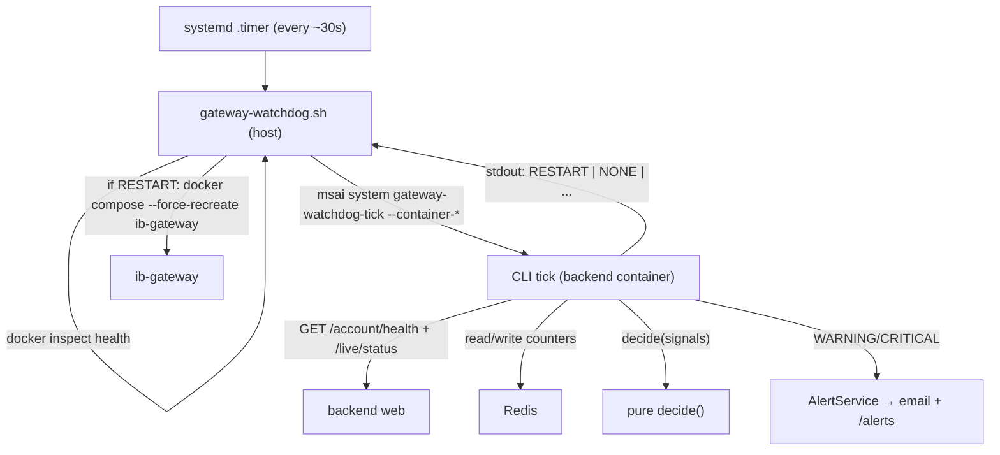

# Always-On IB Gateway Watchdog (prod) — Implementation Plan

> **For agentic workers:** REQUIRED SUB-SKILL: Use superpowers:subagent-driven-development or superpowers:executing-plans to implement this plan task-by-task. Steps use checkbox (`- [ ]`) syntax.

**Goal:** Ship a prod-only watchdog that keeps the IB Gateway _session_ up — detecting "container up but IB API dead" + idle-down and recreating the container, with anti-flap (escalate+stop on persistent failure) and halt-awareness (never restart under a running live deployment).

**Architecture:** Host systemd oneshot + `.timer` (per the Approach Comparison below) gathers `docker inspect` health, delegates the decision to a PURE app function (`msai.services.gateway_watchdog.decide`) reached via `msai system gateway-watchdog-tick`, then acts on the host (recreate the gateway) while the in-app CLI emits alerts + persists anti-flap counters in Redis. Decision logic is pure + unit-tested; the host script and systemd units are thin.

**Tech Stack:** Python 3.12 (Typer CLI, httpx, arq/Redis — all existing deps), Bash host script, systemd unit+timer, Docker Compose. No new pip dependencies. No DB migration.

---

## Approach Comparison

### Chosen Default

Host systemd timer + app-signal (decision in app code via `msai system gateway-watchdog-tick`; restart via `docker compose --force-recreate` on the host; alert via existing `AlertService`).

### Best Credible Alternative

Extend the always-on `live-supervisor` container with the watchdog loop — more integrated (direct DB/Redis) but requires mounting the Docker socket into the trading-supervisor process (security smell + couples gateway lifecycle into the live-trading blast radius).

### Scoring (fixed axes)

| Axis                  | Default (host systemd) | Alternative (extend supervisor) |
| --------------------- | ---------------------- | ------------------------------- |
| Complexity            | M                      | M                               |
| Blast Radius          | L                      | H                               |
| Reversibility         | L                      | M                               |
| Time to Validate      | M                      | M                               |
| User/Correctness Risk | L-M                    | H                               |

### Cheapest Falsifying Test

"Can a host systemd oneshot curl localhost:8000 app state + run `docker compose --force-recreate ib-gateway` on the prod VM?" — already passed empirically during the 2026-06-09/10 drills (both run from the host worked).

## Contrarian Verdict

**VALIDATE** (Codex, Phase 3.1c). Host-systemd default confirmed correct: "fix healthcheck + restart policy" can't solve the core gap (Docker doesn't restart `unhealthy` containers, only on exit); autoheal/sidecar still needs docker.sock + a new always-on service + halt coordination; extending `live-supervisor` wrongly gives the trading blast-radius lifecycle authority over the broker container. Required hardening (folded into tasks below): `TimeoutStartSec`, non-overlap guard (flock belt-and-suspenders on top of systemd's oneshot serialization), conservative behavior when live-status is unknown, bounded restart counters, clear escalation paths.

---

## Developer Briefing (Gate 1)

**What I'll build** — a small always-on watchdog for the production VM that notices when the Interactive Brokers gateway has stopped responding (even while its container looks "up"), automatically restarts it when no trading is running, and — if it keeps failing — stops hammering and emails a "needs a human" alert instead.

**How it'll fit** `[planned]`:



**Planned file-map** `[planned]`:

- Create `backend/src/msai/services/gateway_watchdog.py` (pure decision logic)
- Modify `backend/src/msai/cli.py` (`system_app` → `gateway-watchdog-tick`)
- Create `scripts/gateway-watchdog.sh` (host script)
- Create `scripts/msai-gateway-watchdog.service` + `scripts/msai-gateway-watchdog.timer`
- Modify `scripts/deploy-on-vm.sh` (install + enable the timer)
- Create `backend/tests/unit/test_gateway_watchdog.py` + `backend/tests/integration/test_gateway_watchdog_cli.py`

**Key decisions:**

- Decision logic is a PURE function (`now` + counters injected) → fully unit-testable; the process-boundary (each tick is a fresh oneshot) is bridged by persisting `WatchdogState` in Redis.
- "Down" = container not running OR healthcheck `unhealthy` OR `/account/health` body says not-connected for ≥ grace. `Health=starting` is treated as NOT-down (respect the 180s `start_period` — `[inferred]` from research, verified in plan-review).
- Restart authority stays on the host (no docker.sock in any app container).

---

## Surface coverage decision

Project exposes `[API, CLI, UI]`.

- **CLI: Covered** — `msai system gateway-watchdog-tick` is operator-runnable; the CLI UC drives it.
- **API: Covered (read-side)** — the watchdog's user-observable effect is a WARNING/CRITICAL entry in `GET /api/v1/alerts/`; the API UC observes it.
- **UI: N/A** — unattended operational watchdog, no new user-facing page; its effect (alerts) renders on the existing alerts surface with no UI code change.

---

#### E2E Use Cases

**UC-CLI-1 — Operator manually runs a watchdog tick against a down gateway and sees the decision + persisted counter.**

- **Actor:** Operator from the CLI on the prod VM (or local stack) diagnosing gateway health.
- **Scenario:** The operator suspects the IB gateway is wedged and wants to confirm the watchdog would act, without waiting for the timer. They run a tick manually and expect it to (a) decide to restart when idle+down and (b) record that it did so, so a second tick reflects the advancing anti-flap counter.
- **Interface:** CLI.
- **Intent:** The operator confirms the watchdog correctly detects a down-but-idle gateway and tracks its remediation attempts.
- **Setup:** Local stack up (`docker compose -f docker-compose.dev.yml up -d`); reset the watchdog Redis state via the documented `msai system gateway-watchdog-reset` (a tiny companion command) so the counter starts clean. (Do NOT pre-set the counter — that's what the tick advances.) Simulate a down gateway with the tick's dry-run inject flags — bare boolean form: `--inject-health down --inject-idle` (NOT `--no-container-running=false`; Typer dual-bool flags take no `=value`), OR run with the dev gateway stopped.
- **Steps:** Run `msai system gateway-watchdog-tick --dry-run --inject-health down --inject-idle` → run it a second time.
- **Verification:** First invocation's stdout shows a human-readable line naming the decision (e.g. `decision=RESTART reason=idle-gateway-down restart_count=1`) with exit 0; the second invocation shows `restart_count=2` — i.e. the next invocation reflects the advanced counter. (`--dry-run` suppresses the real `docker compose` action but still persists counters + decision.)
- **Persistence:** Exit the shell, open a new one, run `msai system gateway-watchdog-tick --dry-run --inject-health down --inject-idle` again → `restart_count` continues advancing from the persisted Redis state (not reset to 1).

**UC-API-1 — Operator polling the alerts feed sees the watchdog's escalation after persistent gateway failure.**

- **Actor:** Operator/integrator polling the operational alerts API.
- **Scenario:** The gateway has been failing to recover; the operator monitors `/api/v1/alerts/` and expects the watchdog to escalate to a CRITICAL "persistent failure — operator needed" alert (and stop restart-storming) so they know to intervene manually.
- **Interface:** API.
- **Intent:** The operator learns from the alerts feed that the watchdog has escalated a persistent gateway failure and stopped auto-restarting.
- **Setup:** Local stack up; reset watchdog state. Drive the watchdog past the restart cap by running `msai system gateway-watchdog-tick --dry-run --inject-health down --inject-idle` K+1 times (each "restart" never recovers because health stays injected-down). (Do NOT write the alert directly — the tick must produce it.)
- **Steps:** Run the tick K+1 times → `GET /api/v1/alerts/`.
- **Verification:** The alerts response includes a CRITICAL entry whose title/message names the gateway watchdog persistent-failure escalation; the body explains operator action is needed. The **K+1-th (final) tick's** stdout shows `decision=ESCALATE` (the first K ticks append restart events; the K+1-th sees `len(recent) >= restart_cap` and escalates).
- **Persistence:** Re-request `GET /api/v1/alerts/` after a short delay → the CRITICAL escalation alert is still listed with the same content.

> Note: the full systemd-timer + real `docker compose --force-recreate` loop on the prod VM is verified at deploy time (the unit installs/enables idempotently) + by an attended prod observation; the local E2E exercises the decision + alert + counter surfaces (the parts a user can drive without the VM's systemd).

---

## Tasks

### Task 1: Pure decision logic (`gateway_watchdog.py`)

**Files:**

- Create: `backend/src/msai/services/gateway_watchdog.py`
- Test: `backend/tests/unit/test_gateway_watchdog.py`

- [ ] **Step 1: Write failing tests** for the decision matrix (healthy→reset; idle-down→RESTART; unhealthy-running→RESTART; live-active-down→ALERT_ONLY no restart; starting→NONE; ≥K restarts→ESCALATE+stop; cooldown active→NONE; recovery→counter reset; live-status-unknown→conservative NONE+alert).

```python
# backend/tests/unit/test_gateway_watchdog.py
from msai.services.gateway_watchdog import (
    Signals, WatchdogState, WatchdogConfig, GatewayHealth, Action, decide,
)

CFG = WatchdogConfig(grace_secs=60, restart_cap=3, window_secs=900, cooldown_secs=1800)

def _sig(**kw):
    base = dict(
        container_running=True, health=GatewayHealth.HEALTHY, gateway_connected=True,
        consecutive_failures=0, live_deployment_active=False,
        state=WatchdogState(), now=1000.0, config=CFG,
    )
    base.update(kw)
    return Signals(**base)

def test_healthy_resets_counter():
    s = _sig(state=WatchdogState(restart_events=[100.0, 200.0], down_since=50.0))
    d = decide(s)
    assert d.action is Action.NONE
    assert d.new_state.restart_events == []
    assert d.new_state.down_since is None

def test_idle_down_past_grace_restarts():
    # down_since old enough to clear grace
    s = _sig(gateway_connected=False, health=GatewayHealth.UNHEALTHY,
             state=WatchdogState(down_since=900.0))  # now=1000, grace=60
    d = decide(s)
    assert d.action is Action.RESTART
    assert len(d.new_state.restart_events) == 1

def test_down_within_grace_waits():
    s = _sig(gateway_connected=False, health=GatewayHealth.UNHEALTHY, state=WatchdogState())
    d = decide(s)  # down_since just set this tick → within grace
    assert d.action is Action.NONE
    assert d.new_state.down_since == s.now

def test_starting_is_not_down():
    s = _sig(health=GatewayHealth.STARTING, gateway_connected=False,
             container_running=True, state=WatchdogState(down_since=900.0))
    d = decide(s)
    assert d.action is Action.NONE  # RUNNING + starting → respect start_period

def test_stopped_container_with_stale_starting_health_is_down():
    # container exited but docker still reports last health 'starting' → must be DOWN,
    # not transitional-forever (container_running dominates STARTING).
    s = _sig(container_running=False, health=GatewayHealth.STARTING,
             gateway_connected=False, state=WatchdogState(down_since=900.0))
    d = decide(s)
    assert d.action is Action.RESTART   # idle + down past grace

def test_live_active_down_alerts_no_restart():
    s = _sig(gateway_connected=False, health=GatewayHealth.UNHEALTHY,
             live_deployment_active=True, state=WatchdogState(down_since=900.0))
    d = decide(s)
    assert d.action is Action.ALERT_ONLY
    assert d.alert_level == "warning"
    assert d.new_state.restart_events == []   # did NOT restart under a live deployment

def test_escalates_after_cap():
    evts = [400.0, 500.0, 600.0]  # 3 within window (now=1000, window=900 → >100)
    s = _sig(gateway_connected=False, health=GatewayHealth.UNHEALTHY,
             state=WatchdogState(down_since=300.0, restart_events=evts))
    d = decide(s)
    assert d.action is Action.ESCALATE
    assert d.alert_level == "critical"
    assert d.new_state.cooldown_until == s.now + CFG.cooldown_secs

def test_cooldown_suppresses_restart():
    s = _sig(gateway_connected=False, health=GatewayHealth.UNHEALTHY,
             state=WatchdogState(down_since=300.0, cooldown_until=2000.0))  # now=1000 < 2000
    d = decide(s)
    assert d.action is Action.NONE

def test_live_status_unknown_is_conservative():
    s = _sig(gateway_connected=False, health=GatewayHealth.UNHEALTHY,
             live_deployment_active=None, state=WatchdogState(down_since=900.0))
    d = decide(s)
    assert d.action is Action.ALERT_ONLY      # do NOT restart when we can't confirm idle

def test_post_cooldown_single_retry():
    # escalated; cooldown elapsed (now=1000 >= cooldown_until=900); retry not yet used
    s = _sig(gateway_connected=False, health=GatewayHealth.UNHEALTHY,
             state=WatchdogState(down_since=300.0, cooldown_until=900.0, escalated=True))
    d = decide(s)
    assert d.action is Action.RESTART
    assert d.reason == "post-cooldown-retry"
    assert d.new_state.post_cooldown_retry_used is True

def test_post_cooldown_reescalates_after_retry_still_down():
    s = _sig(gateway_connected=False, health=GatewayHealth.UNHEALTHY,
             state=WatchdogState(down_since=300.0, cooldown_until=900.0, escalated=True,
                                 post_cooldown_retry_used=True))
    d = decide(s)
    assert d.action is Action.ESCALATE
    assert d.alert_level == "critical"
    assert d.new_state.cooldown_until == s.now + CFG.cooldown_secs
    assert d.new_state.post_cooldown_retry_used is False

def test_recovery_after_escalation_emits_info():
    # confirmed-healthy after a prior escalation → RECOVERED (clears the CRITICAL)
    s = _sig(state=WatchdogState(escalated=True, down_since=300.0,
                                 cooldown_until=2000.0))  # healthy signals (defaults)
    d = decide(s)
    assert d.action is Action.RECOVERED
    assert d.alert_level == "info"
    assert d.new_state == WatchdogState()  # full reset

def test_self_recovery_without_escalation_is_silent():
    # healthy after a transient blip we never escalated → silent reset, no alert
    s = _sig(state=WatchdogState(down_since=300.0, restart_events=[400.0]))
    d = decide(s)
    assert d.action is Action.NONE
    assert d.alert_level is None
    assert d.new_state == WatchdogState()

def test_alert_only_throttled_within_window():
    # same live-active reason already alerted at t=999 (now=1000, throttle=1800) → suppress
    s = _sig(gateway_connected=False, health=GatewayHealth.UNHEALTHY, live_deployment_active=True,
             state=WatchdogState(down_since=300.0, last_alert_reason="live-active",
                                 last_alert_at=999.0))
    d = decide(s)
    assert d.action is Action.ALERT_ONLY    # still ALERT_ONLY (host never restarts)
    assert d.alert_level is None            # but the alert is throttled (no storm)

def test_alert_only_reemits_after_throttle_window():
    s = _sig(gateway_connected=False, health=GatewayHealth.UNHEALTHY, live_deployment_active=True,
             state=WatchdogState(down_since=300.0, last_alert_reason="live-active",
                                 last_alert_at=-1000.0))  # now=1000 → past throttle window
    d = decide(s)
    assert d.action is Action.ALERT_ONLY
    assert d.alert_level == "warning"
    assert d.new_state.last_alert_at == s.now
```

- [ ] **Step 2: Run tests, confirm they fail** (`uv run pytest tests/unit/test_gateway_watchdog.py` → ImportError).
- [ ] **Step 3: Implement** `gateway_watchdog.py`:

```python
"""Pure decision logic for the prod IB Gateway watchdog (see docs/prds/ib-gateway-watchdog.md).

PURE: decide() takes all inputs (including `now` and prior counter state) and returns a
Decision with the next state. No I/O, no clock, no Redis — the CLI tick wires those.
"""
from __future__ import annotations

from dataclasses import dataclass, field, replace
from enum import Enum


class GatewayHealth(str, Enum):
    HEALTHY = "healthy"
    UNHEALTHY = "unhealthy"
    STARTING = "starting"   # docker start_period / IBC login in progress — NOT down
    UNKNOWN = "unknown"


class Action(str, Enum):
    NONE = "none"
    RESTART = "restart"
    ALERT_ONLY = "alert_only"   # down but must not restart (live deployment / unknown)
    ESCALATE = "escalate"       # persistent failure — stop restarting, CRITICAL alert
    RECOVERED = "recovered"     # came back after prior down — emit recovery alert


@dataclass(frozen=True)
class WatchdogConfig:
    grace_secs: float = 60.0
    restart_cap: int = 3          # K restarts within window before escalate
    window_secs: float = 900.0    # 15 min
    cooldown_secs: float = 1800.0 # 30 min
    alert_throttle_secs: float = 1800.0  # re-emit a *repeating* same-reason alert at most this often


@dataclass(frozen=True)
class WatchdogState:
    down_since: float | None = None
    restart_events: list[float] = field(default_factory=list)
    cooldown_until: float | None = None
    escalated: bool = False        # tracks "was previously escalated" → recovery alert on return
    post_cooldown_retry_used: bool = False  # PRD "cooldown → ONE retry → re-escalate"
    last_alert_reason: str | None = None    # anti-storm: throttle repeating same-reason alerts
    last_alert_at: float | None = None


@dataclass(frozen=True)
class Signals:
    container_running: bool
    health: GatewayHealth
    gateway_connected: bool
    consecutive_failures: int
    live_deployment_active: bool | None   # None = could not determine (conservative)
    state: WatchdogState
    now: float
    config: WatchdogConfig


@dataclass(frozen=True)
class Decision:
    action: Action
    alert_level: str | None        # "warning" | "critical" | "info" | None
    alert_title: str | None
    alert_message: str | None
    new_state: WatchdogState
    reason: str


def _is_confirmed_healthy(s: Signals) -> bool:
    """Strict 'up': container running AND healthcheck healthy AND IB API connected.
    ONLY this resets state. STARTING/ambiguous must NOT reset — otherwise the several
    `starting` ticks Docker reports after a --force-recreate would wipe the anti-flap
    counters (restart_events/escalated/post_cooldown_retry_used) before the gateway
    ever proves healthy, defeating the restart cap + post-cooldown logic."""
    return (
        s.container_running
        and s.health is GatewayHealth.HEALTHY
        and s.gateway_connected
    )


def _is_down(s: Signals) -> bool:
    if not s.container_running:
        return True  # stopped/exited container is DOWN even if last health was 'starting'
    if s.health is GatewayHealth.STARTING:
        return False  # RUNNING + transitional — respect the 180s start_period / IBC login
    if s.health is GatewayHealth.UNHEALTHY:
        return True
    return not s.gateway_connected


def decide(s: Signals) -> Decision:
    cfg = s.config
    st = s.state

    if not _is_down(s):
        if _is_confirmed_healthy(s):
            # CONFIRMED healthy: reset. Emit a RECOVERED (info) alert ONLY if we had
            # ESCALATED — that clears a prior CRITICAL operator alert. A self-recovery
            # from a transient blip (or a routine idle-down restart, which already fired
            # its own WARNING) resets silently to avoid alert noise.
            recovered = st.escalated
            return Decision(
                action=Action.RECOVERED if recovered else Action.NONE,
                alert_level="info" if recovered else None,
                alert_title="IB Gateway recovered" if recovered else None,
                alert_message="ib-gateway session is healthy again." if recovered else None,
                new_state=WatchdogState(),
                reason="recovered" if recovered else "healthy",
            )
        # Not down, but not confirmed-healthy → STARTING / up-but-unconfirmed.
        # PRESERVE state, take no action (this is what survives a recreate's `starting`
        # ticks so the counters aren't wiped before recovery is confirmed).
        return Decision(Action.NONE, None, None, None, st, "transitional")

    # Down. Stamp down_since on first down tick.
    down_since = st.down_since if st.down_since is not None else s.now
    base = replace(st, down_since=down_since)

    # Grace: ignore brief blips.
    if s.now - down_since < cfg.grace_secs:
        return Decision(Action.NONE, None, None, None, base, "within-grace")

    # Cooldown after escalation: do nothing but stay escalated.
    if st.cooldown_until is not None and s.now < st.cooldown_until:
        return Decision(Action.NONE, None, None, None, base, "cooldown")

    # Halt-awareness / unknown live status → never restart; alert. THROTTLED: this
    # condition persists tick-after-tick, so de-dup the warning (alert once, then
    # suppress for alert_throttle_secs) to avoid a 30s alert storm. The ALERT_ONLY
    # action still returns every tick (so the host never restarts); only the alert
    # emission is rate-limited.
    if s.live_deployment_active is None or s.live_deployment_active:
        reason = "live-active" if s.live_deployment_active else "live-status-unknown"
        throttled = (
            st.last_alert_reason == reason
            and st.last_alert_at is not None
            and s.now - st.last_alert_at < cfg.alert_throttle_secs
        )
        if throttled:
            return Decision(Action.ALERT_ONLY, None, None, None, base, reason)
        return Decision(
            Action.ALERT_ONLY, "warning", "IB Gateway down during live trading",
            f"ib-gateway is down/unhealthy ({reason}); NOT restarting until the deployment "
            "halts/flattens. Node disconnect-handler will halt it.",
            replace(base, last_alert_reason=reason, last_alert_at=s.now), reason,
        )

    # Post-cooldown phase: a prior escalation's cooldown has elapsed (it passed the
    # cooldown guard above). PRD = "cooldown, then ONE retry + re-alert" — NOT a fresh
    # K-restart budget. (A successful retry hits the healthy/RECOVERED branch next tick,
    # which resets all state; the 180s start_period STARTING handling gives it time.)
    if st.escalated and st.cooldown_until is not None:
        if not st.post_cooldown_retry_used:
            return Decision(
                Action.RESTART, "warning", "IB Gateway post-cooldown retry",
                "Cooldown elapsed after a persistent-failure escalation — making ONE "
                "recovery attempt (recreate).",
                # Clear down_since so the recreate gets a fresh grace window before the
                # next down-assessment (the IBProbe refresh lags the recreate ~30s).
                replace(base, post_cooldown_retry_used=True, down_since=None),
                "post-cooldown-retry",
            )
        # Single retry already spent and still down → re-escalate + re-cooldown.
        return Decision(
            Action.ESCALATE, "critical", "IB Gateway STILL failing after cooldown retry",
            f"ib-gateway did not recover after the post-cooldown retry. Auto-restart "
            f"STOPPED again for {int(cfg.cooldown_secs / 60)} min. Operator intervention "
            "needed — likely an IBKR auth/config issue (paper-vs-live login / IB Key 2FA).",
            replace(base, restart_events=[], cooldown_until=s.now + cfg.cooldown_secs,
                    escalated=True, post_cooldown_retry_used=False),
            "re-escalate-after-retry",
        )

    # Idle + down → normal anti-flap restart path.
    recent = [t for t in base.restart_events if s.now - t < cfg.window_secs]
    if len(recent) >= cfg.restart_cap:
        return Decision(
            Action.ESCALATE, "critical", "IB Gateway persistent failure — operator needed",
            f"ib-gateway failed to recover after {len(recent)} restarts in "
            f"{int(cfg.window_secs / 60)} min. Auto-restart STOPPED for "
            f"{int(cfg.cooldown_secs / 60)} min. Likely an IBKR auth/config issue "
            "(e.g. paper-vs-live login / IB Key 2FA) — needs manual fix.",
            replace(base, restart_events=recent, cooldown_until=s.now + cfg.cooldown_secs,
                    escalated=True, post_cooldown_retry_used=False),
            "escalate-restart-cap",
        )

    return Decision(
        Action.RESTART, "warning", "IB Gateway auto-restart",
        f"ib-gateway down/unhealthy while idle — recreating (attempt {len(recent) + 1}).",
        # Clear down_since: after issuing a recreate, the next tick must re-stamp and
        # re-serve the full grace window so the recreate's start_period + IBProbe refresh
        # complete before we'd ever recreate again (prevents post-restart reflap).
        replace(base, restart_events=[*recent, s.now], down_since=None),
        "idle-down-restart",
    )
```

- [ ] **Step 4: Run tests, confirm pass.**
- [ ] **Step 5: Commit** — `feat(watchdog): pure gateway-watchdog decision logic`.

### Task 2: CLI tick command (`msai system gateway-watchdog-tick`)

**Files:**

- Modify: `backend/src/msai/cli.py` (under `system_app`)
- Test: `backend/tests/integration/test_gateway_watchdog_cli.py`

- [ ] **Step 1: Write failing integration test** (via `CliRunner`; mock the `/account/health` httpx GET to a 200 body with `gateway_connected:false`; seed the live-active source by inserting `LiveDeployment` rows in the test DB session; mock Redis get/set). **Drive the actionable-down cases through the `--inject-health down` dry-run path** — it deterministically re-seeds past-grace per the inject semantics, so the test isn't fighting the grace window / the `down_since`-clear-on-RESTART. Cases:
  - **Restart + counter persistence:** ZERO active `LiveDeployment` rows seeded → `gateway-watchdog-tick --inject-health down --inject-idle` → stdout last line `restart`, `decision=RESTART`, `restart_count=1`, exit 0, and `AlertService.send_alert(..., level="warning")` called. Run AGAIN → `restart_count=2` (Redis-persisted counter advances; the inject path re-seeds past-grace each tick so the `down_since`-clear doesn't drop it back to `NONE`). Also assert **NO HTTP call to `/live/status`** (P0 fix uses the DB).
  - **Live-active → ALERT_ONLY:** seed ONE active `LiveDeployment` (status `running`), run `--inject-health down` (NOT `--inject-idle`) → `decision=ALERT_ONLY`, NO `restart` token (host must not restart under a live deployment).
  - **DB error → conservative:** make the live-active DB query raise → `live_deployment_active=None` → `decision=ALERT_ONLY`.
  - **Unexpected fatal (Redis down) → non-zero exit, NO valid token** (per the error-handling split): make the Redis state read raise → command exits non-zero with no action-token line (so the Task 3 host guard would fire `--report-host-failure`).
- [ ] **Step 2: Run → fails.**
- [ ] **Step 3: Implement** the command + a `gateway-watchdog-reset` companion.
  - **Typer/async pattern (P2):** follow the existing `system_app` convention (`cli.py:342` / `system_health`) — a SYNC `@system_app.command("gateway-watchdog-tick")` wrapper that calls an `async def _tick(...)` helper via `asyncio.run(...)`. Do NOT make the Typer command itself `async`.
  - Flags: `--container-running/--no-container-running`, `--container-health [healthy|unhealthy|starting|unknown]` (passed by the host script from `docker inspect`), `--dry-run` (suppress the host's restart side-effect token but STILL persist counters + emit alerts), and operator dry-run conveniences `--inject-health [healthy|down]` + `--inject-idle/--no-inject-idle`.
  - **Inject semantics (operator dry-run, for UC-CLI-1):** `--inject-health down` forces the gateway signals to a down state (`container_running=True, health=UNHEALTHY, gateway_connected=False`) AND, so the dry-run shows the _actionable_ decision on the first tick rather than `NONE`-within-grace, seeds `Signals.state.down_since = now - grace_secs - 1` **when the persisted `down_since` is None or still within grace** (it does NOT overwrite a genuine older `down_since`). `--inject-idle` forces `live_deployment_active=False` (skip the DB query). The persisted `restart_events` counter still increments realistically across invocations, so a second/third dry-run tick advances `restart_count` (UC-CLI-1) and the K+1-th escalates (UC-API-1).
  - **Gateway-health signal (HTTP — reads the web process's in-memory IBProbe):** `httpx.get("http://localhost:8000/api/v1/account/health", headers={"X-API-Key": settings.msai_api_key}, timeout=10)` → parse BODY fields `gateway_connected` / `status` (NOT `is_success` — endpoint returns 200 when down, per `account.py:235-238`). Combine with the host-passed `--container-*` flags into `GatewayHealth`.
  - **Live-active signal (P0 — DB-direct over `LiveDeployment`, NOT the 50-capped HTTP `/live/status`, NOT `LiveNodeProcess`):** `select(func.count()).select_from(LiveDeployment).where(LiveDeployment.status.in_(ACTIVE_DEPLOYMENT_STATUSES))` — `from msai.models.live_deployment import LiveDeployment` + `from msai.services.live.broker_account_service import ACTIVE_DEPLOYMENT_STATUSES`. `ACTIVE_DEPLOYMENT_STATUSES` is authoritatively defined for `LiveDeployment.status` (used exactly this way by the boot KV-probe `main.py:252` + the active-deployments gate `live.py:3406`) = `running, ready, starting, building, stopping` (INCLUDES `stopping` per nautilus gotcha #13 — a node mid-teardown still holds positions; EXCLUDES terminal `failed`/`stopped`). `live_deployment_active = count > 0`. On **any** DB error → `live_deployment_active = None` (conservative → `decide()` returns `ALERT_ONLY`, never restarts). Querying `LiveDeployment` (not the capped `/live/status` nor `LiveNodeProcess`) fixes both the fail-open (capped list drops an active row / stale-absent process row) and fail-closed (`failed` blocking restart) bugs.
  - Read `WatchdogState` JSON from Redis key `msai:gateway_watchdog:state` via `get_redis_pool()`; build `Signals(now=time.time(), config=WatchdogConfig(**env_overrides))`; call `decide()`. Wrap Redis use in `try/finally: await redis.aclose()` (short-lived CLI pool — P3).
  - Persist `decision.new_state` to Redis (JSON).
  - If `decision.alert_level`: construct **bare `AlertService()`** — that's exactly what the other async call sites do (`disconnect_handler.py:296`, `fleet_router.py:2010`, `live_supervisor/__main__.py:980`); it degrades gracefully (logs + writes the `/api/v1/alerts/` history even when SMTP is unconfigured — `alerting.py:262-269`). `settings` has NO SMTP fields, so do NOT invent a settings-backed constructor. Then **`await alert_service.send_alert(decision.alert_title, decision.alert_message, level=decision.alert_level)`** — the REAL signature is `send_alert(subject, body, recipients=None, *, level="warning")` (`alerting.py:290`); passing `(level, title, message)` positionally is WRONG (P1).
  - Print `decision={ACTION} reason={reason} restart_count={len(new_state.restart_events)}` then the bare action token on the LAST line for the host script to grep.
  - **Error handling (P2 — must NOT mask internal failures, and must stay consistent with the Task 3 host rc-guard):** distinguish two classes.
    - **Expected probe degradations → convert to CONSERVATIVE signals, then a normal decision + token + exit 0:** `/account/health` unreachable/timeout/non-2xx (catch `httpx.ConnectError`/`TimeoutException`/`RequestError` like `cli.py:1488-1495`) → treat the gateway as **down** (`gateway_connected=False`, health `unknown`) — never falsely healthy; live-active DB error → `live_deployment_active=None` (→ `decide()` returns `ALERT_ONLY`). These are the designed conservative paths and still emit a valid token.
    - **Unexpected fatal errors (Redis unavailable, state-JSON decode failure, any unhandled exception) → do NOT swallow into a `none` token + exit 0.** Log + **exit non-zero and emit NO valid token line**, so the Task 3 host guard (`rc != 0` OR empty `ACTION`) fires and raises a `--report-host-failure` CRITICAL. (The systemd `.timer` survives a failed oneshot run regardless — it just logs the failed unit; it does not stop firing.)
  - **`--report-host-failure TEXT` mode (P2 — surfaces host-action failures, THROTTLED):** a separate flag that SKIPS the decision/counter logic and emits a **CRITICAL** alert via `AlertService` — title `IB Gateway watchdog host-action FAILED`, body = `TEXT`. The host script calls this when its `docker compose --force-recreate` fails, `/run/*.env` is missing, OR the tick-exec itself fails — so a broken host action (compose error, missing rendered env, docker daemon issue, container/import failure) produces its own distinct `/api/v1/alerts/` CRITICAL, never silent. **Anti-storm throttle (best-effort / FAIL-OPEN):** read a dedicated Redis key `msai:gateway_watchdog:last_host_failure_alert_at`; if `now - that < alert_throttle_secs` → log + SKIP the alert; else emit + write the key. **If the throttle Redis read OR write raises** (e.g. Redis itself is the failed dependency that prompted the host-failure report) → **still emit the CRITICAL UNTHROTTLED** — the alert must never be swallowed by its own throttle. Does NOT touch the main decision counters.
- [ ] **Step 4: Run → pass.**
- [ ] **Step 5: Commit.**

### Task 3: Host watchdog script (`scripts/gateway-watchdog.sh`)

**Files:** Create `scripts/gateway-watchdog.sh`

- [ ] **Step 1:** Write the script (POSIX/bash; runs on the VM host):
  - `flock -n /run/msai-gateway-watchdog.lock` belt-and-suspenders non-overlap (on top of systemd oneshot serialization).
  - Fail-safe: if `/run/msai.env` or `/run/msai-images.env` is missing → log loudly to the journal AND emit a CRITICAL via `docker exec msai-backend-1 python -m msai.cli system gateway-watchdog-tick --report-host-failure "rendered env missing (/run/msai.env|images) — render service may have failed; gateway cannot be recreated"` (best-effort; if even that fails, the journal line remains), then `exit 0` (don't crash-loop the timer; the render service owns the env files). NOT silent.
  - `GW=$(docker inspect msai-ib-gateway-1 --format '{{.State.Running}}|{{if .State.Health}}{{.State.Health.Status}}{{else}}none{{end}}' 2>/dev/null)` → parse running + health (`healthy|unhealthy|starting|none`→map to enum; `none`→`unknown`).
  - Map `.State.Running` → the **bare** Typer flag: `RUNNING_FLAG=$([ "$RUNNING" = "true" ] && echo --container-running || echo --no-container-running)`. Typer's dual-bool `--container-running/--no-container-running` REJECTS `--container-running=true` (exit 2 — P1), so pass the bare flag form.
  - Run the tick capturing BOTH its exit code and output without the pipe masking the rc (P2): `docker exec msai-backend-1 python -m msai.cli system gateway-watchdog-tick "$RUNNING_FLAG" --container-health "$HEALTH" >/tmp/wd-tick.out 2>>/var/log/msai-gateway-watchdog.log; rc=$?; ACTION=$(tail -1 /tmp/wd-tick.out)`. **If `rc -ne 0` OR `ACTION` is empty** → the tick itself failed (Typer/import/container/daemon error) → log + best-effort `--report-host-failure "gateway-watchdog tick exec failed (rc=$rc); ACTION='$ACTION'"` and **do NOT** fall through to the restart block. **Use `python -m msai.cli`, NOT `msai`** (P1): the prod image builds with `uv sync --no-install-project` (`backend/Dockerfile:15`) so the `[project.scripts] msai` console entry is NOT installed; prod invokes the CLI via `python -m msai.cli` (`scripts/deploy-smoke.sh:250`; `cli.py:3066` has the `__main__` guard). In-container `python` resolves to the venv interpreter.
  - On `$ACTION = restart`: run `COMPOSE_PROFILES=broker docker compose --project-name msai --env-file /run/msai.env --env-file /run/msai-images.env -f /opt/msai/docker-compose.prod.yml up -d --force-recreate ib-gateway` and **capture its exit code**. On non-zero (compose error / docker daemon issue) → log loudly + emit a CRITICAL via `--report-host-failure "docker compose --force-recreate ib-gateway FAILED (rc=$rc) — gateway not recreated despite watchdog decision; manual intervention needed"` (P2 — a failed host recreate must NOT be silent; the in-app WARNING already counted the attempt, so without this the operator can't tell "host action broke" from "gateway won't come up"). **Must pin `--project-name msai`** (deploy-on-vm.sh:254 uses it; the hard-coded `msai-ib-gateway-1`/`msai-backend-1` names only match when the project is `msai`). The CRITICAL/ESCALATE + ALERT_ONLY decision paths already alerted in-app; the host acts only on the `restart` token.
  - All other tokens (`none`/`alert_only`/`escalate`/`recovered`): no host action.
- [ ] **Step 2:** Commit.

### Task 4: systemd unit + timer

**Files:** Create `scripts/msai-gateway-watchdog.service`, `scripts/msai-gateway-watchdog.timer`

- [ ] **Step 1: Service** (mirror `msai-render-env.service` conventions):

```ini
[Unit]
Description=MSAI v2 IB Gateway watchdog (keep gateway session up)
After=docker.service
StartLimitIntervalSec=300
StartLimitBurst=20

[Service]
Type=oneshot
ExecStart=/usr/local/bin/gateway-watchdog.sh
TimeoutStartSec=120
```

- [ ] **Step 2: Timer** (per research — monotonic, overlap-free for oneshot):

```ini
[Unit]
Description=Periodic trigger for MSAI v2 IB Gateway watchdog

[Timer]
OnBootSec=90
OnUnitInactiveSec=30s
AccuracySec=5s
Unit=msai-gateway-watchdog.service

[Install]
WantedBy=timers.target
```

- [ ] **Step 3:** Commit.

### Task 5: Deploy wiring (`scripts/deploy-on-vm.sh`)

**Files:** Modify `scripts/deploy-on-vm.sh`

- [ ] **Step 1:** Add a phase mirroring the **current** backup-to-blob block (`deploy-on-vm.sh:432-468`, which is FATAL-on-failure + verifies active state — NOT the older non-fatal pattern): `install -m 0755 /opt/msai/scripts/gateway-watchdog.sh /usr/local/bin/gateway-watchdog.sh`; `cp` the `.service` + `.timer` to `/etc/systemd/system/`; `systemctl daemon-reload`; `systemctl enable --now msai-gateway-watchdog.timer` (enable the **timer**, not the service); then **`systemctl restart msai-gateway-watchdog.timer`** so a redeploy actually applies edited timer-file contents (the current backup block does this — `deploy-on-vm.sh` — before checking active; without it `enable --now` is a no-op when the timer is already enabled). **FATAL on failure (P1) — mirror the backup-to-blob block EXACTLY:** on `enable --now` failure → `echo FAIL_WATCHDOG_TIMER … >&2; exit 1`; then `systemctl restart …timer` (idempotent, WARN-only on non-zero); then `is-active` check → if ≠ `active` → `echo FAIL_WATCHDOG_TIMER_INACTIVE … >&2; exit 1`. **Do NOT set `rollback_required=1`** and do NOT claim rollback: this phase runs AFTER the app deploy + health probes + the rollback decision (`deploy-on-vm.sh:273-345`), exactly like the backup-to-blob phase — so a bare `exit 1` fails the deploy step and surfaces the failure in the deploy log/journal WITHOUT rolling back the (already-healthy) app. For an "always-on" watchdog, silently shipping with no active timer is spec loss; failing the deploy step surfaces it immediately for the operator.
- [ ] **Step 2:** Commit.

### Task 6: Docs

**Files:** Modify `docs/runbooks/ib-gateway.md` (or create a watchdog section)

- [ ] Document: what the watchdog does, the thresholds + env overrides, how to read `journalctl -u msai-gateway-watchdog`, how to interpret the CRITICAL escalation, and the manual `msai system gateway-watchdog-tick --dry-run` diagnostic. Commit.

---

## Dispatch Plan

| Task ID | Depends on | Writes (concrete file paths)                                                                   |
| ------- | ---------- | ---------------------------------------------------------------------------------------------- |
| T1      | —          | `backend/src/msai/services/gateway_watchdog.py`, `backend/tests/unit/test_gateway_watchdog.py` |
| T2      | T1         | `backend/src/msai/cli.py`, `backend/tests/integration/test_gateway_watchdog_cli.py`            |
| T3      | T2         | `scripts/gateway-watchdog.sh`                                                                  |
| T4      | —          | `scripts/msai-gateway-watchdog.service`, `scripts/msai-gateway-watchdog.timer`                 |
| T5      | T3, T4     | `scripts/deploy-on-vm.sh`                                                                      |
| T6      | T5         | `docs/runbooks/ib-gateway.md`                                                                  |

**Sequential mode** — high coupling (T2 imports T1's types; T3 calls T2's CLI; T5 wires T3+T4). Dispatch one task at a time in ID order. T4 is file-disjoint from T1–T3 and may run anytime before T5.
